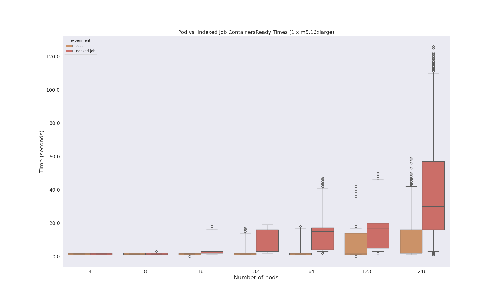
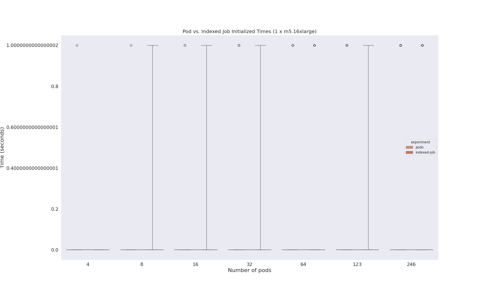
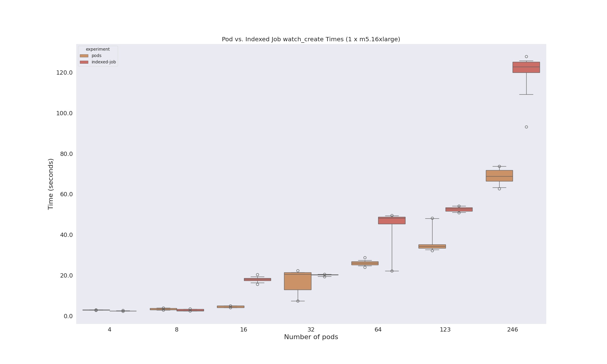
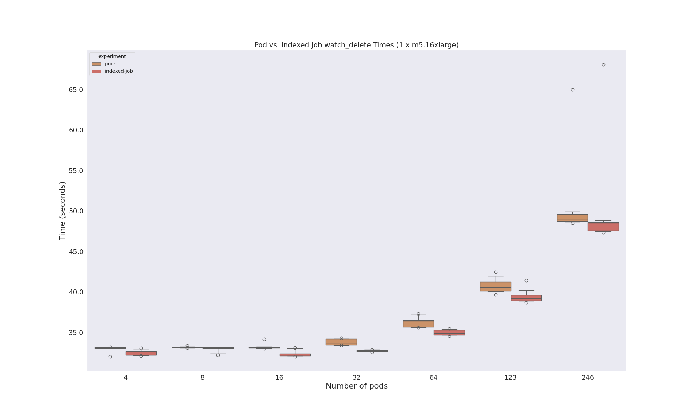

# Indexed Job Times

Here is the [pricing page](https://aws.amazon.com/ec2/pricing/on-demand/) and I'm interested in these instance type:

| Name | Cost/hour | On demand hourly rate | vCPU | Memory | Storage | Network Performance |
|------|-----------|-----------------------|------|--------|---------|---------------------|
| m5.8xlarge |$1.536 | 32 | 128 GiB | EBS Only | 10 Gigabit |
| m5.12xlarge |	$2.304	| 48	| 192 GiB	| EBS Only  |	10 Gigabit |
|m5.16xlarge|	$3.072|	64	|256 GiB|	EBS Only|	20 Gigabit|
|m5.24xlarge|	$4.608	|96	|384 GiB|	EBS Only|	25 Gigabit|


If I run 1 instance of this type I can ask for up to 250 pods. This would cost $1.536 * 24 = $36 in a day
If I run 4 instances of this size we can ask for up to 1000 pods [according to this site](https://learnk8s.io/kubernetes-instance-calculator). This would be ~$150/day.

But if we look at [this page](https://github.com/aws/amazon-vpc-cni-k8s/blob/master/misc/eni-max-pods.txt) we can see the *actual* limits based on the [ENI](https://github.com/aws/amazon-vpc-cni-k8s/releases/tag/v1.9.0).

Yeah let's try one instance for `m5.16xlarge` and see if we can hit the 737 limit. That would be just under ~$75 if I ran all day, which I won't.

## Setup

### 1. Create Cluster

Create the cluster with eksctl.

```bash
time eksctl create cluster -f ./config/eksctl-config.yaml
```

<details>

<summary>Cluster creation logs</summary>

```console
2023-10-13 13:16:25 [ℹ]  eksctl version 0.162.0
2023-10-13 13:16:25 [ℹ]  using region us-east-2
2023-10-13 13:16:25 [ℹ]  subnets for us-east-2b - public:192.168.0.0/19 private:192.168.64.0/19
2023-10-13 13:16:25 [ℹ]  subnets for us-east-2c - public:192.168.32.0/19 private:192.168.96.0/19
2023-10-13 13:16:25 [ℹ]  nodegroup "chonkmaster" will use "" [AmazonLinux2/1.27]
2023-10-13 13:16:25 [ℹ]  using SSH public key "/home/vanessa/.ssh/id_eks.pub" as "eksctl-pod-timing-study-nodegroup-chonkmaster-4e:93:d9:47:eb:81:3e:4f:1b:e0:44:ac:af:c6:ac:b3" 
2023-10-13 13:16:25 [ℹ]  using Kubernetes version 1.27
2023-10-13 13:16:25 [ℹ]  creating EKS cluster "pod-timing-study" in "us-east-2" region with managed nodes
2023-10-13 13:16:25 [ℹ]  1 nodegroup (chonkmaster) was included (based on the include/exclude rules)
2023-10-13 13:16:25 [ℹ]  will create a CloudFormation stack for cluster itself and 0 nodegroup stack(s)
2023-10-13 13:16:25 [ℹ]  will create a CloudFormation stack for cluster itself and 1 managed nodegroup stack(s)
2023-10-13 13:16:25 [ℹ]  if you encounter any issues, check CloudFormation console or try 'eksctl utils describe-stacks --region=us-east-2 --cluster=pod-timing-study'
2023-10-13 13:16:25 [ℹ]  Kubernetes API endpoint access will use default of {publicAccess=true, privateAccess=false} for cluster "pod-timing-study" in "us-east-2"
2023-10-13 13:16:25 [ℹ]  CloudWatch logging will not be enabled for cluster "pod-timing-study" in "us-east-2"
2023-10-13 13:16:25 [ℹ]  you can enable it with 'eksctl utils update-cluster-logging --enable-types={SPECIFY-YOUR-LOG-TYPES-HERE (e.g. all)} --region=us-east-2 --cluster=pod-timing-study'
2023-10-13 13:16:25 [ℹ]  
2 sequential tasks: { create cluster control plane "pod-timing-study", 
    2 sequential sub-tasks: { 
        wait for control plane to become ready,
        create managed nodegroup "chonkmaster",
    } 
}
2023-10-13 13:16:25 [ℹ]  building cluster stack "eksctl-pod-timing-study-cluster"
2023-10-13 13:16:26 [ℹ]  deploying stack "eksctl-pod-timing-study-cluster"
2023-10-13 13:16:56 [ℹ]  waiting for CloudFormation stack "eksctl-pod-timing-study-cluster"
2023-10-13 13:17:26 [ℹ]  waiting for CloudFormation stack "eksctl-pod-timing-study-cluster"
2023-10-13 13:18:26 [ℹ]  waiting for CloudFormation stack "eksctl-pod-timing-study-cluster"
2023-10-13 13:19:27 [ℹ]  waiting for CloudFormation stack "eksctl-pod-timing-study-cluster"
2023-10-13 13:20:27 [ℹ]  waiting for CloudFormation stack "eksctl-pod-timing-study-cluster"
2023-10-13 13:21:27 [ℹ]  waiting for CloudFormation stack "eksctl-pod-timing-study-cluster"
2023-10-13 13:22:28 [ℹ]  waiting for CloudFormation stack "eksctl-pod-timing-study-cluster"
2023-10-13 13:23:28 [ℹ]  waiting for CloudFormation stack "eksctl-pod-timing-study-cluster"
2023-10-13 13:24:28 [ℹ]  waiting for CloudFormation stack "eksctl-pod-timing-study-cluster"
2023-10-13 13:26:31 [ℹ]  building managed nodegroup stack "eksctl-pod-timing-study-nodegroup-chonkmaster"
2023-10-13 13:26:32 [ℹ]  deploying stack "eksctl-pod-timing-study-nodegroup-chonkmaster"
2023-10-13 13:26:32 [ℹ]  waiting for CloudFormation stack "eksctl-pod-timing-study-nodegroup-chonkmaster"
2023-10-13 13:27:02 [ℹ]  waiting for CloudFormation stack "eksctl-pod-timing-study-nodegroup-chonkmaster"
2023-10-13 13:27:58 [ℹ]  waiting for CloudFormation stack "eksctl-pod-timing-study-nodegroup-chonkmaster"
2023-10-13 13:29:18 [ℹ]  waiting for CloudFormation stack "eksctl-pod-timing-study-nodegroup-chonkmaster"
2023-10-13 13:29:18 [ℹ]  waiting for the control plane to become ready
2023-10-13 13:29:19 [✔]  saved kubeconfig as "/home/vanessa/.kube/config"
2023-10-13 13:29:19 [ℹ]  no tasks
2023-10-13 13:29:19 [✔]  all EKS cluster resources for "pod-timing-study" have been created
2023-10-13 13:29:19 [ℹ]  nodegroup "chonkmaster" has 1 node(s)
2023-10-13 13:29:19 [ℹ]  node "ip-192-168-6-201.us-east-2.compute.internal" is ready
2023-10-13 13:29:19 [ℹ]  waiting for at least 1 node(s) to become ready in "chonkmaster"
2023-10-13 13:29:19 [ℹ]  nodegroup "chonkmaster" has 1 node(s)
2023-10-13 13:29:19 [ℹ]  node "ip-192-168-6-201.us-east-2.compute.internal" is ready
2023-10-13 13:29:20 [ℹ]  kubectl command should work with "/home/vanessa/.kube/config", try 'kubectl get nodes'
2023-10-13 13:29:20 [✔]  EKS cluster "pod-timing-study" in "us-east-2" region is ready

real	12m55.530s
user	0m1.079s
sys	0m0.181s
```

</details>

```bash
mkdir -p ./data
kubectl get nodes -o yaml > ./data/nodes.yaml 
```

And setup your Python environment, and :

```
pip install -r requirements.txt
```

### 2. Create Experiments

We have templates and a script to generate the files. We will want to go up to 737.

```bash
python generate-size.py 4
python generate-size.py 8
python generate-size.py 16
python generate-size.py 32
python generate-size.py 64
python generate-size.py 123
python generate-size.py 246
```

### 3. Run Experiment

And then run a particular experiment, some number of times. Start with max pods and go down...

```bash
/bin/bash ./run.sh 246
/bin/bash ./run.sh 123
/bin/bash ./run.sh 64
/bin/bash ./run.sh 32
/bin/bash ./run.sh 16
/bin/bash ./run.sh 8
/bin/bash ./run.sh 4
```


### 4. Process Result Data

```bash
python analyze-results.py data/
```
### 5. Delete cluster

```bash
eksctl delete -f ./config/eksctl-config.yaml
```

Also check the console that everything is gone.

### 5. View Results

Here is an overview of times:

#### ContainersReady



#### Initialized



#### PodScheduled


#### Ready


#### Create Times (all)



#### Delete Times (all)



