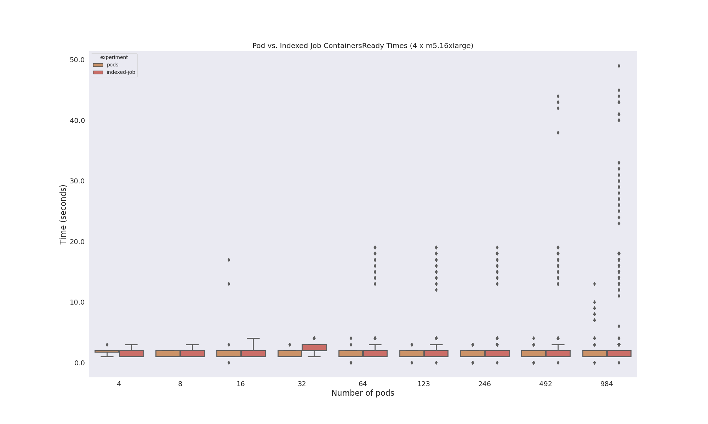
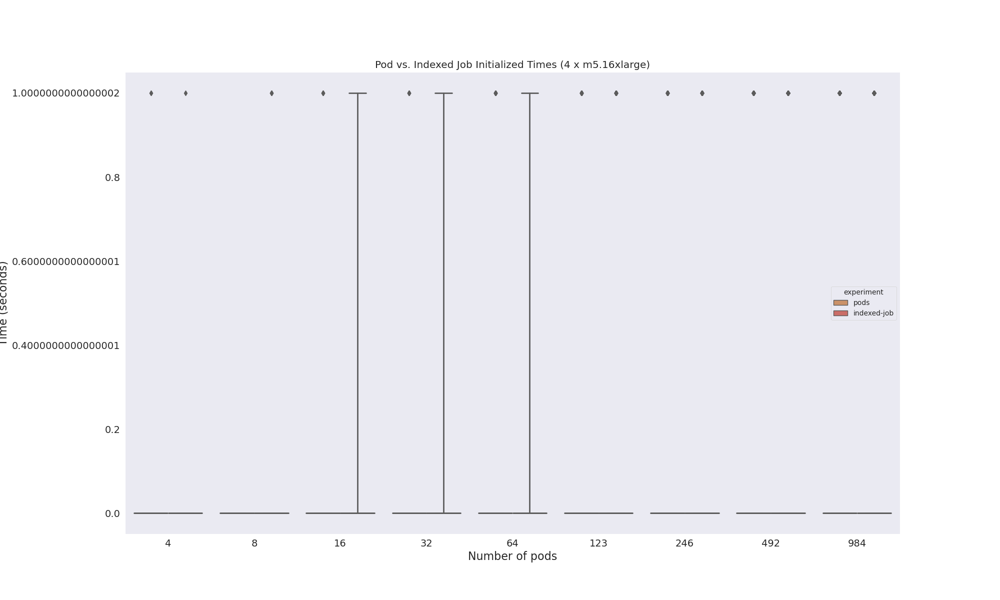
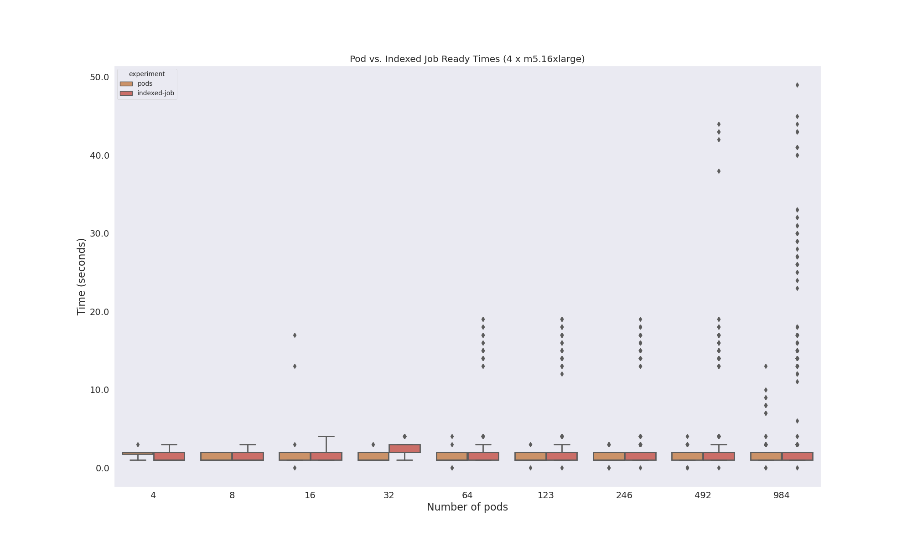
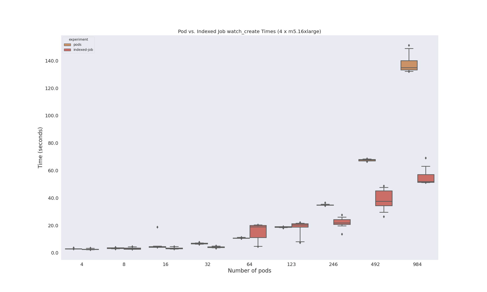
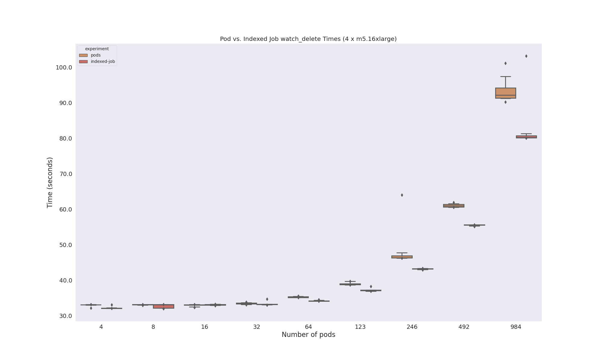

# Indexed Job Times

Here is the [pricing page](https://aws.amazon.com/ec2/pricing/on-demand/) and I'm interested in these instance type:

| Name | Cost/hour | On demand hourly rate | vCPU | Memory | Storage | Network Performance |
|------|-----------|-----------------------|------|--------|---------|---------------------|
|m5.16xlarge|	$3.072|	64	|256 GiB|	EBS Only|	20 Gigabit|

If I run 4 instances of this size it's $12.288/hour, and then:

- 6 hours: $73
- 12 hours: ~150
- 24 hours: ~295

I doubt it will take more than 6 so I'm going to proceed. 
The limits on [this page](https://github.com/aws/amazon-vpc-cni-k8s/blob/master/misc/eni-max-pods.txt) are wrong because we can only actually get 246 per node.

## Setup

### 1. Create Cluster

Create the cluster with eksctl.

```bash
time eksctl create cluster -f ./config/eksctl-config.yaml
```

- Cluster started going up at 6:18pm
- Cluster going down at: 10:30pm

<details>

<summary>Cluster creation logs</summary>

```console
```

</details>

```bash
mkdir -p ./data
kubectl get nodes -o yaml > ./data/nodes.yaml 
```

And setup your Python environment, and :

```
pip install -r requirements.txt
```

Apply the largest indexed job once just to ensure the busybox container is pulled (it's so small it's trivial but might as well not include it).

```bash
kubectl apply -f experiments/984/indexed-job.yaml
kubectl delete -f experiments/984/indexed-job.yaml
```

### 2. Create Experiments

We have templates and a script to generate the files. We will want to go up to 984.

```bash
python generate-size.py 4
python generate-size.py 8
python generate-size.py 16
python generate-size.py 32
python generate-size.py 64
python generate-size.py 123
python generate-size.py 246
python generate-size.py 492
python generate-size.py 984
```

### 3. Run Experiment

And then run a particular experiment, some number of times. Start with max pods and go down...

```bash
/bin/bash ./run.sh 984
/bin/bash ./run.sh 492
/bin/bash ./run.sh 246
/bin/bash ./run.sh 123
/bin/bash ./run.sh 64
/bin/bash ./run.sh 32
/bin/bash ./run.sh 16
/bin/bash ./run.sh 8
/bin/bash ./run.sh 4
```


### 4. Process Result Data

```bash
python analyze-results.py data/
```
### 5. Delete cluster

```bash
eksctl delete -f ./config/eksctl-config.yaml
```

Also check the console that everything is gone.

### 5. View Results

Here is an overview of times:

#### ContainersReady



#### Initialized



#### PodScheduled


#### Ready



#### Create Times (all)



#### Delete Times (all)



