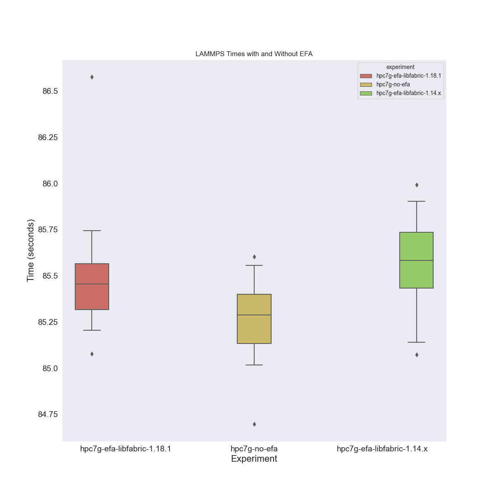

# Testing HPC7G with More Debug

This run will bring up one cluster for the new instance type to test with and without efa.
We are hoping to verify that it's working and see differences between the two!

 - For the new instance type hpc7g we use the container base built with arm ` ghcr.io/rse-ops/flux-arm-lammps:july-14-2023`
 - The container above uses spack 0.20.0 and has libfabric 0.18.1
 - All instructions are in this README, and config files / parsing scripts included for reproducibility.
 - I've updated to Kubernetes 1.27 because 1.23 is a bit old at this point.

- **Pricing** At the time of this writing, the cost for the hpc7g is ~$1.60/hour, so a cluster of size 8 will be $12.80/hour.

Note that the design here is different than our initial one that brought up a different MiniCluster each time.
For these runs, we are going to bring up ONE cluster and then run lammps jobs on it many times,
and then save the output from Flux. This is because we care more about the use
case of running the jobs (and less about bringing up the cluster, assuming that we generally
will bring up a cluster to run more than one job!)

Note that the new libfabric 1.18.1 did not work. An error log is [here](https://gist.github.com/vsoch/f8964a71165d9f8dad5da4772e23625e). 
I am going to test the previously working one (a much older version).

## TLDR:

 - Libfabric 1.18.1 did not work with spack 0.20.0, likely with newer components. An error log is [here](https://gist.github.com/vsoch/f8964a71165d9f8dad5da4772e23625e)
 - The build for spack 0.19.0 + libfabric 1.18.1 did work.
 - The variables `RDMAV_FORK_SAFE=1 and `FI_EFA_USE_DEVICE_RDMA=1` absolutely are required.
 - The overall setup was slower than the first times we tried it (typically ~85 seconds)
 - There was no visible difference between libfabric 1.18.x and 1.14.x
 - We can sanity check the efa device status with `fi_info -p efa` and verify it's there (or not)
 - Without efa (with newer libfabric) is FASTER! 
 - See [results](#results) for the wowza.

## Setup

Note that I am using the build of eksctl from [this branch](https://github.com/weaveworks/eksctl/pull/6743#pullrequestreview-1507361538)
that has the new nodes added, and a bugfix for the plugin adapter.
Also make sure you have awscli installed (`pip install awscli`). If you don't
have it (or it's not on the path) your cluster won't correctly create, and then
the EFA devices won't be found (because the eksctl tool did not complete correctly).

If you wind up building on a different machine and need to regenerate your kubetl connection,
you can run this command:
 
```bash
$ aws eks --region us-east-1 update-kubeconfig --name scaling-study-efa
```

It's a challenge that many of the AWS tools / SDKs don't actually interact well
with the `aws` command line client, but it is what it is!

## Usage

The following can be run for hpc7g.16xlarge. 

| Name         | Cores | Memory (GiB) | Network Bandwidth (Gbps) | Cluster Size      | Total Cores |
|--------------|-------|--------------|--------------------------|-------------------|-------------|
|hpc7g.16xlarge| 64    | 128          | Up to 200                | 12                | 768 (12*64) |


Here is how to create the hpc7g.16xlarge cluster (you should still be using the `eksctl` with the fix!)

```bash
$ ./bin/eksctl create cluster -f ./config/eks-config.yaml
```

Note that the number of nodes, and zones are different, and I tried [this](https://eksctl.io/announcements/nodegroup-override-announcement/)
to use a custom AMI. It did not work, so I made a [custom branch](https://github.com/weaveworks/eksctl/compare/main...researchapps:eksctl:add/hpc7g-node-arm-support?expand=1) 
to add support for the new instance type. Do a sanity check that efa is working:

```bash
$ kubectl logs -n kube-system aws-efa-k8s-device-plugin-daemonset-zdjs8
2023/07/15 18:40:55 Fetching EFA devices.
2023/07/15 18:40:55 device: rdmap0s6,uverbs0,/sys/class/infiniband_verbs/uverbs0,/sys/class/infiniband/rdmap0s6

2023/07/15 18:40:55 EFA Device list: [{rdmap0s6 uverbs0 /sys/class/infiniband_verbs/uverbs0 /sys/class/infiniband/rdmap0s6}]
2023/07/15 18:40:55 Starting FS watcher.
2023/07/15 18:40:55 Starting OS watcher.
2023/07/15 18:40:55 device: rdmap0s6,uverbs0,/sys/class/infiniband_verbs/uverbs0,/sys/class/infiniband/rdmap0s6

2023/07/15 18:40:55 Starting to serve on /var/lib/kubelet/device-plugins/aws-efa-device-plugin.sock
2023/07/15 18:40:55 Registered device plugin with Kubelet
```

### Install Flux Operator

Now let's install an arm version of the Flux Operator.

```bash
$ kubectl apply -f ./config/flux-operator-arm.yaml
```

This will create our size 12 cluster that we will be running LAMMPS on many times:

```bash
$ kubectl create namespace flux-operator
$ kubectl apply -f ./config/minicluster-libfabric-new.yaml # 18.1.1
```

### Save Metadata 

You'll want to wait until your pods are ready, and then save some metadata about both pods and nodes:

```bash
$ mkdir -p ./data
$ kubectl get nodes -o json > data/nodes.json
$ kubectl get -n flux-operator pods -o json > data/pods-libfabric-new.json
```

### Run Experiments

Then copy your run-experiments script into the lead broker pod:

```bash
POD=$(kubectl get pods -n flux-operator -o json | jq -r .items[0].metadata.name)

# This will copy configs / create directories for it
kubectl cp -n flux-operator ./scripts/run-experiments.py ${POD}:/home/flux/examples/reaxff/HNS/run-experiments.py -c flux-sample
```

and then shell in:

```bash
$ kubectl exec -it -n flux-operator ${POD} bash
```
You should be in the experiment directory.
Connect to the main broker (after all the spack stuff):

```bash
. /etc/profile.d/z10_spack_environment.sh 
cd /opt/spack-environment
. /opt/spack-environment/spack/share/spack/setup-env.sh
spack env activate .
cd /home/flux/examples/reaxff/HNS
# With EFA
sudo -u flux -E PYTHONPATH=$PYTHONPATH -E PATH=$PATH -E HOME=/home/flux -E FI_PROVIDER=efa -E OMPI_MCA_btl=self,ofi -E RDMAV_FORK_SAFE=1 -E FI_EFA_USE_DEVICE_RDMA=1 flux proxy local:///run/flux/local bash
```

Sanity check we have our resources (sometimes they might not be all ready right away, so wait)

```
 flux resource list
     STATE NNODES   NCORES NODELIST
      free     12      768 flux-sample-[0-11]
 allocated      0        0 
      down      0        0 
```

Let's write output to our home. This might be wonky because we don't have a shared filesystem.
Sanity check these variables are in the environment, and also test doing a `flux run env | grep <NAME>` to 
verify they will show up for a flux run.

```bash
# restricts to only efa as OFI option
export FI_PROVIDER=efa
export OMPI_MCA_btl=self,ofi
export RDMAV_FORK_SAFE=1
export FI_EFA_USE_DEVICE_RDMA=1
```

Double check that efa is there.

```bash
$ fi_info -p efa
```
```console
provider: efa
    fabric: efa
    domain: rdmap0s6-rdm
    version: 118.10
    type: FI_EP_RDM
    protocol: FI_PROTO_EFA
provider: efa
    fabric: efa
    domain: rdmap0s6-dgrm
    version: 118.10
    type: FI_EP_DGRAM
    protocol: FI_PROTO_EFA
```

What are the two components? Let's prepare a small test run. This will use flux submit,
and given that carries forward the current environment, it should work to use EFA (I think).

```bash
mkdir -p /home/flux/data
$ python3 ./run-experiments.py --outdir /home/flux/data/test-size-1 \
          --workdir /home/flux/examples/reaxff/HNS \
          --times 2 -N 12 --tasks 768 lmp -v x 1 -v y 1 -v z 1 -in in.reaxc.hns -nocite
```

And the actual run (20x) with the variables set that force efa

```bash
$ python3 ./run-experiments.py --outdir /home/flux/data/size-64-16-16-efa \
          --workdir /opt/lammps/examples/reaxff/HNS \
          --times 20 -N 12 --tasks 768 lmp -v x 64 -v y 16 -v z 16 -in in.reaxc.hns -nocite
```

The above times were slow - about 85 seconds. Let's also test removing the "you must use EFA" variables, just test runs. I was curious
if by removing these (one by one) it might get faster. First I tried changing this one:

```diff
- export OMPI_MCA_btl=self,ofi
+ export OMPI_MCA_btl=ofi
``
And the manual test run with this change. Note that it generated a pmix warning (which could be related) that we don't see with
the first version of the variable.

```bash
flux mini run -N 12 -n 768 -ompi=openmpi@5 -c 1 -o cpu-affinity=per-task -vvv lmp -v x 64 -v y 16 -v z 16 -in in.reaxc.hns -nocite
```
```console
1.161s: flux-shell[0]: stderr: flux-shell: unable to format log msg (pmix server %s %.*s): Resource temporarily unavailable
1.170s: flux-shell[2]: stderr: flux-shell: unable to format log msg (pmix server %s %.*s): Resource temporarily unavailable
```

This took still 85 seconds so I didn't test it in batch. Then I tried unsetting it entirely:

```bash
unset OMPI_MCA_btl
flux mini run -N 12 -n 768 -ompi=openmpi@5 -c 1 -o cpu-affinity=per-task -vvv lmp -v x 64 -v y 16 -v z 16 -in in.reaxc.hns -nocite
```

I saw the same error, and it was even slower, ~87 seconds. I didn't do further runs of this style.
Next, I unset the forced "use this efa provider"

```bash
unset FI_PROVIDER
flux mini run -N 12 -n 768 -ompi=openmpi@5 -c 1 -o cpu-affinity=per-task -vvv lmp -v x 64 -v y 16 -v z 16 -in in.reaxc.hns -nocite
```

I saw the same error, and it was again slow, ~86 seconds. 
When it's done running, you can copy the entire output directory from the pod to your local machine:

```bash
POD=$(kubectl get pods -n flux-operator -o json | jq -r .items[0].metadata.name)
kubectl cp -n flux-operator ${POD}:/home/flux/data ./data/hpc7g-efa-libfabric-1.18.1 -c flux-sample
```

### Libfabric Older Version

Next we want to exit, delete this minicluster, and create the (older) one with libfabric 1.14.x.

```bash
$ kubectl delete -f ./config/minicluster-libfabric-new.yaml # 1.18.1
$ kubectl apply -f ./config/minicluster-libfabric-old.yaml # 1.14.x
```

When they are running:

```bash
$ kubectl get -n flux-operator pods -o json > data/pods-libfabric-old.json
```

Next, do the same steps as above for [running experiments](#run-experiments).
Here is the output for the adapter.

```bash
$ fi_info -p efa
```
```console
provider: efa
    fabric: EFA-fe80::c3f:2fff:fe0f:8f39
    domain: rdmap0s6-rdm
    version: 114.0
    type: FI_EP_RDM
    protocol: FI_PROTO_EFA
provider: efa
    fabric: EFA-fe80::c3f:2fff:fe0f:8f39
    domain: rdmap0s6-dgrm
    version: 114.0
    type: FI_EP_DGRAM
    protocol: FI_PROTO_EFA
```


Next, outside the container, we want to delete the daemonset. This is going to essentially
remove the devices.


```bash
# restricts to only efa as OFI option
export FI_PROVIDER=efa
export OMPI_MCA_btl=self,ofi
export RDMAV_FORK_SAFE=1
export FI_EFA_USE_DEVICE_RDMA=1
```

Double check that efa is there.

```bash
$ fi_info -p efa
```
```console
provider: efa
    fabric: EFA-fe80::c05:54ff:fe5f:83d5
    domain: rdmap0s6-rdm
    version: 114.0
    type: FI_EP_RDM
    protocol: FI_PROTO_EFA
provider: efa
    fabric: EFA-fe80::c05:54ff:fe5f:83d5
    domain: rdmap0s6-dgrm
    version: 114.0
    type: FI_EP_DGRAM
    protocol: FI_PROTO_EFA
```

The experiment runs should look the same. I found they were also around ~85 seconds, so there doesn't seem to be significant difference
between the libfabric version. However this time, we are going to (after we do the same 20x test)
delete the daemonset outside the pod to disable efa. We want to sanity check that with / without the device is somehow different.
To delete the daemonset:

```bash
kubectl delete daemonset -n kube-system aws-efa-k8s-device-plugin-daemonset
```

It's weird that this command still works?

```bash
$ fi_info -p efa
```
```console
provider: efa
    fabric: EFA-fe80::c05:54ff:fe5f:83d5
    domain: rdmap0s6-rdm
    version: 114.0
    type: FI_EP_RDM
    protocol: FI_PROTO_EFA
provider: efa
    fabric: EFA-fe80::c05:54ff:fe5f:83d5
    domain: rdmap0s6-dgrm
    version: 114.0
    type: FI_EP_DGRAM
    protocol: FI_PROTO_EFA
```

I did a test run to verify that something that was previously there was no longer there.

```bash
flux mini run -N 12 -n 768 -ompi=openmpi@5 -c 1 -o cpu-affinity=per-task -vvv lmp -v x 64 -v y 16 -v z 16 -in in.reaxc.hns -nocite
```
That still took about 85 seconds. Then I unset everything.

```bash
unset FI_PROVIDER
unset OMPI_MCA_btl
```

Another test run.

```bash
flux mini run -N 12 -n 768 -ompi=openmpi@5 -c 1 -o cpu-affinity=per-task -vvv lmp -v x 64 -v y 16 -v z 16 -in in.reaxc.hns -nocite
```

That also took 85 seconds! It's not worth running that 20x again. I want to try creating a new MiniCluster without the annotation for efa.
Exit and save our data again.

```bash
POD=$(kubectl get pods -n flux-operator -o json | jq -r .items[0].metadata.name)
kubectl cp -n flux-operator ${POD}:/home/flux/data ./data/hpc7g-efa-libfabric-1.14.x -c flux-sample
```

### MiniCluster without EFA

This will be the final one! Delete and cleanup, and do everything again.

```bash
$ kubectl delete -f ./config/minicluster-libfabric-old.yaml # 1.14.x
$ kubectl apply -f ./config/minicluster-no-efa.yaml
```

When they are running:

```bash
$ kubectl get -n flux-operator pods -o json > data/pods-no-efa.json
```

Next, do the same steps as above for [running experiments](#run-experiments).
This should (finally) fail:

```bash
$ fi_info -p efa
```
```console
fi_getinfo: -61
```

I tried a test run:

```bash
flux mini run -N 12 -n 768 -ompi=openmpi@5 -c 1 -o cpu-affinity=per-task -vvv lmp -v x 64 -v y 16 -v z 16 -in in.reaxc.hns -nocite
```

without unsetting environment variables that forced using efa, and got a huge error dump! So that is good, lol.
Then I unset:

```bash
unset FI_PROVIDER
unset OMPI_MCA_btl
```

and tried again:

```bash
flux mini run -N 12 -n 768 -ompi=openmpi@5 -c 1 -o cpu-affinity=per-task -vvv lmp -v x 64 -v y 16 -v z 16 -in in.reaxc.hns -nocite
```

and this worked! So I then ran our same experiments for size 1 and 64.

```bash
mkdir -p /home/flux/data
python3 ./run-experiments.py --outdir /home/flux/data/test-size-1 \
          --workdir /home/flux/examples/reaxff/HNS \
          --times 2 -N 12 --tasks 768 lmp -v x 1 -v y 1 -v z 1 -in in.reaxc.hns -nocite

python3 ./run-experiments.py --outdir /home/flux/data/size-64-16-16-no-efa \
          --workdir /opt/lammps/examples/reaxff/HNS \
          --times 20 -N 12 --tasks 768 lmp -v x 64 -v y 16 -v z 16 -in in.reaxc.hns -nocite
```

Exit and save our data again.

```bash
POD=$(kubectl get pods -n flux-operator -o json | jq -r .items[0].metadata.name)
kubectl cp -n flux-operator ${POD}:/home/flux/data ./data/hpc7g-no-efa -c flux-sample
```


### Clean Up

Delete the cluster with eksctl

```bash
$ eksctl delete cluster -f ./config/eks-config.yaml 
```

## Results

Here is how to plot:

```bash
python scripts/plot-results.py ./data
```

And wow, the results look like without efa is the fastest? Lol!



That's a pretty fun result! 
