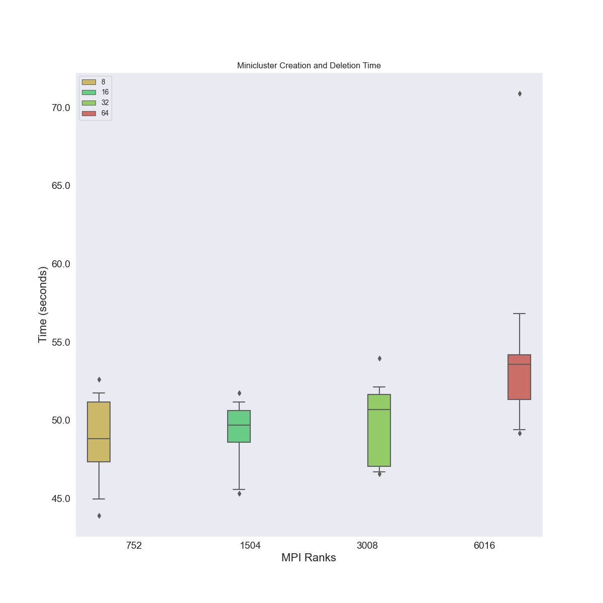
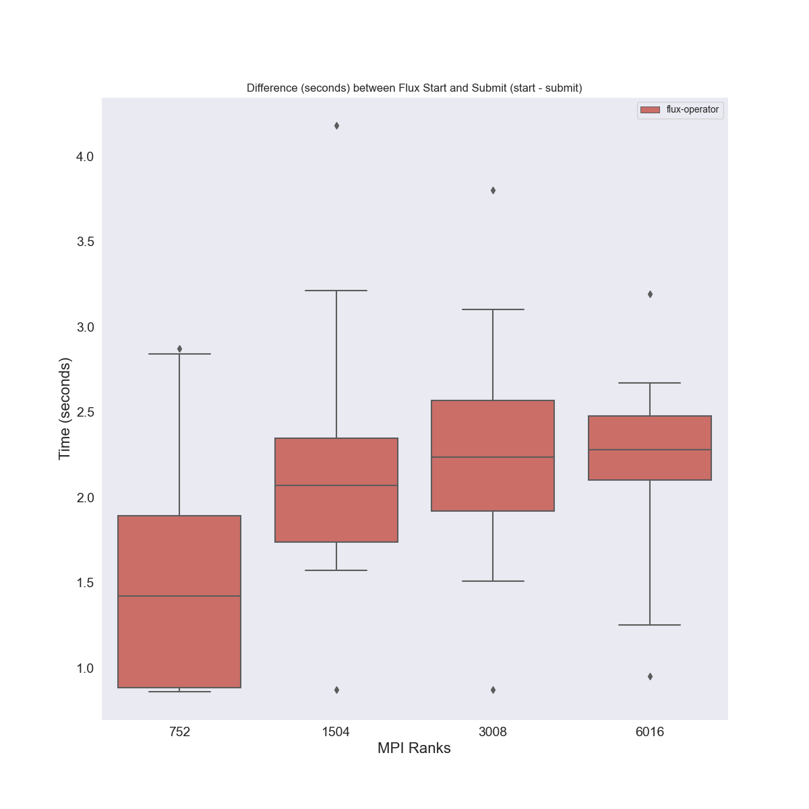
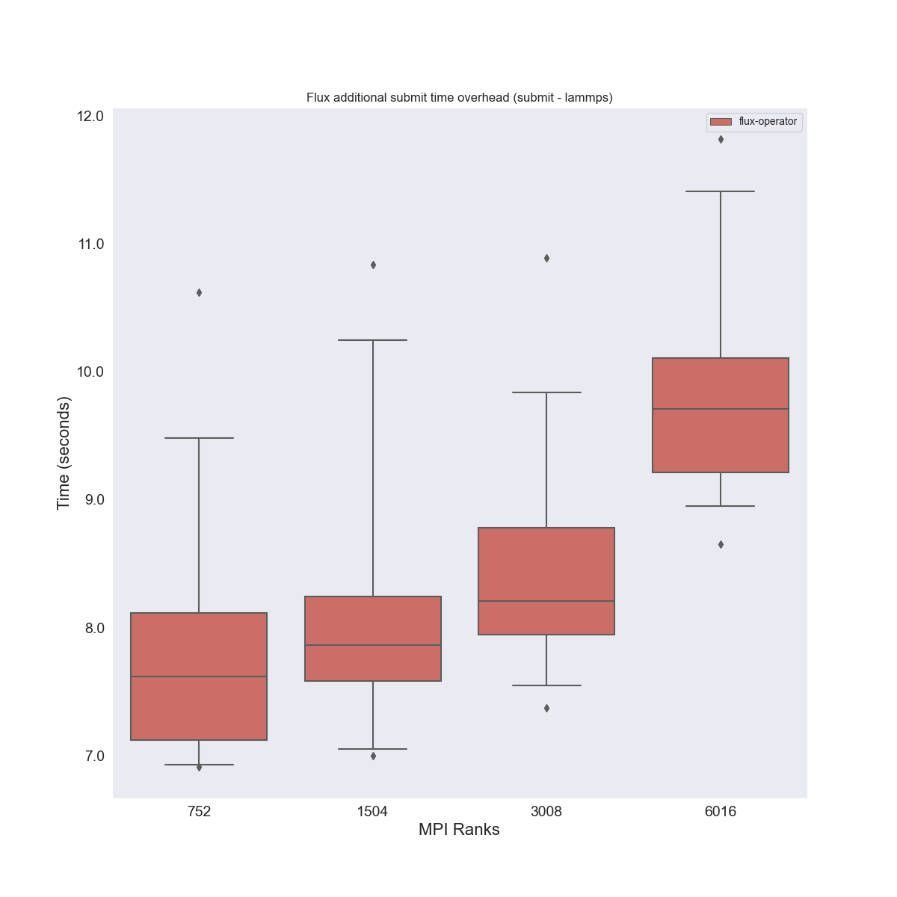
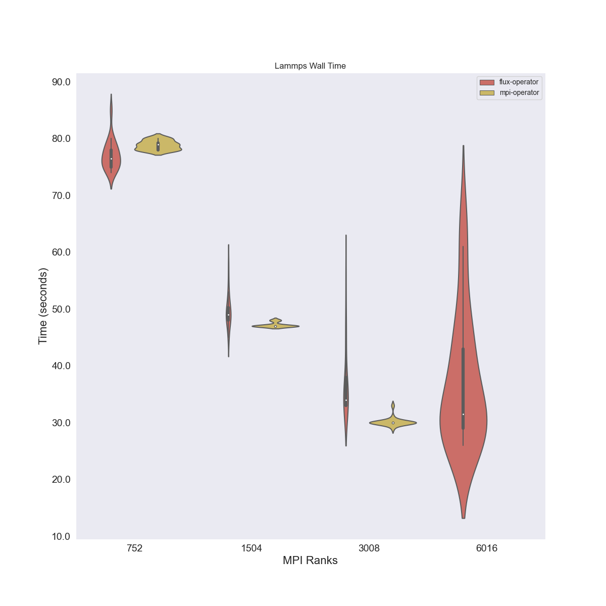

# Fixed EFA

The update to eksctl broke being able to create the efa pods [see this issue](https://github.com/weaveworks/eksctl/issues/6222).
So this experiment created the cluster, and grabbed the previous config as [efa-device-plugin.yaml](efa-device-plugin.yaml)
to create the containers and allow root. I had to clone eksctl, replace the plugin file with the one here, rebuild,
and use that binary. So this run includes all 4 cluster sizes, with efa, and more detailed flux timings.

## Results

These images were generated after creating the environment, generating the data, and then running the plots script, e.g.,

```bash
$ python -m venv env
$ source env/bin/activate
$ pip install -r requirements.txt
$ python process_lammps.py --meta data/aws/k8s-size-64-hpc6a.48xlarge/meta.json ./data/
$ python plot_results.py 
```
And move the images

```bash
$ mkdir -p img/
$ mv *.png img/
```

This plot shows MiniCluster creation / deletion times, they scale well:


 
Starting with flux start (1st) vs submit (2nd) (and note submit timing is new, for [run2](../run2) talk we only showed flux start). This time around the times we have are easily on average better than the MPI operator, but the variance is still much larger, especially with respect to the size 64 cluster.


The differences between start and submit aren't exact, but I like seeing that it seems to have some kind of upper limit (at least for these sizes):



The "overhead" time of running flux (flux submit - lammps):



And finally, for LAMMPS itself, this one is weird - we do better at size 8, a little worst at 16/32, but then the median of 64 is actually better than our median of 32?




## Initial impressions:

- Flux (hence the Operator) is faster at bootstrapping MPI than rsh/ssh tree based bootstrap in OpenMPI as evidenced by “flux submit vs mpirun.” Especially since there are more steps involved with flux 
submit, and the LAMMPS wall time is greater with the Operator
- LAMMPS median wall time differences are easily explained by CPU optimizations with the MPI Operator container
- The LAMMPS wall time heteroscedasticity of the Flux Operator could be that sometimes multiple MPI ranks are running on a single core. If that mapping is random there would be a greater number of oversubscription incidents with a larger number of MPI ranks which would further increase wall time. You could try adding -c 1 -o cpu-affinity=per-task
- It may also be good to compare against the MPI Operator at 64 instances and 6016 ranks to make sure the behavior at that size isn’t due to AWS/EKS (I don’t think it’s likely)


For next steps we will try adding the flag `-c 1 -o cpu-affinity=per-task` see [run5](../run5).
