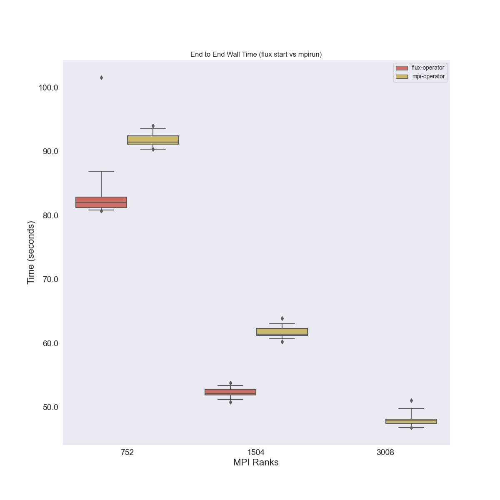
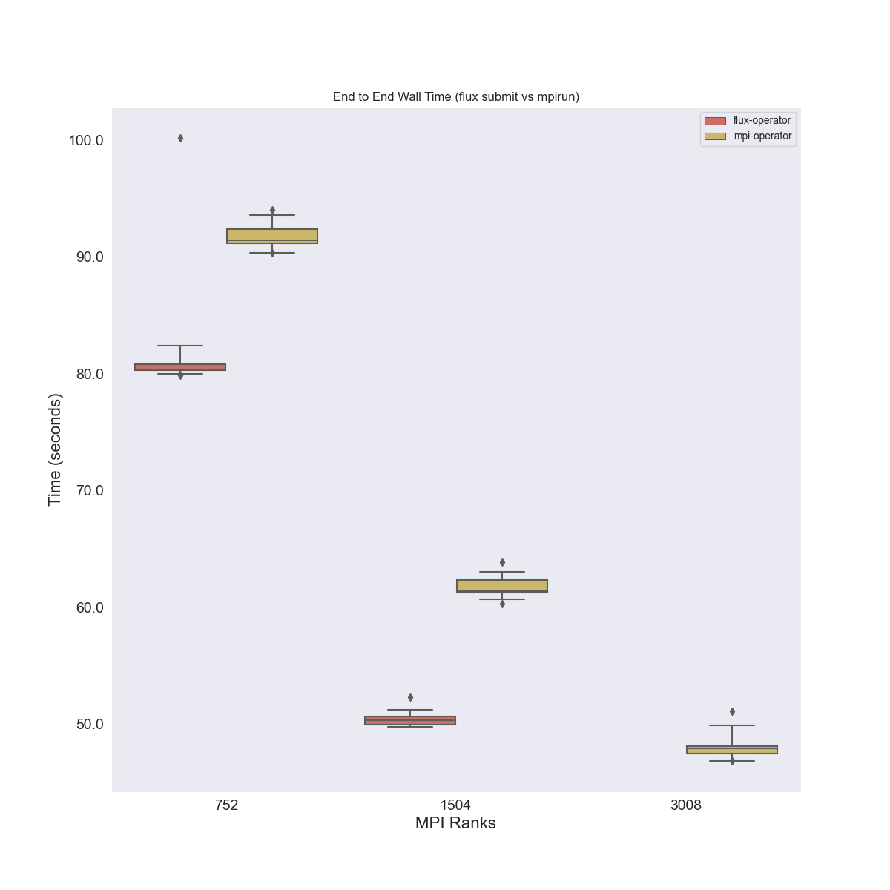
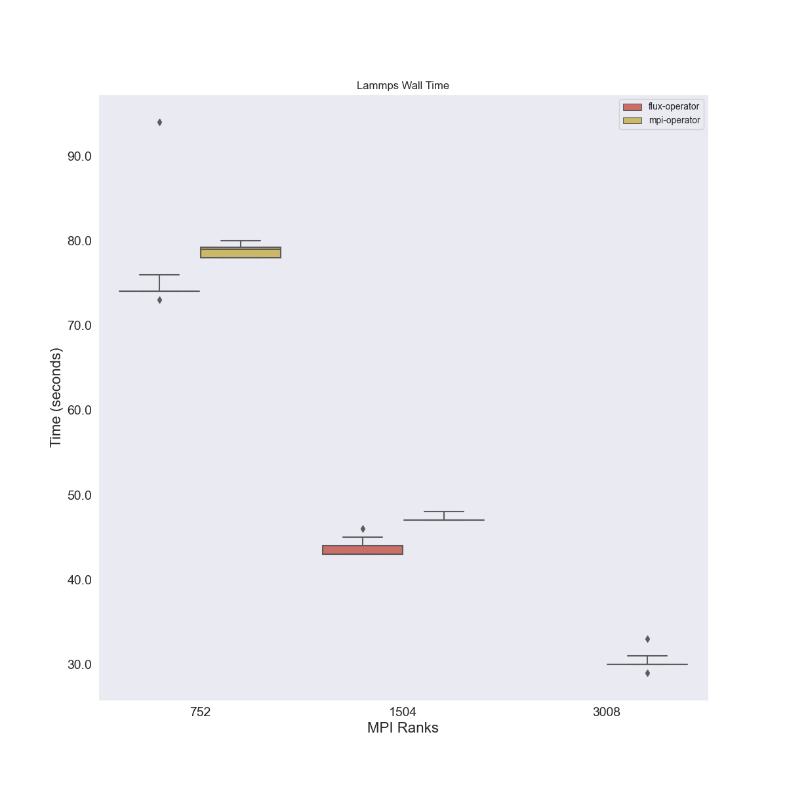

# Testing Additional Flag

For these runs we want to see if the variance in times changes if we have the full
following option flags:

```
-ompi=openmpi@5 -c 1 -o cpu-affinity=per-task
```

## Results

These images were generated after creating the environment, generating the data, and then running the plots script, e.g.,

```bash
$ python -m venv env
$ source env/bin/activate
$ pip install -r requirements.txt
$ python process_lammps.py --meta data/aws/k8s-size-16-hpc6a.48xlarge/meta.json ./data/
$ python plot_results.py 
```

And then move into img

```bash
$ mkdir -p img
$ mv *.png img/
```

This is an amazing result! We only did two smaller cluster sizes, but we show that
the unoptimized container running in the Flux Operator is now faster than the optimized container 
with the MPI Operator. The variability is also much reduced from before with our new flag!




There was only one outlier for the size 8 cluster. And for the lammps total time.


