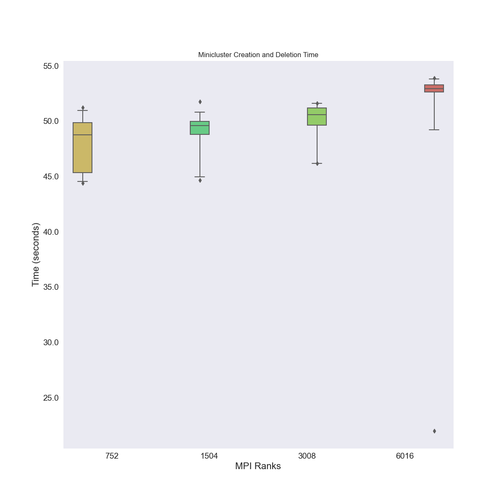
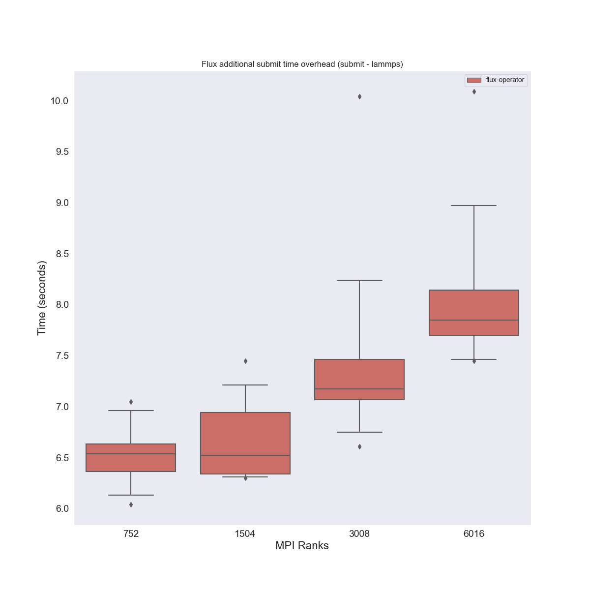
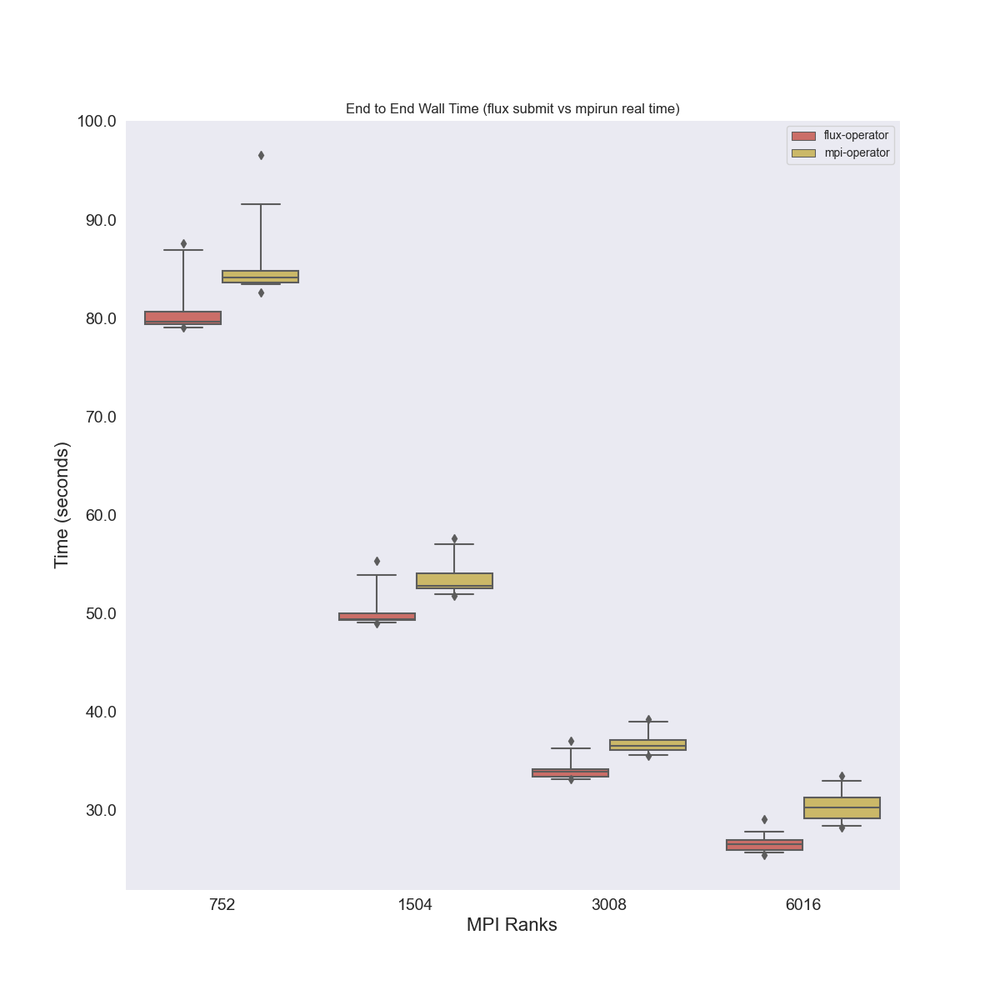
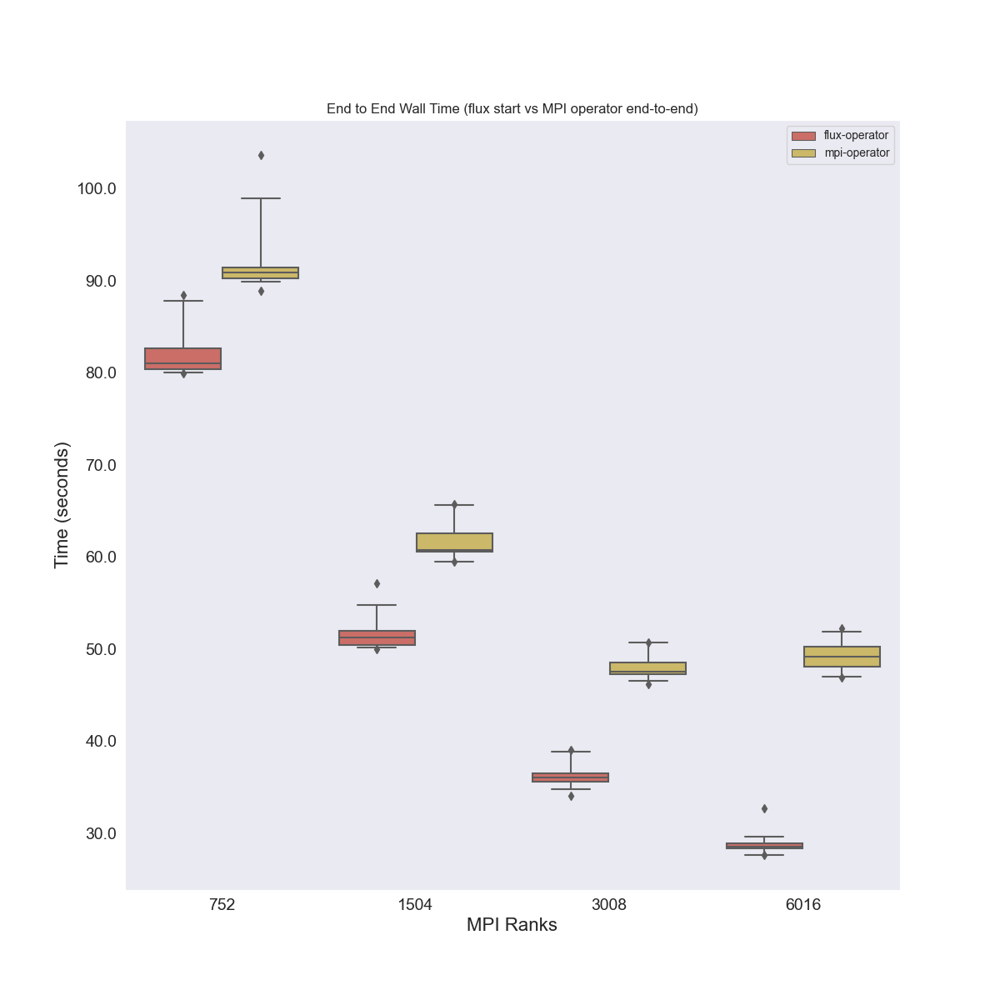

# Adding MPI Operator

This run will bring up one cluster that will run both the MPI operator
and Flux operator, that way we can compare the two fairly. Since we won't
add the mpi-operator to flux-cloud, we will run the creation commands manually.
High level notes:

 - We use the same (unoptimzied) container for both `ghcr.io/rse-ops/spack-ubuntu-libfabric-ssh:ubuntu-20.04`
 - The MPI Operator requires a node just for a launcher, so we need a size 65 cluster for each of 64, 32, 16, and 8 runs
 - The MPI Operator yaml included here references a container that we built with a change/fix.
 - All experiments (for different sizes) are run on the exact same kubernetes cluster
 - All instructions are in this README, and config files / parsing scripts included for reproducibility.

## Usage

### MPI Operator Experiments

First (after exporting your AWS credentials to the environment) create the cluster that will be used by the Flux Operator and MPI
Operator.

```bash
$ eksctl create cluster -f ./scripts/kube_setup/eks-efa-cluster-config.yaml
```

You'll need [the amazon command line client](https://aws.amazon.com/cli/) and [eksctl](https://eksctl.io/).
Be weary of [this bug](https://github.com/weaveworks/eksctl/issues/6222) (I had to compile my own eksctl with the fixed config).
Next, install the mpi-operator.

```bash
$ kubectl create -f ./scripts/kube_setup/mpi-operator.yaml
```
Note that this yaml file references the MPI Operator container built with our improvements that fix race conditions.
We need to tweak the aws-efa-k8s-* pods to have a tolerance so they don't scheduler jobs. These pods are created
[by eksctl](https://github.com/weaveworks/eksctl/blob/9e0d41a8ee48d3a9ff7137dbd2aa706ac23c0bb9/pkg/addons/assets/efa-device-plugin.yaml#L5) so we are just updating them.

```bash
$ kubectl apply -f ./scripts/kube_setup/efa-device-plugin.yaml 
```

This daemonset makes the devices available to EKS pods, and we start on all nodes (including the launcher).
Next, apply a taint to worker nodes which corresponds to the toleration set in each worker pod manifest. This forces the launcher pods to run only on the launcher node(s).

```bash
$ /bin/bash ./scripts/taint_workers.sh
```

Next, let's install what we need to run experiments! This will install deps for the MPI operator and Flux operator (flux-cloud)

```bash
$ python -m venv env
$ source env/bin/activate
$ pip3 install -r requirements.txt
```

The directory [mpi-operator](mpi-operator) has scripts and config files to run experiments.

```bash
$ cd mpi-operator
```

The file `app-experiment-config.json` should just have lammps, and has all the sizes of experiments. We need the number of nodes +1 for the launcher.

Use it from the mpi-operator directory to run the experiment:

```bash
$ mkdir -p logs
$ python ./run_experiments.py --app_config ./app-experiment-config.json --node_cpu 94 --node_mem 340 --num_runs 20 --cluster_log cluster.log
```

**Note**: You should have a way to pull the containers to the nodes first, either via ssh, or via messing up experiments and re-creating everything (but having the containers pulled, possibly a more expensive way to go about it!)

You likely want to do the number of runs to correspond with the number the flux operator is doing (1 for testing, eventually 20).
Depending on the size of your cluster and available nodes configuration, these parameters need to change.

Clean up the mpi operator to prepare for the Flux Operator experiments (and note we do not bring down the cluster, we will
use the same cluster).

```bash
$ cd ../
$ kubectl delete -f ./scripts/kube_setup/mpi-operator.yaml
```

Note that we need to remove the taint on the workers.

```bash
$ /bin/bash ./scripts/untaint_workers.sh
```

I like to do one final sanity check that everything is cleaned up:

```bash
$ kubectl get pods
No resources found in default namespace.

$ kubectl get pods -n mpi-operator
No resources found in mpi-operator namespace.
```

### Flux Operator Experiments

Now install the flux operator!

```bash
$ kubectl apply -f ./scripts/kube_setup/flux-operator.yaml
```

The cluster is already up, so let's just run the jobs.

```bash
$ flux-cloud --debug apply --cloud aws
```

And that's it! See how much easier the flux operator is? If we used flux-cloud up/down we wouldn't need to manually run the up/down either!

### Clean Up

Delete the cluster with eksctl

```bash
$ eksctl delete cluster -f ./scripts/kube_setup/eks-efa-cluster-config.yaml
```

### Analysis

The analysis works as follows

 1. We parse the results from the mpi-operator and save to mpi_operator_results.json
 2. We do the same for the Flux operator, and include the MPI operator results for comparison.
 
To do step 1:

```bash
$ cd mpi-operator
$ python process_lammps_canopie22.py --output-dir ./logs --plotname lammps 
```

This will generate [mpi-operator/mpi_operator_results.json](mpi-operator/mpi_operator_results.json).
Next, cd up one level and add these results to the Flux Operator data runs:

```bash
$ cd ..
```

And your same environment should still be sourced! First, process the Flux Operator results:

```bash
$ python process_lammps.py --meta data/aws/k8s-size-65-hpc6a.48xlarge/meta.json ./data/
```

This will generate [results.json](results.json) that has compiled Flux Operator results!
Then plot results, ensuring you point to the MPI operator results to be included.

```bash
$ mkdir -p img/
$ python plot_results.py results.json --mpi-operator ./mpi-operator/mpi_operator_results.json --outdir ./img
```

### Results

And here are the resulting images! 

#### Flux Operator Metrics

##### MiniCluster Scaling

First, we can see that the Flux Operator scaled well with respect
to bringing up a MiniCluster across cluster sizes:



##### Flux Start vs. Flux Submit

We are interested to see if flux start (which would wrap flux submit) scales
well, or is otherwise very different. Akin to previous results, we see that
the difference never goes over three seconds.


You can think of this as one type of Flux overhead - the flux start needs to
orchestrate the workers and running the job.

##### Flux Submit vs. Lammps

We next want to see how Flux Submit compares to the runtime of lammps.
We see that as the cluster gets larger, the difference is greater, meaning
that the submit also adds some overhead as we are scaling.



#### Flux Operator vs MPI Operator

Now for the fun plots! We can compare how the Flux Operator vs. the MPI
Operator run lammps.

##### Flux Submit vs. MPIrun real time

We record the `real` time of the mpirun command, and we compare this with flux submit.



##### End to End Walltime Running Lammps

This is the most fair comparison we can do, as the same container ran the same lammps
job on both operators!


It looks like the Flux Operator is a bit faster! Awesome :)

#### Likely Not Comparable

##### Flux Start vs MPI Operator end-to-end time

We place this plot last because we don't think the times are fair to compare. The reasons being:

 - `flux start` by the broker is run whenever the broker happens to come up, and it waits for the other pods. The MPI operator "end to end" time starts when the MPI operator log gets the first message about the job, and finishes when the MPIJob transitions to "MPIJobSucceeded" state. This means that the MPI operator log time does not include time for the pods to come up, because the launcher doesn't go up (to send the message about the job) until all the pods are created.
 - on the tail end, `flux start` finishes after the worker pods are cleaned up, which likely is after the "MPIJobSucceeded" state. It's really hard to compare given the different designs, so we suggest to the reader not to compare them!
  
However, the one interesting part about this plot is that, whatever the MPI Operator is doing,
it seems to level out (time wise) as we scale up, meaning that it either will have some asymptote for
a time, or could even reverse and go the other way (e.g., take much longer for this step as the size
of the cluster increases).



It's hard to tell without running a larger size! But this is interesting, because
in previous experiments we didn't get large enough to see this pattern.
