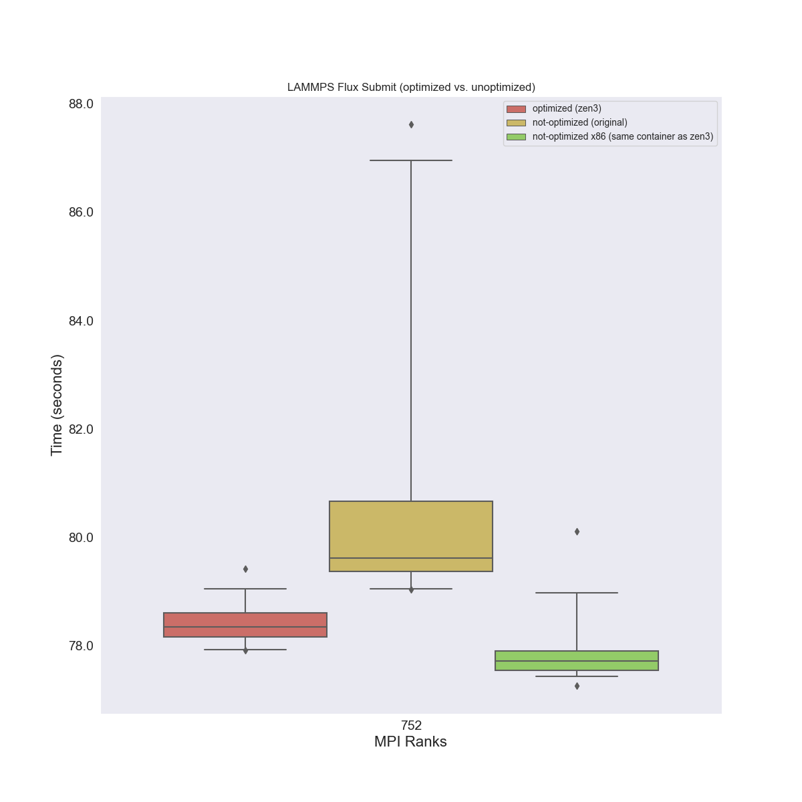

# Testing Optimized Build on x86

We saw pretty bad results for our [test-optimized](../test-optimized) experiment,
so this set aims to use the same container (e.g., with hwloc and OS versions changed)
but without zen3.


```bash
$ pip install flux-cloud[all]
```
```bash
$ flux-cloud --version
0.1.18
```

Bring up the cluster

```bash
$ flux-cloud --debug up --cloud aws
```

Once the cluster is up, run the experiments:

```bash
$ flux-cloud --debug apply --cloud aws
```

We do 21 runs on a size 8 cluster, and we do 21 because the first run needs to
pull the images. When they finish, bring down the cluster.

```bash
$ flux-cloud --debug down --cloud aws
```

Rename the first run so it is not included (this included container pulling)

```bash
$ mv data/aws/k8s-size-8-hpc6a.48xlarge/lmp-8-1-minicluster-size-8/ data/aws/k8s-size-8-hpc6a.48xlarge/_lmp-8-1-minicluster-size-8/
```

And now we can process this new data into a [results.json](results.json):

```bash
$ python process_lammps.py --meta data/aws/k8s-size-8-hpc6a.48xlarge/meta.json ./data/
```

This will generate [results.json](results.json) that has Flux Operator results for this
size 8 cluster. Note we've copied the [unoptimized-results.json](unoptimized-results.json) from
[run6](../kubecon/run6) and the [zen3 results](optimized-zen3-results.json) from [test-optimized](../test-optimized) Then plot results:

```bash
$ mkdir -p img/
                         # zen 3 build that was slow             # same container, but x86      # original unoptimized
$ python plot_results.py --optimized optimized-zen3-results.json --results results.json --non-optimized unoptimized-results.json --outdir ./img
```

## Results

We can then compare times across the optimized vs. unoptimized





Weird.
