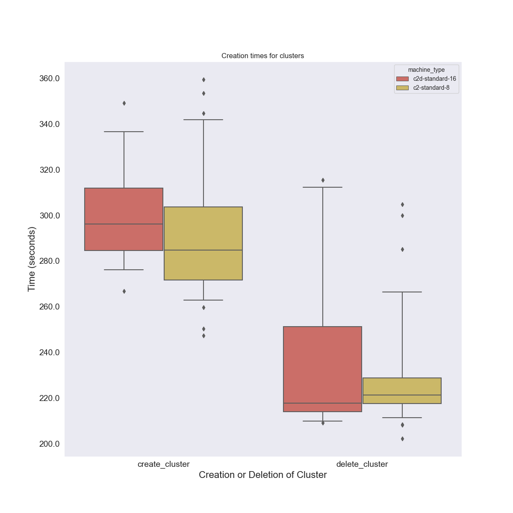
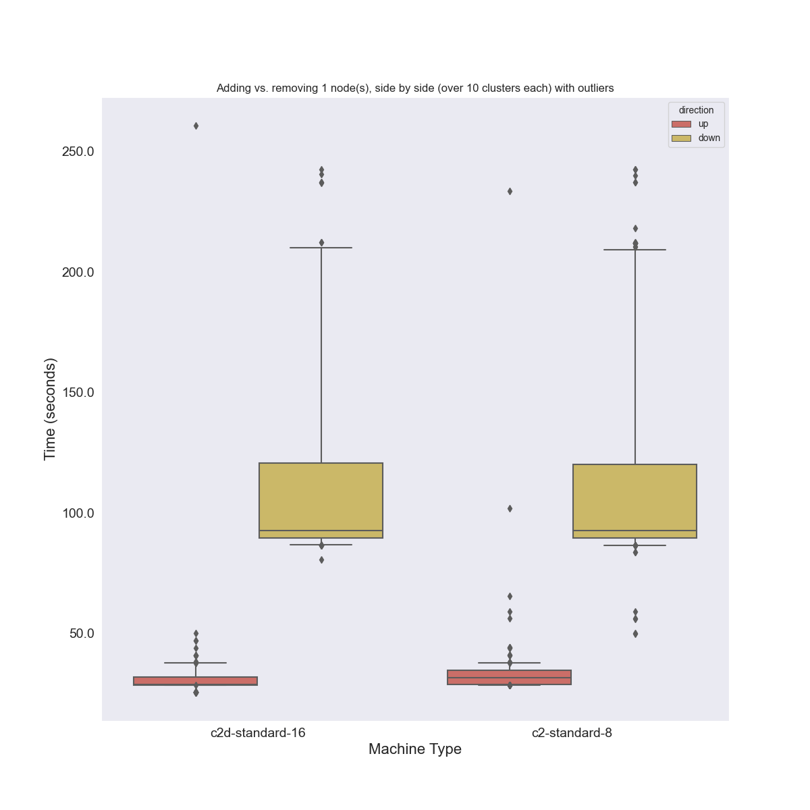
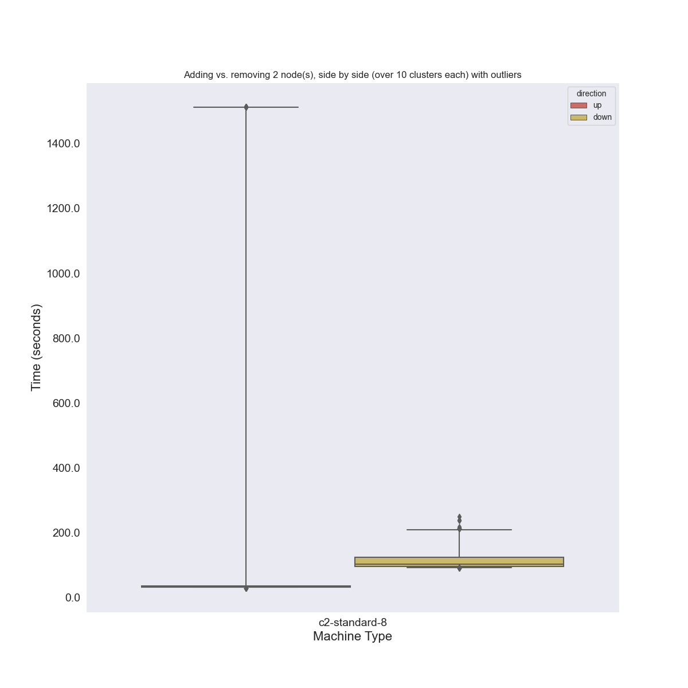
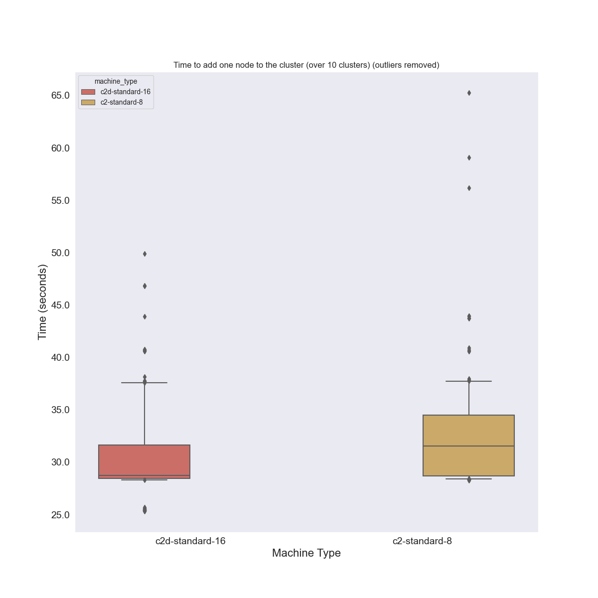
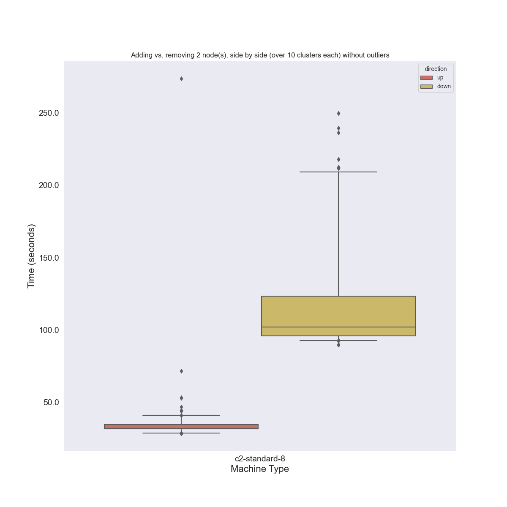
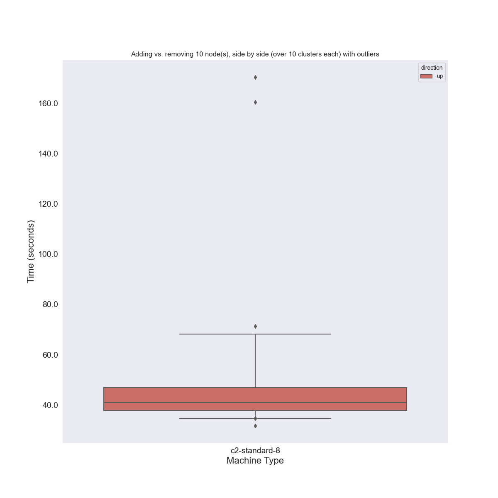

## Google GKE Autoscaling

> Understanding small autoscales on GKE

Our goal is ultimately to try to control both a GKE cluster scaling and a Flux OperatorMiniCluster scaling from the same
script. However, before we do that I want to better understand how long it takes to change the size of a GKE cluster,
and that's it. For this first experiment I'll look at cluster creation, deletion, and increasing/decreasing by each
of 1 and 2 nodes.

The longer term vision is to have a controller for both in the same script, and then 
theoretically, some other algorithm (that is smarter than my manual calls) can do it too.
See the [elasticity page](https://flux-framework.org/flux-operator/tutorials/elasticity.html) for early work
on elasticity in the Floux Operator.

Note that the main scripts that wil be continued to be worked on (e.g., [fluxcluster.py](fluxcluster.py) will
be kept alongside the operator, but the versions that were used for these experiments are kept here for
reproducibility.

### Dependencies

We will need the google cloud APIs

```bash
$ python -m venv env
$ source env/bin/activate
# https://github.com/googleapis/python-container
$ pip install google-cloud-container
```

### Experiments

All experiments use the shared class in [fluxcluster.py](fluxcluster.py)

#### Scaling Up

For the first experiment, I wanted to test the time that it takes a cluster to scale up,
and by only one or two nodes. The default script scales up by one for c2-standard-8, 
so we only need to specify a `--machine-type` if we change that.

```bash
# Test scale up in increments of 1 (up to 32) for c2-standard-8 (the default)
$ python test-scale.py --increment 1 flux-cluster

# Test scale up in increments of 2 (up to 64)
$ python test-scale.py --increment 2 flux-cluster

# Test scale up increments of 1 with a larger maching, also up to 32 (default)
$ python test-scale.py c2d-flux-cluster --machine-type-memory-gb 64 --machine-type-vcpu 16 --machine-type c2d-standard-16

# Try a larger increment up to scale (in case it's different from one node) 1,11,21,31,41,51
$ python test-scale.py --increment 10 flux-cluster --max-node-count 51
```

#### Scaling Down

And then scaling down! The same logic for the most part.

```bash
$ python test-scale.py --increment 1 flux-cluster --down

# Test scale up in increments of 2 (up to 64)
$ python test-scale.py --increment 2 flux-cluster --down

# Test scale down in increments of 1 with a larger maching, also up to 32 (default)
$ python test-scale.py c2d-flux-cluster --machine-type-memory-gb 64 --machine-type-vcpu 16 --machine-type c2d-standard-16 --down
```

Note that I did these runs as I was developing the scripts.

### Process

Compile the data and make some plots!

```bash
# Generate results.json
$ python process.py ./data
$ python plot_results.py ./results.json
```

### Results

For each of these plots, each bar is typically a set of 10 runs, where each run
is an entire cluster brought up and down, and within that run we add/remove nodes
from 0...N or N...0. What we haven't looked at here (and can) is if the timing changes
based on the "index" - e.g., does adding the 20th node go slower than adding the second?

#### Cluster Deletion / Creation Times

I was interested to time creation and deletion. I learned:

 - creation is relatively slower than deletion (maybe by a factor of 1.5 or 80 seconds?)
 - larger instances seem to take a longer time (is this logical?)




#### Adding vs Removing One Node

When we add or remove one node, we see that:

 - Removing a node ("down") is slower than adding a new one (maybe 4x slower - why?)
 - There is a lot more variation in bringing them down.
 
Likely for flux this is an OK pattern, because as soon as a node starts to go offline, Flux registers it as
offline. In other words, we don't need to wait for it to be totallly down to continue. On the flip side,
we do need a node to be entirely up to use it! For this plot, there was no outliers. 



I also did the above two separately because just for closer inspection:

#### Adding vs Removing Two Nodes

I saw a similar pattern with adding/removing two nodes, although I did see an outlier:






We can remove it to see a similar pattern:



It's slower to remove "down" two nodes. I would be interested to know if this pattern continues
with N nodes. When does the time to add or remove nodes start to scale so it takes a LOT longer?
The reason this plot is smaller is because I didn't run it for c2d-standard-16.
 
#### Adding vs Removing 10 Nodes

For funsies, although I wasn't planning on doing this, I decided to look at adding 
10 nodes at a time.



I didn't get to multiple instance types, or even removing nodes (I guess I got tired at the end of the
day). This is interesting because note that 40 seconds is quite a bit slower than approximately 25 that I saw before. 
So I think when we plan new experiments we want to test these larger batches, and for different instance types.


## Next Steps

I wrote the automation for these in just a few hours and planned very quickly,
and I think we would likely want to (as a group):

1. Go over the automation steps that I came up with for autoscaling. E.g., it's a bunch of rpc calls and I want to check the configs / parameters I chose (links are in the main script).
2. Then decide on a more proper and planned set of experiments :)


