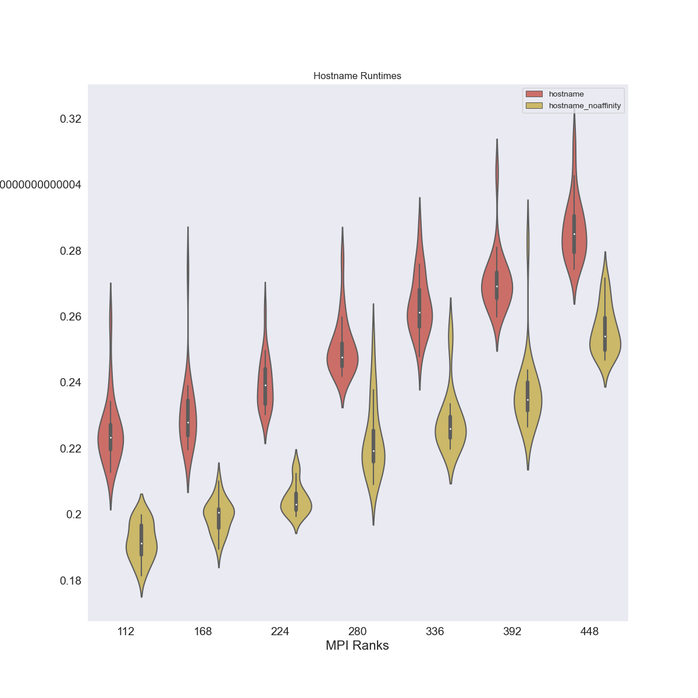

# Hello World Flux Operator

> These experiments were run on May 14, 2023 on GKE

We stepped back after [lammps](../lammps) had issues and decided to do some basic
tests on just the operator, and with hostname and lammps. The differences:

 - adding a basic hostname to run across ranks
 - removing the clouddns networking, adding `--enable-gvnic`

The total time to bring up the cluster, run experiments and write these docs, was about
an hour.

## Run Experiments

These are the experiments we ran on a size 8 cluster, c2-highmem-112 instances:

| name | vCPU | cores | memory GB | Notes |
|------|------|-------|------------|-----|
|c2d-standard-112 | 112 | 56 | 	448 | Didn't work well |


### Setup Flux Operator

I tried to mimic the [advice from this post](https://cloud.google.com/compute/docs/instances/create-hpc-vm#configure_your_hpc_vm_according_to_best_practices) for "best practices" and used `--enable-gvnic`

```bash
$ time gcloud container clusters create flux-operator  \
   --threads-per-core=1 --enable-gvnic \
   --placement-type COMPACT \
   --addons=GcpFilestoreCsiDriver \
   --region=us-central1-a --project $GOOGLE_PROJECT \
   --machine-type c2d-standard-112 --num-nodes=8 \
   --tags=flux-cluster

$ gcloud container clusters get-credentials flux-operator --zone us-central1-a --project $GOOGLE_PROJECT
$ kubectl create clusterrolebinding cluster-admin-binding --clusterrole cluster-admin --user $(gcloud config get-value core/account)
```

The time for creation:

```
real	4m27.793s
user	0m3.277s
sys	0m0.229s
```

I chose the one size (8) that worked previously, and we could easily see if there was any improvement
in performance. We could infer improvement means we could try a larger size. I also removed the extra flag for intra node visibilility. 
Then we install the operator. This was the current latest version, but a hash so we can
reproduce later if needed.

```bash
$ kubectl create namespace flux-operator
$ kubectl apply -f operator/flux-operator.yaml
```

Create the persistent volume claim for filestore:

```bash
$ kubectl apply -f operator/pvc.yaml
```

And check on the status:

```bash
$ kubectl get -n flux-operator pvc
NAME   STATUS    VOLUME   CAPACITY   ACCESS MODES   STORAGECLASS   AGE
data   Pending                                      standard-rwx   6s
```

It will be pending under we make a request to use it! 

### Lammps and Hostname

Let's run the same basic tests with LAMMPS again, and we will also look at the hostname here.
This creates the MiniCluster:

```bash
$ kubectl apply -f operator/minicluster-8-lammps.yaml
```

I found this confusing because at first they were all pending, and there was an error message about
insufficient cpu/memory. But then I waited - and they started to pop into "ContainerCreating" state
around 3 minutes, and then shortly after (when the container image was pulled) into "Running." 
I added a sleep of 1 minute to the worker pre command to ensure they started after the broker.

So wait until you see all the pods running, and verify that the flux-sample-0-xxx has a full quorum
by looking at the log for flux-sample-0-xxxx. You'll then want to copy the experiments file over

```bash
$ kubectl cp ./run-experiments.py flux-operator/flux-sample-0-xxx:/home/flux/run-experiments.py
```

...shell in and connect to the broker:

```bash
$ kubectl exec -it -n flux-operator flux-sample-0-xxxx -- bash
$ sudo -u flux -E HOME=/home/flux -E PATH=$PATH -E PYTHONPATH=$PYTHONPATH flux proxy local:///run/flux/local bash
```

And since we have flux installed under spack, we need a few special commands.

```bash
source /etc/profile.d/z10_spack_environment.sh
. /etc/profile.d/z10_spack_environment.sh 
cd /opt/spack-environment
. /opt/spack-environment/spack/share/spack/setup-env.sh
spack env activate .
cd /opt/lammps/examples/reaxff/HNS
```

Now you can proceed to the following sections to run experiments. We are going to add a test of 
just a simple hostname (to get timings) across nodes along with our original lammps to see if
the networking specification changed anything.

#### Hostname

Now let's run basic experiments to ping hostname on different size instances. For each of nodes 2,4,8:

```bash
export outdir=/workflow
sudo cp /home/flux/run-experiments.py /workflow/run-experiments.py

# Size 8
flux alloc -N 8 /bin/bash
nodes=8

# All flags
sudo mkdir -p ${outdir}/data/size_${nodes}_hostname
sudo chown ${USER} ${outdir}/data/size_${nodes}_hostname
python3 /workflow/run-experiments.py --workdir /home/flux --tasks 448 --times 20 -N ${nodes} hostname --outdir $outdir/data/size_${nodes}_hostname --identifier lammps-${nodes}

# No CPU Affinity
sudo mkdir -p ${outdir}/data/size_${nodes}_hostname_noaffinity
sudo chown ${USER} ${outdir}/data/size_${nodes}_hostname_noaffinity
python3 /workflow/run-experiments.py --workdir /home/flux --tasks 448 --times 20 -N ${nodes} hostname --outdir $outdir/data/size_${nodes}_hostname_noaffinity --identifier lammps-${nodes} --no-cpu-affinity
exit

# Size 7
flux alloc -N 7 /bin/bash
nodes=7

# All flags
sudo mkdir -p ${outdir}/data/size_${nodes}_hostname
sudo chown ${USER} ${outdir}/data/size_${nodes}_hostname
python3 /workflow/run-experiments.py --workdir /home/flux --tasks 392 --times 20 -N ${nodes} hostname --outdir $outdir/data/size_${nodes}_hostname --identifier lammps-${nodes}

# No CPU Affinity
sudo mkdir -p ${outdir}/data/size_${nodes}_hostname_noaffinity
sudo chown ${USER} ${outdir}/data/size_${nodes}_hostname_noaffinity
python3 /workflow/run-experiments.py --workdir /home/flux --tasks 392 --times 20 -N ${nodes} hostname --outdir $outdir/data/size_${nodes}_hostname_noaffinity --identifier lammps-${nodes} --no-cpu-affinity
exit

# Size 6
flux alloc -N 6 /bin/bash
nodes=6

# All flags
sudo mkdir -p ${outdir}/data/size_${nodes}_hostname
sudo chown ${USER} ${outdir}/data/size_${nodes}_hostname
python3 /workflow/run-experiments.py --workdir /home/flux --tasks 336 --times 20 -N ${nodes} hostname --outdir $outdir/data/size_${nodes}_hostname --identifier lammps-${nodes}

# No CPU Affinity
sudo mkdir -p ${outdir}/data/size_${nodes}_hostname_noaffinity
sudo chown ${USER} ${outdir}/data/size_${nodes}_hostname_noaffinity
python3 /workflow/run-experiments.py --workdir /home/flux --tasks 336 --times 20 -N ${nodes} hostname --outdir $outdir/data/size_${nodes}_hostname_noaffinity --identifier lammps-${nodes} --no-cpu-affinity
exit

# Size 5
flux alloc -N 5 /bin/bash
nodes=5

# All flags
sudo mkdir -p ${outdir}/data/size_${nodes}_hostname
sudo chown ${USER} ${outdir}/data/size_${nodes}_hostname
python3 /workflow/run-experiments.py --workdir /home/flux --tasks 280 --times 20 -N ${nodes} hostname --outdir $outdir/data/size_${nodes}_hostname --identifier lammps-${nodes}

# No CPU Affinity
sudo mkdir -p ${outdir}/data/size_${nodes}_hostname_noaffinity
sudo chown ${USER} ${outdir}/data/size_${nodes}_hostname_noaffinity
python3 /workflow/run-experiments.py --workdir /home/flux --tasks 280 --times 20 -N ${nodes} hostname --outdir $outdir/data/size_${nodes}_hostname_noaffinity --identifier lammps-${nodes} --no-cpu-affinity
exit

# Size 4
flux alloc -N 4 /bin/bash
nodes=4
sudo mkdir -p ${outdir}/data/size_${nodes}_hostname
sudo chown ${USER} ${outdir}/data/size_${nodes}_hostname
python3 /workflow/run-experiments.py --workdir /home/flux --tasks 224 --times 20 -N ${nodes} hostname --outdir $outdir/data/size_${nodes}_hostname --identifier lammps-${nodes}

sudo mkdir -p ${outdir}/data/size_${nodes}_hostname_noaffinity
sudo chown ${USER} ${outdir}/data/size_${nodes}_hostname_noaffinity
python3 /workflow/run-experiments.py --workdir /home/flux --tasks 224 --times 20 -N ${nodes} hostname --outdir $outdir/data/size_${nodes}_hostname_noaffinity --identifier lammps-${nodes} --no-cpu-affinity
exit


# Size 3
flux alloc -N 3 /bin/bash
nodes=3
sudo mkdir -p ${outdir}/data/size_${nodes}_hostname
sudo chown ${USER} ${outdir}/data/size_${nodes}_hostname
python3 /workflow/run-experiments.py --workdir /home/flux --tasks 168 --times 20 -N ${nodes} hostname --outdir $outdir/data/size_${nodes}_hostname --identifier lammps-${nodes}

sudo mkdir -p ${outdir}/data/size_${nodes}_hostname_noaffinity
sudo chown ${USER} ${outdir}/data/size_${nodes}_hostname_noaffinity
python3 /workflow/run-experiments.py --workdir /home/flux --tasks 168 --times 20 -N ${nodes} hostname --outdir $outdir/data/size_${nodes}_hostname_noaffinity --identifier lammps-${nodes} --no-cpu-affinity
exit

# Size 2
flux alloc -N 2 /bin/bash
nodes=2
sudo mkdir -p ${outdir}/data/size_${nodes}_hostname
sudo chown ${USER} ${outdir}/data/size_${nodes}_hostname
python3 /workflow/run-experiments.py --workdir /home/flux --tasks 112 --times 20 -N ${nodes} hostname --outdir $outdir/data/size_${nodes}_hostname --identifier lammps-${nodes}

sudo mkdir -p ${outdir}/data/size_${nodes}_hostname_noaffinity
sudo chown ${USER} ${outdir}/data/size_${nodes}_hostname_noaffinity
python3 /workflow/run-experiments.py --workdir /home/flux --tasks 112 --times 20 -N ${nodes} hostname --outdir $outdir/data/size_${nodes}_hostname_noaffinity --identifier lammps-${nodes} --no-cpu-affinity
exit
```

And that's just a small set to start us off.

#### LAMMPS

Now the same for LAMMPS!

```bash
export outdir=/workflow
sudo cp /home/flux/run-experiments.py /workflow/run-experiments.py
cd /opt/lammps/examples/reaxff/HNS

# Testing with the flags for ompi and cpu affinity
flux alloc -N 8 /bin/bash
nodes=8
sudo mkdir -p ${outdir}/data/size_${nodes}_lammps_small
sudo chown ${USER} ${outdir}/data/size_${nodes}_lammps_small
python3 /workflow/run-experiments.py --workdir /opt/lammps/examples/reaxff/HNS --tasks 448 --times 12 -N ${nodes} lmp -v x 2 -v y 2 -v z 2 -in in.reaxc.hns -nocite --outdir $outdir/data/size_${nodes}_lammps_small --identifier lammps-${nodes}

# Removed flags for cpu affinity
sudo mkdir -p ${outdir}/data/size_${nodes}_lammps_nocpuaff
sudo chown ${USER} ${outdir}/data/size_${nodes}_lammps_nocpuaff
cd /opt/lammps/examples/reaxff/HNS
python3 /workflow/run-experiments.py --workdir /opt/lammps/examples/reaxff/HNS --tasks 448 --times 12 -N ${nodes} lmp -v x 2 -v y 2 -v z 2 -in in.reaxc.hns -nocite --outdir $outdir/data/size_${nodes}_lammps_nocpuaff --identifier lammps-${nodes} --no-cpu-affinity

flux alloc -N 4 /bin/bash
nodes=4
sudo mkdir -p ${outdir}/data/size_${nodes}_lammps_small
sudo chown ${USER} ${outdir}/data/size_${nodes}_lammps_small
python3 /workflow/run-experiments.py --workdir /opt/lammps/examples/reaxff/HNS --tasks 224 --times 12 -N ${nodes} lmp -v x 2 -v y 2 -v z 2 -in in.reaxc.hns -nocite --outdir $outdir/data/size_${nodes}_lammps_small --identifier lammps-${nodes}

# Removed flags for cpu affinity
sudo mkdir -p ${outdir}/data/size_${nodes}_lammps_nocpuaff
sudo chown ${USER} ${outdir}/data/size_${nodes}_lammps_nocpuaff
cd /opt/lammps/examples/reaxff/HNS
python3 /workflow/run-experiments.py --workdir /opt/lammps/examples/reaxff/HNS --tasks 224 --times 12 -N ${nodes} lmp -v x 2 -v y 2 -v z 2 -in in.reaxc.hns -nocite --outdir $outdir/data/size_${nodes}_lammps_nocpuaff --identifier lammps-${nodes} --no-cpu-affinity

flux alloc -N 2 /bin/bash
nodes=2
sudo mkdir -p ${outdir}/data/size_${nodes}_lammps_small
sudo chown ${USER} ${outdir}/data/size_${nodes}_lammps_small
python3 /workflow/run-experiments.py --workdir /opt/lammps/examples/reaxff/HNS --tasks 112 --times 12 -N ${nodes} lmp -v x 2 -v y 2 -v z 2 -in in.reaxc.hns -nocite --outdir $outdir/data/size_${nodes}_lammps_small --identifier lammps-${nodes}

# Removed flags for cpu affinity
sudo mkdir -p ${outdir}/data/size_${nodes}_lammps_nocpuaff
sudo chown ${USER} ${outdir}/data/size_${nodes}_lammps_nocpuaff
cd /opt/lammps/examples/reaxff/HNS
python3 /workflow/run-experiments.py --workdir /opt/lammps/examples/reaxff/HNS --tasks 112 --times 12 -N ${nodes} lmp -v x 2 -v y 2 -v z 2 -in in.reaxc.hns -nocite --outdir $outdir/data/size_${nodes}_lammps_nocpuaff --identifier lammps-${nodes} --no-cpu-affinity
```

### Clean Up

Exit from the broker and the node/pod, and then copy the results over with kubectl

```bash
$ mkdir -p ./data/kubernetes-8
$ kubectl cp flux-operator/flux-sample-0-xxxx:/workflow/data ./data/kubernetes-8/
```

And when you are sure you have all the data, cleanup the cluster. You need to delete the pvc
explicitly, either here or in the console (it doesn't just cleanup with the cluster)!
Don't forget to save nodes and pods if you need to debug!

```bash
$ kubectl get pods -n flux-operator -o json > ./data/kubernetes-8/pods.json
$ kubectl get nodes -o json > ./data/kubernetes-8/nodes.json
```

```bash
$ kubectl delete -f operator/pvc.yaml
$ gcloud container clusters delete --zone us-central1-a flux-operator
```

## Analysis

### Observations

For LAMMPS, I noticed this in the logs:

```
flux-shell[1]:  WARN: pmix: unknown optional fence attr: pmix.sorted.parr
flux-shell[1]:  WARN: pmix: unknown optional fence attr: pmix.size.est
```

### Times

Process the data into one file:

```bash
$ python process.py ./data
```

And then plot results:

```bash
pip install pandas seaborn matplotlib
```

```bash
mkdir -p img
python plot_results.py ./results.json
```

What a pretty plot!



I didn't do the lammps runs carefully enough and didn't get a fluxinfo json file
for all of them, so likely we want to run them again, and in a more informed way.
