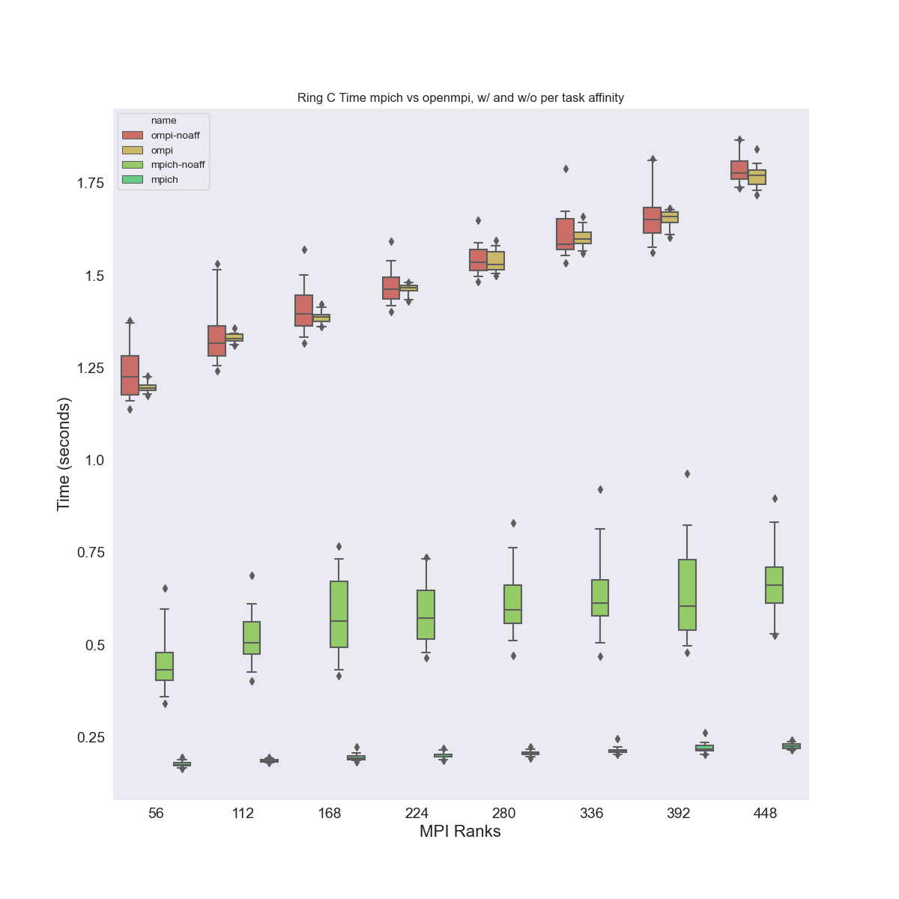
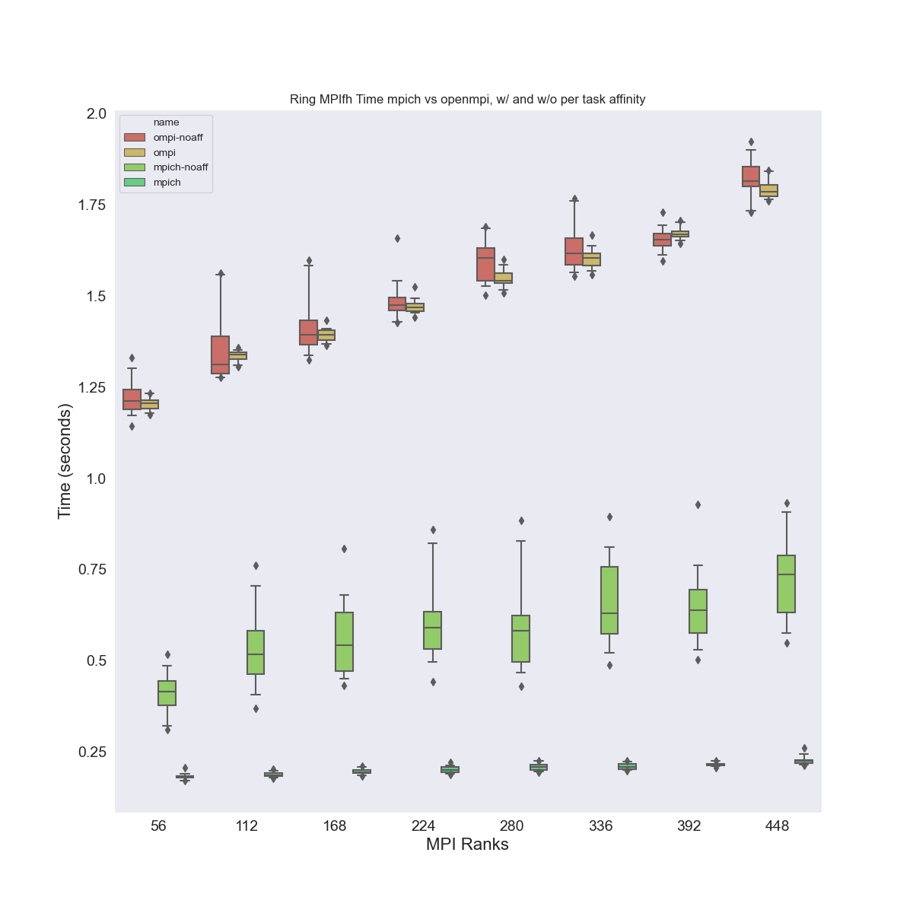
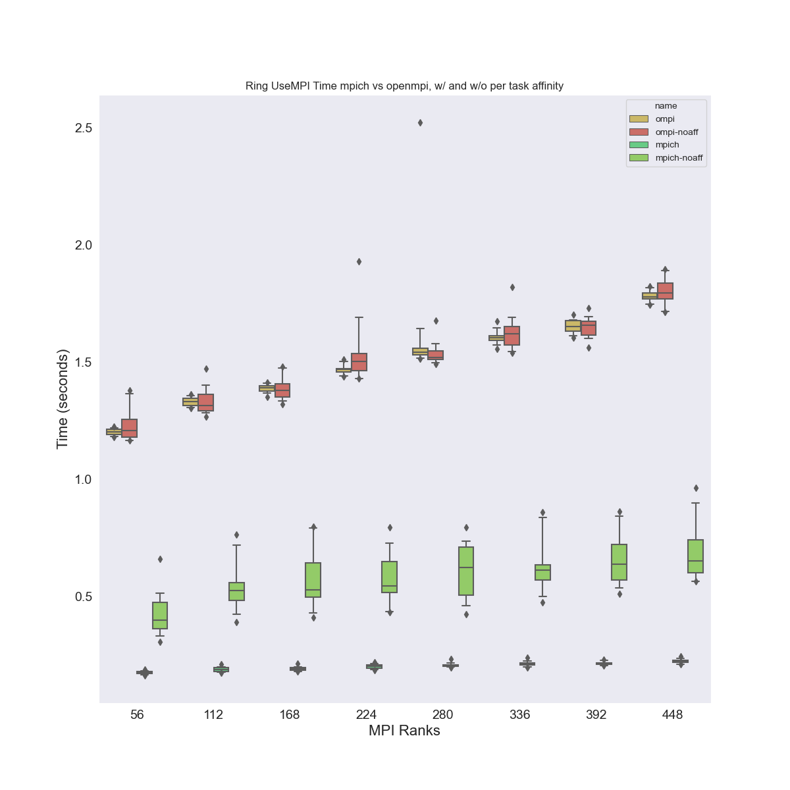

# MPIs in Flux Operator

> These experiments were run on May 15, 2023 on GKE

This will be a follow up to [hello-world](../hello-world) where we ran a basic hostname.
For these experiments, we want to test using mpich vs openmpi, and also add this
[dataplane-v2 flag](https://cloud.google.com/kubernetes-engine/docs/concepts/dataplane-v2)
that might help with networking.

## Run Experiments

These are the experiments we ran on a size 8 cluster, c2-highmem-112 instances:

| name | vCPU | cores | memory GB | Notes |
|------|------|-------|------------|-----|
|c2d-standard-112 | 112 | 56 | 	448 | Didn't work well |

### Setup Flux Operator

I tried to mimic the [advice from this post](https://cloud.google.com/compute/docs/instances/create-hpc-vm#configure_your_hpc_vm_according_to_best_practices) for "best practices" and used `--enable-gvnic`

```bash
$ time gcloud container clusters create flux-operator \
   --cluster-dns=clouddns \
   --addons=GcpFilestoreCsiDriver \
   --cluster-dns-scope=cluster \
   --region=us-central1-a \
   --placement-type COMPACT \
   --threads-per-core=1 \
   --enable-gvnic \
   --project $GOOGLE_PROJECT \
   --machine-type c2d-standard-112 \
   --num-nodes=8 \
   --tags=flux-cluster \
   --enable-intra-node-visibility \
   --enable-dataplane-v2

$ gcloud container clusters get-credentials flux-operator --zone us-central1-a --project $GOOGLE_PROJECT
$ kubectl create clusterrolebinding cluster-admin-binding --clusterrole cluster-admin --user $(gcloud config get-value core/account)
```

Note that the `--enable-network-policy` and dataplane flags didn't seem to be allowed together.

The time for creation:

```
real	5m8.832s
user	0m3.599s
sys	0m0.250s
```

Warnings:

```
Default change: VPC-native is the default mode during cluster creation for versions greater than 1.21.0-gke.1500. To create advanced routes based clusters, please pass the `--no-enable-ip-alias` flag
Default change: During creation of nodepools or autoscaling configuration changes for cluster versions greater than 1.24.1-gke.800 a default location policy is applied. For Spot and PVM it defaults to ANY, and for all other VM kinds a BALANCED policy is used. To change the default values use the `--location-policy` flag.
Note: Your Pod address range (`--cluster-ipv4-cidr`) can accommodate at most 1008 node(s).
Creating cluster flux-operator in us-central1-a... Cluster is being health-checked (master is healthy)...done. 
Created [https://container.googleapis.com/v1/projects/llnl-flux/zones/us-central1-a/clusters/flux-operator].
To inspect the contents of your cluster, go to: https://console.cloud.google.com/kubernetes/workload_/gcloud/us-central1-a/flux-operator?project=llnl-flux
kubeconfig entry generated for flux-operator.
NAME           LOCATION       MASTER_VERSION  MASTER_IP     MACHINE_TYPE      NODE_VERSION    NUM_NODES  STATUS
flux-operator  us-central1-a  1.25.8-gke.500  34.71.45.203  c2d-standard-112  1.25.8-gke.500  8          RUNNING
```

I chose the one size (8) that worked previously, and we could easily see if there was any improvement
in performance. Then create the namespace and install the operator:

```bash
$ kubectl create namespace flux-operator
$ kubectl apply -f operator/flux-operator.yaml
```

Create the persistent volume claim for filestore (we need this to save logs there)

```bash
$ kubectl apply -f operator/pvc.yaml
```

And check on the status:

```bash
$ kubectl get -n flux-operator pvc
NAME   STATUS    VOLUME   CAPACITY   ACCESS MODES   STORAGECLASS   AGE
data   Pending                                      standard-rwx   6s
```

It will be pending until we make a request to use it.

### OpenMPI and MPICH Hello World

Let's run the MPI hello world test, ensuring we run it 20 times and time it.
We will do the procedure below for each of:

```bash
$ kubectl apply -f operator/minicluster-8-ompi.yaml
$ kubectl apply -f operator/minicluster-8-mpich.yaml
```

For any creation it can be confusing because at first they were all pending, and there was an error message about
insufficient cpu/memory. But then I waited - and they started to pop into "ContainerCreating" state
around 3 minutes, and then shortly after (when the container image was pulled) into "Running." 

So wait until you see all the pods running, and verify that the flux-sample-0-xxx has a full quorum
by looking at the log for flux-sample-0-xxxx. You'll then want to copy the experiments file over

```bash
$ kubectl cp ./run-experiments.py flux-operator/flux-sample-0-xxx:/home/flux/run-experiments.py
```

...shell in and connect to the broker:

```bash
$ kubectl exec -it -n flux-operator flux-sample-0-xxxx -- bash

# For openmpi
$ sudo -u flux -E HOME=/home/flux -E PATH=$PATH -E PYTHONPATH=$PYTHONPATH flux proxy local:///run/flux/local bash

# For mpich
$ sudo -u flux -E HOME=/home/flux -E PATH=$PATH -E LD_LIBRARY_PATH=$LD_LIBRARY_PATH -E PYTHONPATH=$PYTHONPATH flux proxy local:///run/flux/local bash
```

Now you can proceed to the following sections to run experiments. We are going to add a test of 
just a simple hostname (to get timings) across nodes along with our original lammps to see if
the networking specification changed anything.

#### Hello World

Now let's run basic experiments to run mpi hello world on different size Flux instances. Note
that for each I always checked `flux resource list` to see the tasks against my calculation
to make sure they are the same.

**openmpi**

Note that `connectivity_c` did not work for larger sizes. What I did (running them in pairs that equal to 8 to maximally use the resources)
is to allow the larger (slower one) for which I didn't intend to complete for all to run, and that way we would have some minimal data
for each. E.g., as an example, the size 2 ran in reasonable time, and while that was going, I allowed some subset of size 6 to run,
albeit it didn't get very far (and I didn't get to testing no affinity). This does mean smaller sample sizes for these slower ones,
but I needed to be aware of time for credits and cost. In the middle (sizes 3 to 5) when they were slow I just tried to get 3 data points
for each.

 - 8
 - 7
 - 6 (did not run in the full time we took to run a size 2, which was working)
 - 3-5 (1-3 points each)

For the larger sizes 7 and 8 I gave it about 60 seconds and then cut it.

**mpich**

This worked great! Even `connectivity_c` worked at the largest sizes. This is great, but doesn't
help us too much with our LAMMPS bug because we were already using this container base (with mpich)
but at least it sheds some light on why we should NOT use openmpi. 

```bash
export outdir=/workflow
sudo cp /home/flux/run-experiments.py /workflow/run-experiments.py

# Size 8 DONE
flux alloc -N 8 /bin/bash
nodes=8
script=connectivity_c

for script in hello_c hello_cxx hello_usempi hello_usempi ring_c ring_usempi ring_mpifh; do
  echo "Running ${script} WITH affinity"
  sudo mkdir -p ${outdir}/data/size_${nodes}_${script}
  sudo chown ${USER} ${outdir}/data/size_${nodes}_${script}
  python3 /workflow/run-experiments.py --workdir /home/flux --tasks 448 --times 20 -N ${nodes} ./${script} --outdir $outdir/data/size_${nodes}_${script} --identifier mpis-${nodes}-${script}

  echo "Running ${script} without affinity"
  name=${script}-noaff
  sudo mkdir -p ${outdir}/data/size_${nodes}_${name}
  sudo chown ${USER} ${outdir}/data/size_${nodes}_${name}
  python3 /workflow/run-experiments.py --workdir /home/flux --tasks 448 --times 20 -N ${nodes} ./${script} --outdir $outdir/data/size_${nodes}_${name} --identifier mpis-${nodes}-${name} --no-cpu-affinity
done
exit

# Size 7 DONE
flux alloc -N 7 /bin/bash
nodes=7

# this worked great for mpich, for openmpi was done after
script=connectivity_c
for script in hello_c hello_cxx hello_usempi hello_usempi ring_c ring_usempi ring_mpifh; do
  echo "Running ${script} WITH affinity"
  sudo mkdir -p ${outdir}/data/size_${nodes}_${script}
  sudo chown ${USER} ${outdir}/data/size_${nodes}_${script}
  python3 /workflow/run-experiments.py --workdir /home/flux --tasks 392 --times 20 -N ${nodes} ./${script} --outdir $outdir/data/size_${nodes}_${script} --identifier mpis-${nodes}-${script}

  echo "Running ${script} without affinity"
  name=${script}-noaff
  sudo mkdir -p ${outdir}/data/size_${nodes}_${name}
  sudo chown ${USER} ${outdir}/data/size_${nodes}_${name}
  python3 /workflow/run-experiments.py --workdir /home/flux --tasks 392 --times 20 -N ${nodes} ./${script} --outdir $outdir/data/size_${nodes}_${name} --identifier mpis-${nodes}-${name} --no-cpu-affinity
done
exit

# Size 6 DONE
flux alloc -N 6 /bin/bash
nodes=6

# This worked for a few manual runs, hence left out of the loop
script=connectivity_c
for script in connectivity_c hello_c hello_cxx hello_usempi hello_usempi ring_c ring_usempi ring_mpifh; do
  echo "Running ${script} WITH affinity"
  sudo mkdir -p ${outdir}/data/size_${nodes}_${script}
  sudo chown ${USER} ${outdir}/data/size_${nodes}_${script}
  python3 /workflow/run-experiments.py --workdir /home/flux --tasks 336 --times 20 -N ${nodes} ./${script} --outdir $outdir/data/size_${nodes}_${script} --identifier mpis-${nodes}-${script}

  echo "Running ${script} without affinity"
  name=${script}-noaff
  sudo mkdir -p ${outdir}/data/size_${nodes}_${name}
  sudo chown ${USER} ${outdir}/data/size_${nodes}_${name}
  python3 /workflow/run-experiments.py --workdir /home/flux --tasks 336 --times 20 -N ${nodes} ./${script} --outdir $outdir/data/size_${nodes}_${name} --identifier mpis-${nodes}-${name} --no-cpu-affinity
done
exit

# Size 5 DONE
flux alloc -N 5 /bin/bash
nodes=5

# too slow to put in the loop
script=connectivity_c

for script in hello_c hello_cxx hello_usempi hello_usempi ring_c ring_usempi ring_mpifh; do
  echo "Running ${script} WITH affinity"
  sudo mkdir -p ${outdir}/data/size_${nodes}_${script}
  sudo chown ${USER} ${outdir}/data/size_${nodes}_${script}
  python3 /workflow/run-experiments.py --workdir /home/flux --tasks 280 --times 20 -N ${nodes} ./${script} --outdir $outdir/data/size_${nodes}_${script} --identifier mpis-${nodes}-${script}

  echo "Running ${script} without affinity"
  name=${script}-noaff
  sudo mkdir -p ${outdir}/data/size_${nodes}_${name}
  sudo chown ${USER} ${outdir}/data/size_${nodes}_${name}
  python3 /workflow/run-experiments.py --workdir /home/flux --tasks 280 --times 20 -N ${nodes} ./${script} --outdir $outdir/data/size_${nodes}_${name} --identifier mpis-${nodes}-${name} --no-cpu-affinity
done
exit

# Size 4
flux alloc -N 4 /bin/bash
nodes=4

# Ran this for 3 iterations each, had two size 4 flux instances running at once!
script=connectivity_c
for script in hello_c hello_cxx hello_usempi hello_usempi ring_c ring_usempi ring_mpifh; do
  echo "Running ${script} WITH affinity"
  sudo mkdir -p ${outdir}/data/size_${nodes}_${script}
  sudo chown ${USER} ${outdir}/data/size_${nodes}_${script}
  python3 /workflow/run-experiments.py --workdir /home/flux --tasks 224 --times 20 -N ${nodes} ./${script} --outdir $outdir/data/size_${nodes}_${script} --identifier mpis-${nodes}-${script}

  echo "Running ${script} without affinity"
  name=${script}-noaff
  sudo mkdir -p ${outdir}/data/size_${nodes}_${name}
  sudo chown ${USER} ${outdir}/data/size_${nodes}_${name}
  python3 /workflow/run-experiments.py --workdir /home/flux --tasks 224 --times 20 -N ${nodes} ./${script} --outdir $outdir/data/size_${nodes}_${name} --identifier mpis-${nodes}-${name} --no-cpu-affinity
done
exit

# Size 3 DONE
flux alloc -N 3 /bin/bash
nodes=3

# This can be added to the list for mpich (works fine) otherwise separately
script=connectivity_c

for script in hello_c hello_cxx hello_usempi hello_usempi ring_c ring_usempi ring_mpifh; do
  echo "Running ${script} WITH affinity"
  sudo mkdir -p ${outdir}/data/size_${nodes}_${script}
  sudo chown ${USER} ${outdir}/data/size_${nodes}_${script}
  python3 /workflow/run-experiments.py --workdir /home/flux --tasks 168 --times 20 -N ${nodes} ./${script} --outdir $outdir/data/size_${nodes}_${script} --identifier mpis-${nodes}-${script}

  echo "Running ${script} without affinity"
  name=${script}-noaff
  sudo mkdir -p ${outdir}/data/size_${nodes}_${name}
  sudo chown ${USER} ${outdir}/data/size_${nodes}_${name}
  python3 /workflow/run-experiments.py --workdir /home/flux --tasks 168 --times 20 -N ${nodes} ./${script} --outdir $outdir/data/size_${nodes}_${name} --identifier mpis-${nodes}-${name} --no-cpu-affinity
done
exit

# Size 2 DONE
flux alloc -N 2 /bin/bash
nodes=2

for script in hello_c hello_cxx connectivity_c hello_usempi hello_usempi ring_c ring_usempi ring_mpifh; do
  echo "Running ${script} WITH affinity"
  sudo mkdir -p ${outdir}/data/size_${nodes}_${script}
  sudo chown ${USER} ${outdir}/data/size_${nodes}_${script}
  python3 /workflow/run-experiments.py --workdir /home/flux --tasks 112 --times 20 -N ${nodes} ./${script} --outdir $outdir/data/size_${nodes}_${script} --identifier mpis-${nodes}-${script}

  echo "Running ${script} without affinity"
  name=${script}-noaff
  sudo mkdir -p ${outdir}/data/size_${nodes}_${name}
  sudo chown ${USER} ${outdir}/data/size_${nodes}_${name}
  python3 /workflow/run-experiments.py --workdir /home/flux --tasks 112 --times 20 -N ${nodes} ./${script} --outdir $outdir/data/size_${nodes}_${name} --identifier mpis-${nodes}-${name} --no-cpu-affinity
done
exit

# Size 1 DONE
flux alloc -N 1 /bin/bash
nodes=1

for script in hello_c hello_cxx connectivity_c  hello_usempi hello_usempi ring_c ring_usempi ring_mpifh; do
  echo "Running ${script} WITH affinity"
  sudo mkdir -p ${outdir}/data/size_${nodes}_${script}
  sudo chown ${USER} ${outdir}/data/size_${nodes}_${script}
  python3 /workflow/run-experiments.py --workdir /home/flux --tasks 56 --times 20 -N ${nodes} ./${script} --outdir $outdir/data/size_${nodes}_${script} --identifier mpis-${nodes}-${script}

  echo "Running ${script} without affinity"
  name=${script}-noaff
  sudo mkdir -p ${outdir}/data/size_${nodes}_${name}
  sudo chown ${USER} ${outdir}/data/size_${nodes}_${name}
  python3 /workflow/run-experiments.py --workdir /home/flux --tasks 56 --times 20 -N ${nodes} ./${script} --outdir $outdir/data/size_${nodes}_${name} --identifier mpis-${nodes}-${name} --no-cpu-affinity
done
exit
```

### Saving Data

Save the data separately depending on the openmpi / mpich that you used:

```bash
# for openmpi
$ mkdir -p ./data/kubernetes-8/ompi
$ kubectl cp flux-operator/flux-sample-0-xxxx:/workflow/data ./data/kubernetes-8/ompi

# for mpich
$ mkdir -p ./data/kubernetes-8/mpich
$ kubectl cp flux-operator/flux-sample-0-xxxx:/workflow/data ./data/kubernetes-8/mpich
```

Also save the pods and nodes (for me this was just mpich since that is the one that worked faster)

```bash
$ kubectl get pods -n flux-operator -o json > ./data/kubernetes-8/pods.json
$ kubectl get nodes -o json > ./data/kubernetes-8/nodes.json
```

### Clean Up

Exit from the broker and the node/pod, and then copy the results over with kubectl

```bash
$ kubectl delete -f operator/pvc.yaml
$ gcloud container clusters delete --zone us-central1-a flux-operator
```

For a run of about 1 hour 40 minutes I calculated about $67 (without Filestore)
so likely with Filestore (and note delete this manually in the console)
it comes out to still under $100.

## Analysis

### Times

Process the data into one file:

```bash
$ python process.py ./data
```
This generates [results.json](results.json) that has all output files organized by filename.
The filename is largely how we are going to group things for plots. Speaking of plotting...


```bash
pip install pandas seaborn matplotlib
```

```bash
mkdir -p img
python plot_results.py ./results.json
```

### Results!

What I see:

 - the cpu affinity = per task flag makes ompi slower, but makes mpich faster!
 - for mpich, there is also a lot more variability without the cpu affinity per task flag (we saw this with the initial operator experiments on AWS)
 - mpich is faster across the board! This is something Ward already told us, but it's cool to see it in practice
 - For the connectivity tests, we ran them reliably for mpich, but I only got it working (for a small number of runs) for the smallest of ompi





