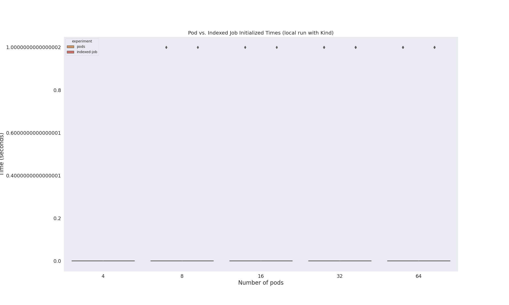
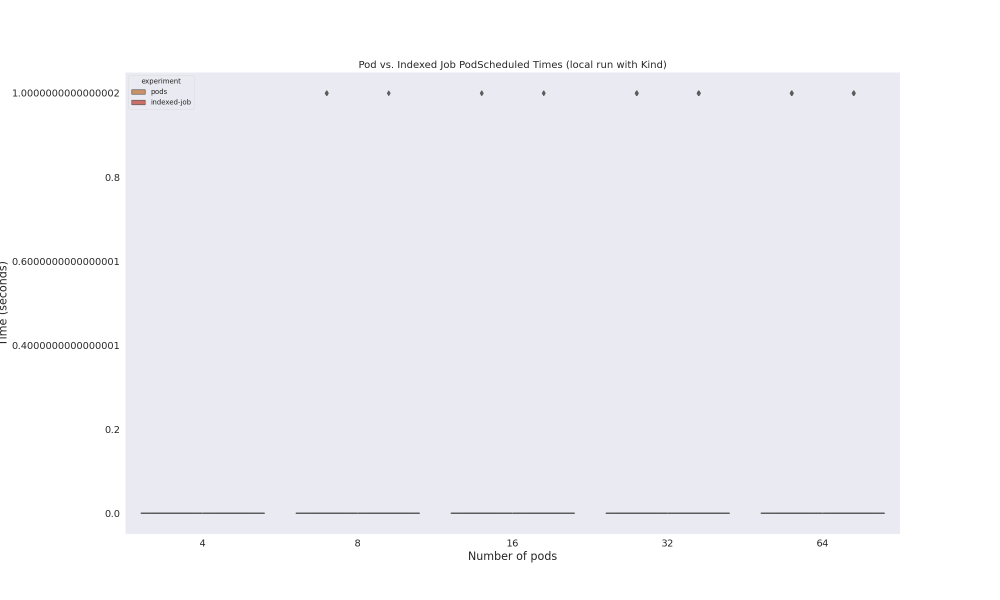
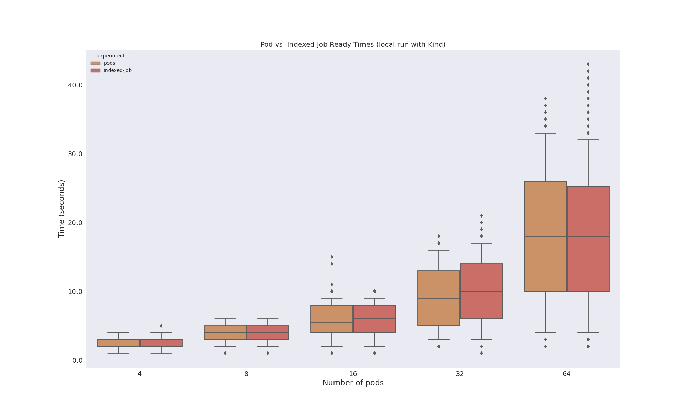
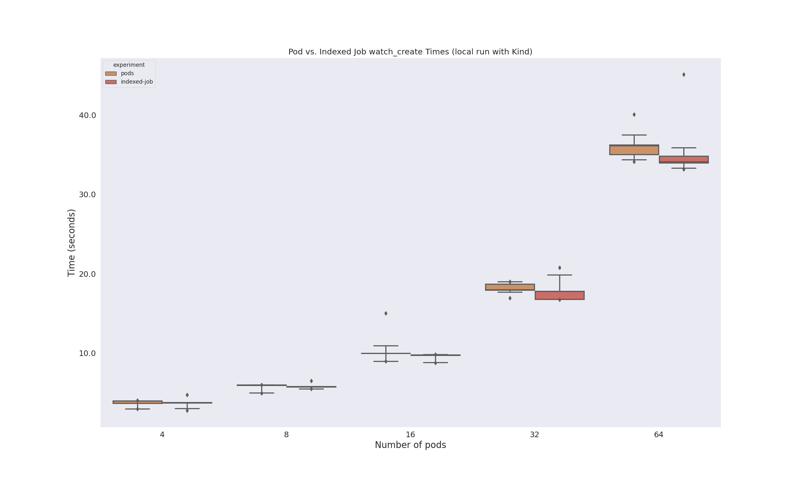
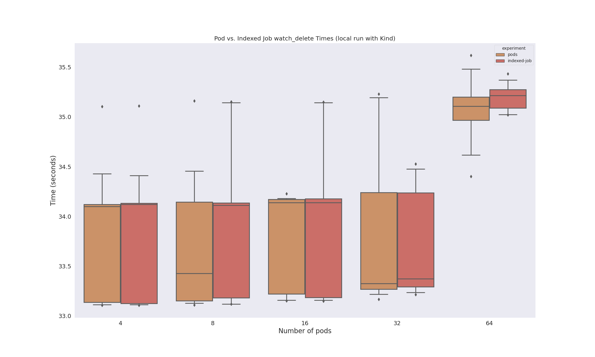

# Indexed Job Times

We are interested to understand how creating batches of pods varies from creating a single indexed job.
I'm going to do some basic tests (first locally) to test that.

## Setup

### 1. Create Cluster

Create a kind cluster

```bash
kind create cluster
```

### 2. Create Experiments

We have templates and a script to generate the files!

```bash
python generate-size.py 8
python generate-size.py 16
python generate-size.py 32
python generate-size.py 64
```

### 3. Run Experiment

And then run a particular experiment, some number of times:

```bash
# 4 pods
for i in {0..20}; do
  echo "Running experiment ${i} for size-4 test"
  python pod-events.py experiments/size-4 --size 4 --idx=${i}
done

# 8 pods
for i in {0..20}; do
  echo "Running experiment ${i} for size-8 test"
  python pod-events.py experiments/size-8 --size 8 --idx=${i}
done

# 16 pods
for i in {0..20}; do
  echo "Running experiment ${i} for size-16 test"
  python pod-events.py experiments/size-16 --size 16 --idx=${i}
done

# 32 pods
for i in {0..20}; do
  echo "Running experiment ${i} for size-32 test"
  python pod-events.py experiments/size-32 --size 32 --idx=${i}
done

# Lol, hope this is OK for my computer...
# 64 pods
for i in {0..20}; do
  echo "Running experiment ${i} for size-64 test"
  python pod-events.py experiments/size-64 --size 64 --idx=${i}
done
```

What isn't clear is if the actual timing of pods will get in the way...

### 4. Process Result Data

```bash
python analyze-results.py data/
```

### 5. View Results

Here is an overview of times:


I'm wondering how the watch loop influences the "all" create times? And if there are any other issues in the experiment running design.

#### ContainersReady


#### Initialized



#### PodScheduled



#### Ready



#### Create Times (all)




#### Delete Times (all)


