# Developing OSU Scale

We now want to bring up a larger cluster (size 128) of a smaller instance, and test
scatter/gather for collective benchmarks and the smaller ones.

## OSU Benchmarks

```bash
GOOGLE_PROJECT=myproject
gcloud compute networks create mtu9k --mtu=8896 
gcloud container clusters create osu-cluster \
    --threads-per-core=1 \
    --placement-type=COMPACT \
    --num-nodes=64 \
    --machine-type=c2d-standard-2 \
    --enable-gvnic
```

Install JobSet

```bash
VERSION=v0.2.0
kubectl apply --server-side -f https://github.com/kubernetes-sigs/jobset/releases/download/$VERSION/manifests.yaml
```

And the operator (I did from a development branch)! 

```bash
make test-deploy-recreate
```

OR (for production install)

```bash
kubectl apply -f https://raw.githubusercontent.com/converged-computing/metrics-operator/main/examples/dist/metrics-operator.yaml
```

We first want to test if OSU can handle > 2 nodes (and for which benchmarks). I've built
a custom version.

```bash
# This took all night, I stopped before last one
kubectl apply -f metrics-64.yaml 
kubectl logs metricset-sample-l-0-0-d2kbq > size-64.log
kubectl delete -f metrics-64.yaml 

# These can be run at the same time (up to a total of 64)
kubectl apply -f metrics-32.yaml 
kubectl logs metricset-sample-l-0-0-d2kbq > size-32.log
kubectl delete -f metrics-32.yaml 

# I changed the name here anticipating adding more jobs at once, didn't work
kubectl apply -f metrics-16.yaml 
kubectl logs metricset-16-l-0-0-d2kbq
kubectl logs metricset-16-l-0-0-ng6vp > size-16.log
kubectl delete -f metrics-16.yaml 

# I added allreduce back here, since the previously allgather ran in ~23 minutes
kubectl apply -f metrics-8.yaml 
kubectl logs metricset-8-l-0-0-d2kbq
kubectl logs metricset-8-l-0-0-lmkg9 > size-8.log
kubectl apply -f metrics-8.yaml 

kubectl apply -f metrics-4.yaml 
kubectl logs metricset-4-l-0-0-d2kbq
kubectl logs metricset-4-l-0-0-lmkg9 > size-4.log
kubectl apply -f metrics-4.yaml 
```

Save nodes, in case we need:

```
kubectl get nodes -o json > nodes.json
```
I put the times together into [times.log](times.log) for plotting.
And delete the cluster:

```bash
gcloud container clusters delete osu-cluster
```

## Analysis

Run the plot times script:

```bash
python plot-times.py
```

A few notes before we look.

- The goal of these runs was to get a general timing for different metrics at different sizes with the goal of running more iterations for actual experiments.
- I first started with a size 128 cluster but absolutely nothing was moving, so I started instead with 64.
- I only ran allgather for all sizes as a proxy for allreduce, since they take similar amounts of time. I ran allreduce toward the end to get a sense of that (smallest sizes)

### Close (Random)

For these plots, times are all low enough to consider running across sizes. They are also close enough
in that range to look fairly random, and we would need more data/interations to see a pattern

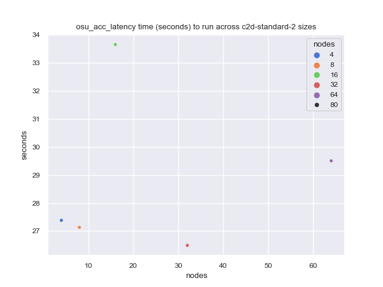
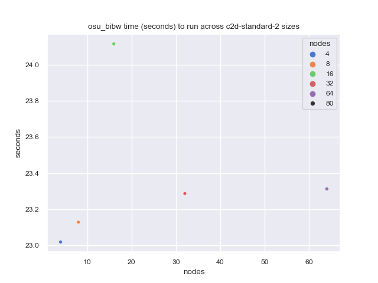
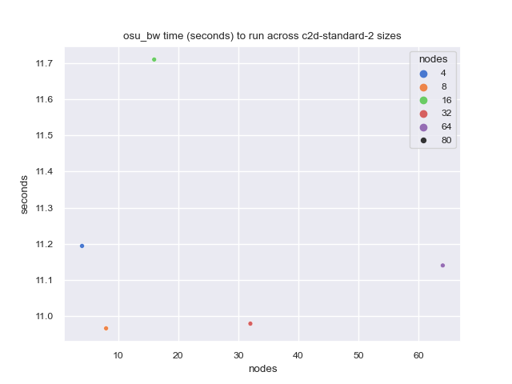
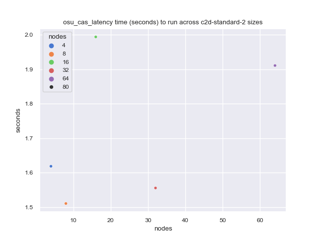
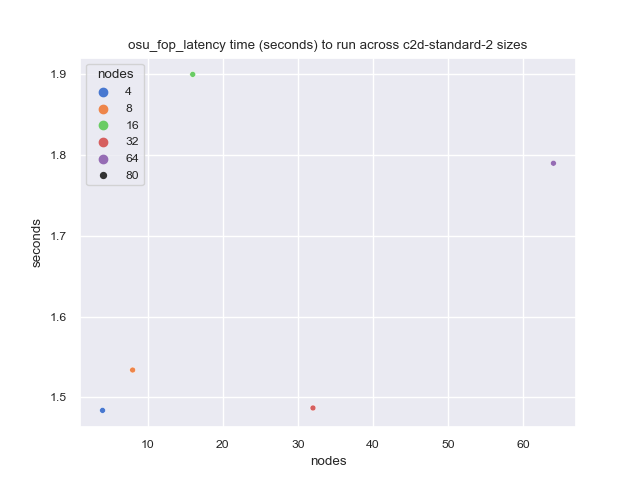
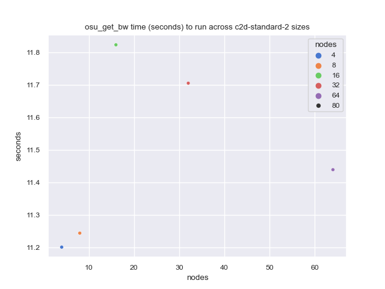
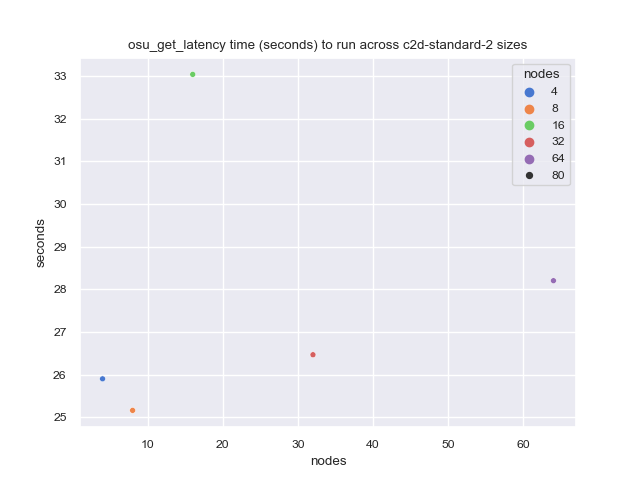
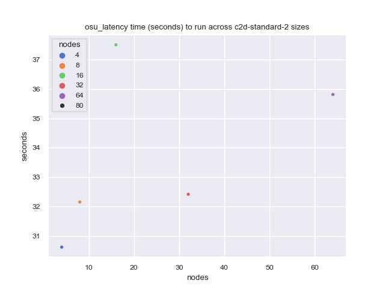
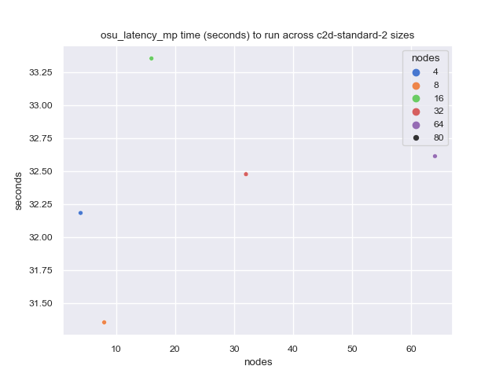
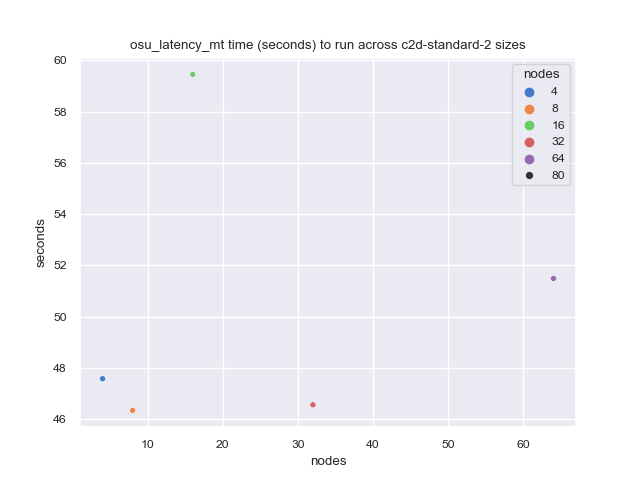
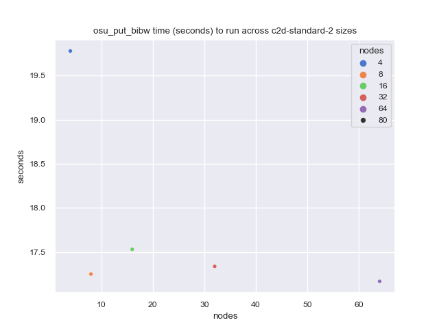
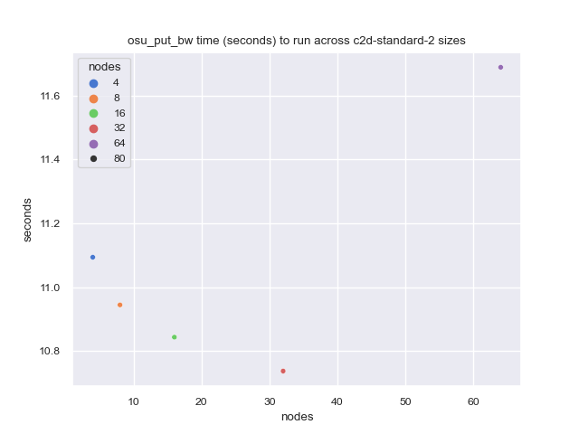
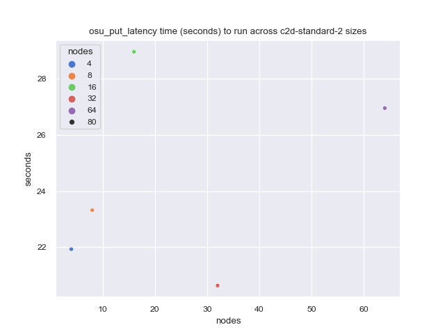


### Possible Scalability Issues

These look both random to me, but I suspect could have scalability issues due to a jump, etc.
It's hard to tell with just one time-point :)

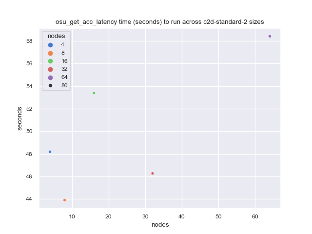

### Scalability Issues

These benchmarks likely have clear scalability issues, as it gets much worse (slower) as we scale.

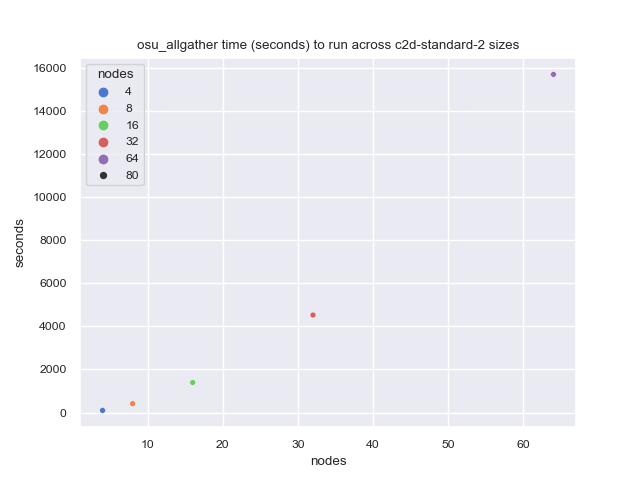
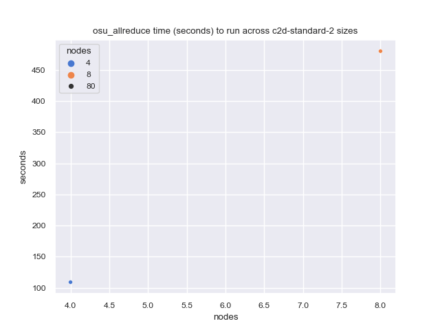
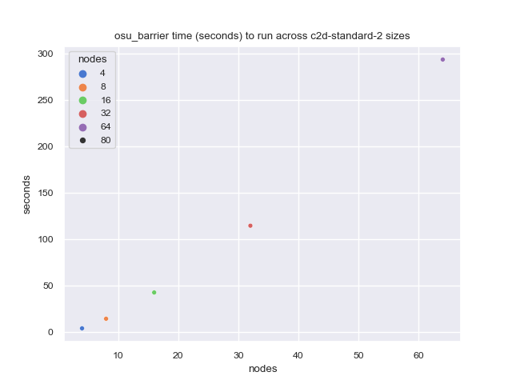
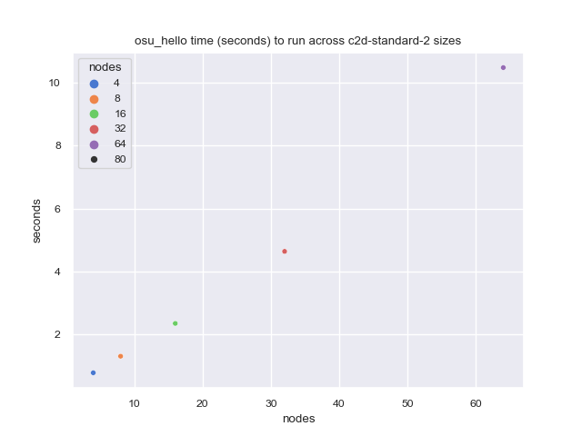
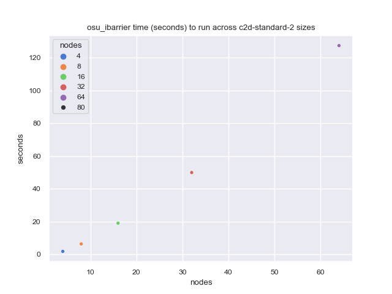
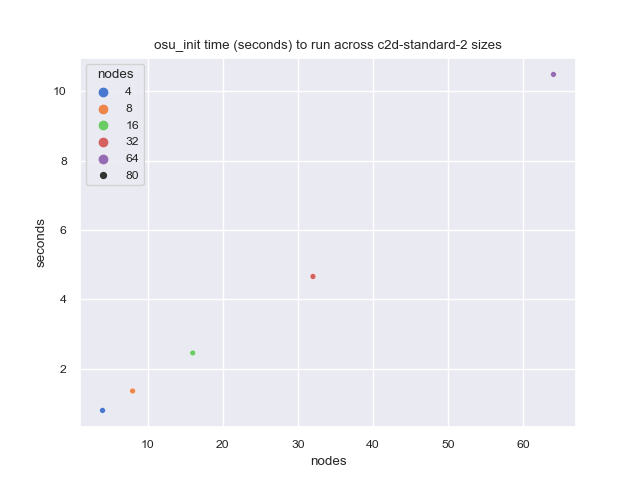
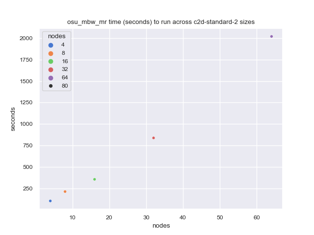
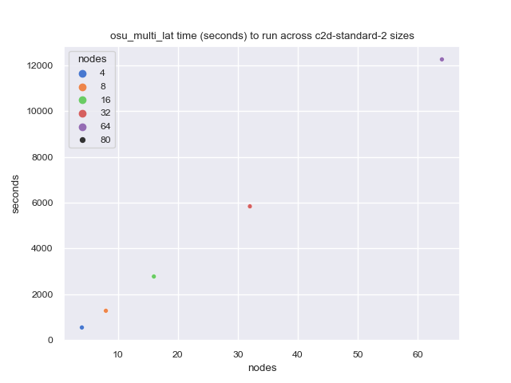
