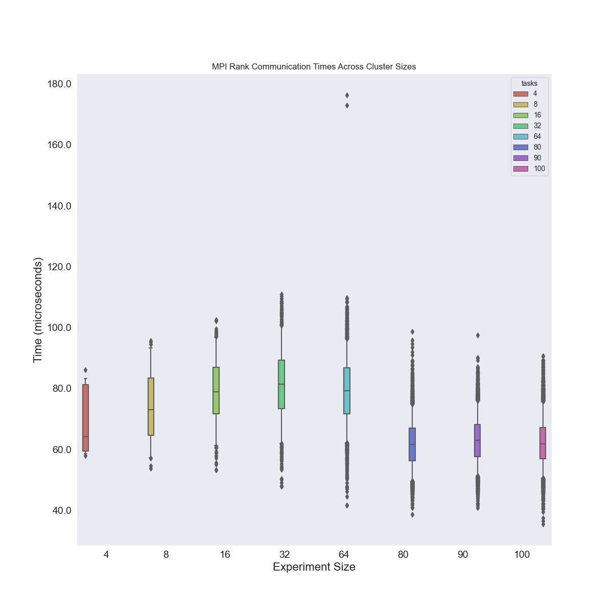

# Netmark

Here we want to test doing Netmark runs with Google Batch.

## Dependencies

First, create the virtual environment:

```bash
python -m venv env
source env/bin/activate
pip install google-cloud-batch google-cloud-storage jinja2
```

Note that you will need to be authenticated to Google Cloud `google cloud auth`
and have the Batch API enabled.

## Setup

Since Netmark is private, to build it in batch we require that you have access to the private repository
to clone, and you are then able to upload assets to a private bucket. Here is what that looks like:

```bash
project_id="$(gcloud config get-value core/project)"
bucket="netmark-experiment-bucket"

# Create the bucket
gcloud storage buckets create gs://${bucket}

# Clone netmark and copy it there, removing history, etc.
git clone --depth 1 git@github.com:ggeorgakoudis/netmark

# Add this import to netmark.c
# #include <getopt.h>
rm -rf netmark/.git
gcloud storage cp --recursive ./netmark/* gs://${bucket}/netmark
```

We will do this just once and then save to our Google Cloud storage to reuse.
Now we have the code in the cloud (privately) and can continue to run out workflow!

## Run Job

Since we want to automate (and minimize YAML and json files) we represent our workflow
in Python.

```bash
# Get google project id, bucket name (should already exist with netmark code)
project_id="$(gcloud config get-value core/project)"
bucket="netmark-experiment-bucket"
tasks=4

# Run netmark with these parameters
$ python run-job.py ${project_id} --cpu-milli 1000 --memory 1000 --tasks ${tasks} --max-run-duration 3600s --bucket ${bucket} --machine-type c2-standard-16 --job-name netmark-job-001 --netmark-store-trial
```

Note that you can customize netmark's parameters too, and you can do `run-job.py --help` to see your options!
The job name MUST be unique - you'll get an error if it's not. The metadata for your run and scripts will be saved locally, organized by the job id:

```
$ tree data/
data/
├── netmark-job-055
│   ├── metadata.json
│   ├── netmark_wrapper.sh
│   ├── run.sh
│   └── setup.sh
└── netmark-job-056
    ├── metadata.json
    ├── netmark_wrapper.sh
    ├── run.sh
    └── setup.sh
```

And this also mirrors the actual structure of output in Google storage, however you'll also see output files there alongside!
When you are done, you can inspect the logs in the Google cloud console, and the scripts
written locally to see what was run. Note that I think for machine type, if we expect 8 cores, we actually need a -16 instance type since there are 2vcpu per actual.

# Experiments

There seems to be a (hidden?) upper limit of 100 jobs (I found this under Batch for Ads):

> Each account can have up to 100 active or pending jobs at the same time.

So we had to adjust the plan below for that.

```
# Setup
project_id="$(gcloud config get-value core/project)"
bucket="netmark-experiment-bucket"


# Our limit is 1500 cores so these could be run at once!
for size in 4 8 16 32 64 70 80 90 100; do
   echo $size
   python run-job.py ${project_id} --cpu-milli 1000 --memory 1000 --tasks ${size} --netmark-tasks ${size} --max-run-duration 3600s --bucket ${bucket} --machine-type c2d-standard-2 --job-name netmark-experiment-size-$size --netmark-store-trial --parallelism ${size} --netmark-tasks-per-node 1 --tasks-per-node 1
done
 
# 8 tasks on 8 instances
$ python run-job.py ${project_id} --cpu-milli 1000 --memory 1000 --tasks 8 --netmark-tasks 8 --max-run-duration 3600s --bucket ${bucket} --machine-type c2d-standard-2 --job-name netmark-experiment-64-07 --netmark-store-trial --parallelism 8 --netmark-tasks-per-node 1 --tasks-per-node 1
```

NOTE that Batch's definition of a "task" is one scoped piece of work, and is NOT an MPI task. In the case we use the size 2 instance above (with one core) then the Batch definition of a task == the netmark definition of an MPI task, but in any other case this won't be true! This was a point of confusion for me. Remember:

 - tasks per node is the number of scoped work pieces we want running per google instance (regardless of cores)
 - netmark tasks per node is the number of tasks netmark can expect per node
 - netmark tasks is the total number of tasks netmark can expect
 - parallelism is the number of instances (nodes) to run
 - we can use barriers only if parallelism == tasks

Also note the size 70 timed out and I cancelled after an hour.

## Analysis

We can read in the RTT.csv files from each run to:

- compare distributions of times across runs
- within each run, create a heatmap.

Let's do each!

```bash
$ pip install pandas seaborn matplotlib
$ python plot-results.py
```


Comparing with sorted means for sanity check:
```
                                  time  tasks
uid                                          
netmark-experiment-size-4    68.502833    4.0
netmark-experiment-size-8    74.584625    8.0
netmark-experiment-size-16   79.056417   16.0
netmark-experiment-size-32   81.348631   32.0
netmark-experiment-size-64   79.286623   64.0
netmark-experiment-size-80   61.839328   80.0
netmark-experiment-size-90   63.100994   90.0
netmark-experiment-size-100  62.347161  100.0
```

And you can look at the pdf of heatmaps for each task experiment in [img](img).

## Feedback for Google Batch

- Upper limit seems small?
- Calling the scoped piece of work a "Task" is hugely confusing for us HPC folks :)
- For MPI workloads in a container, it would be nice to have Singularity support and some means to bind MPI libraries to container
- The "hello world" example (with hostname) doesn't use MPI, would be good to have an actual MPI example
- Really nice UI for seeing everything! I couldn't easy find logging, however. That might be front and center!
- Going from scheduled to running seems a bit slow
- The logging is pretty hard to follow, especially with multiple workers running - it looks like Cloud Build and I wish it was just a big block of text to read!
- Debugging is hard - would be nice to have an interactive job
- It would be nice to have it more automated to be able to submit a job with the same name (and after the next number added)
- It's borderline monster to name your bin "bin64" instead of bin. `bin64 etc64 intel64 lib64 man ` Users are going to have to go thorough lots of extra runs just to find that path. Maybe it should be added to the path on install instead?
- With many jobs (or even few) the table starts in one state, and then sorts to another - it makes it hard to find things. Why not allow the user to provide a job name, and then click into that group (for a smaller scoped set that doesn't have this changing of state/sorting?)
- Stream logs should be the default unless the run is finished - it's confusing coming here the first time and having it either be empty, paused, or not understanding why it's not showing top down lines of the run (start to finish).
- gcloud seems to want python3, but where I tested it didn't seem to exist.
