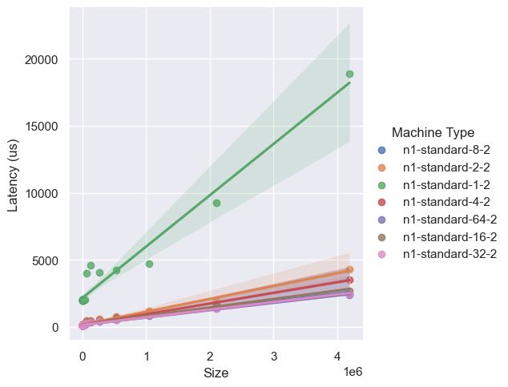
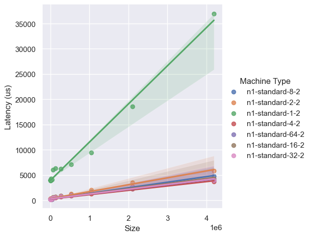
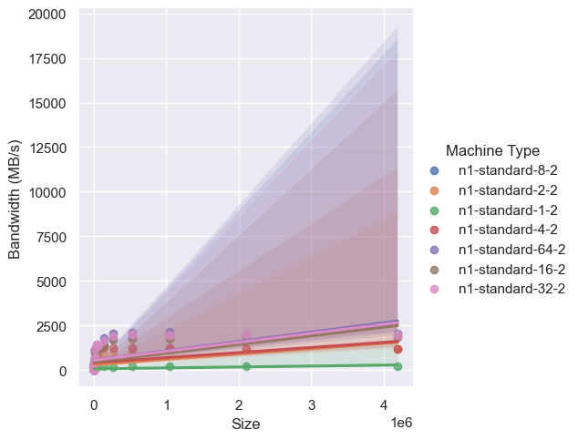
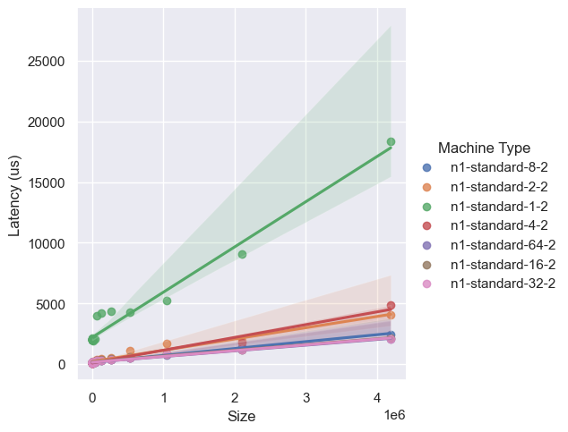
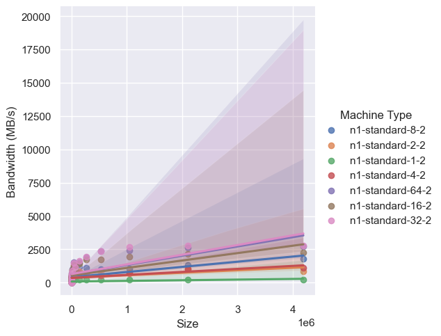
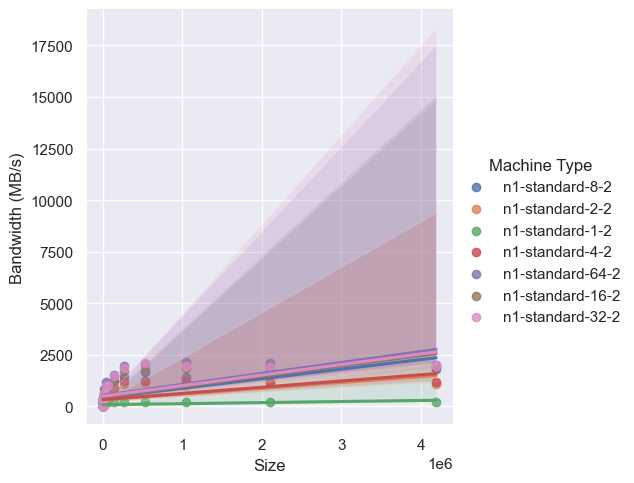
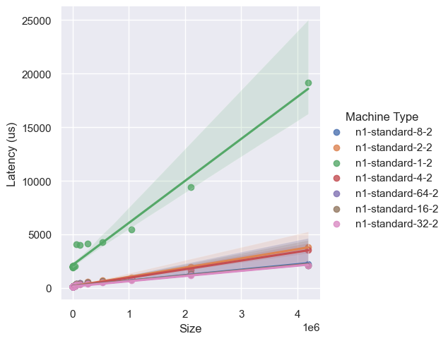

# OSU Benchmarks on Google Kubernetes Engine

In this set of experiments we will run the Flux Operator on Google Cloud at size N=2
(the benchmarks require this) and multiple machine types.

## Pre-requisites

You should first [install gcloud](https://cloud.google.com/sdk/docs/quickstarts)
and ensure you are logged in and have kubectl installed:

```bash
$ gcloud auth login
```

Depending on your install, you can either install with gcloud:

```bash
$ gcloud components install kubectl
```

or just [on your own](https://kubernetes.io/docs/tasks/tools/). In addition,
we will be using [Flux Cloud](https://github.com/converged-computing/flux-cloud) 
to run the Operator on Google Cloud Kubernetes engine.

```bash
$ pip install flux-cloud
```

These experiments were run with flux-cloud 0.1.0.

## Run Experiments

Each experiment here is defined by the matrix and variables in [experiments.yaml](experiment.yaml) that is used to
populate a [minicluster-template.yaml](minicluster-template.yaml) and launch a Kubernetes cluster.
You can read the documentation for flux-cloud to understand the variables available.
This tutorial assumes you have flux-cloud installed and configured. See all unique Kubernetes clusters
we will run the jobs on:

```bash
$ flux-cloud list
```

Then you can either run all at once:

```bash
$ flux-cloud run --force-cluster
```

Or (for testing) to bring up just the first cluster and then manually apply:

```bash
$ flux-cloud up
$ flux-cloud apply
$ flux-cloud down
```

or do the same for a targeted Kubernetes cluster:

```bash
$ flux-cloud up -e n1-standard-2-2
$ flux-cloud apply -e n1-standard-2-2
$ flux-cloud down -e n1-standard-2-2
```


The latter will either use a single experiment you've defined under `experiment` in your experiments.yaml file,
or select the first in your matrix (as we have here).

By default, results will be written to a [./data](data) directory, but you can customize this with `--outdir`.

## Results

We can plot results to produce data and image files in [results](results)!

```bash
$ pip install -r requirements.txt
```
```bash
$ python plot.py
```

I am including the plots that don't just have one value!









I'm not sure these are super meaningful to look at (and only one run per size) but it's a start!
