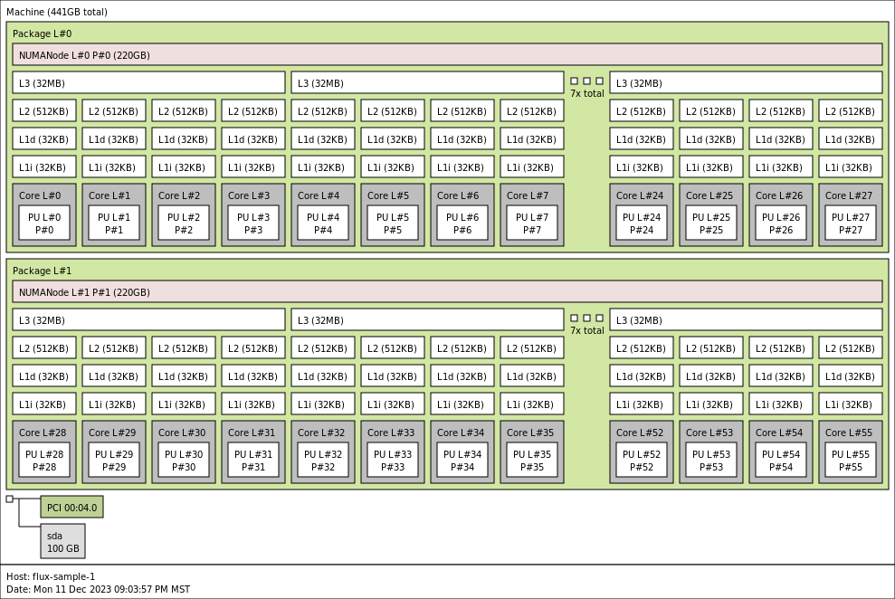
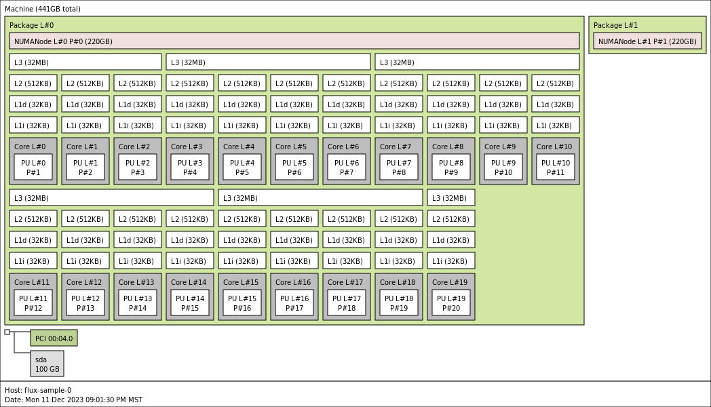
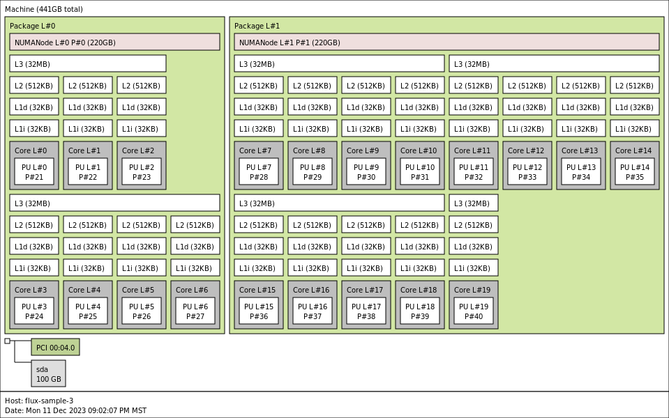

# Google Cloud Resources

This will reproduce [run0](../run0) but look at cgroups specifically and use hwloc
to see what each pod sees.

## c2d-standard-112

### Create the Cluster

Let's test a cluster on c2d-standard-112 for size 4.

```bash
GOOGLE_PROJECT=myproject
gcloud container clusters create test-cluster \
    --threads-per-core=1 \
    --num-nodes=4 \
    --region=us-central1-a \
    --project=${GOOGLE_PROJECT} \
    --machine-type=c2d-standard-112 \
    --placement-type=COMPACT \
    --system-config-from-file=./cluster-config.yaml
```

### Install the Flux Operator

We are going to install the Flux operator from the refactor branch (with the feature added to disable affinity).

```bash
git clone -b test-refactor-modular 
cd test-refactor-modular

# You might need other dependencies, etc. here or to specify your own registry you can push to.
make test-deploy-recreate
```

Save nodes.

```bash
kubectl get nodes -o json > nodes.json
```

### Looking at Resources with hwloc

I'm OK doing this manually since we are just doing it once! I'm going to first create a minicluster where there is 1 pod : 1 node, and then look at the output with lstopo along with what cgroups sees. Then I'll do the same, but break each pod into a few flux containers, and do the same.

#### 4 pods, 1:1 mapping

This should use the entire node for each pod.

```bash
kubectl apply -f minicluster-4.yaml
```

Get the top pod output:

```bash
kubectl top pod --containers=true > top-pod-1-1.txt
```

Shell in to each pod and install hwloc. We will run two commands to generate xml and png.

```bash
kubectl exec -it flux-sample-0-xxx bash
```
```console
yum install -y epel-release
dnf install -y hwloc hwinfo
mkdir -p /opt/info
hwloc-ls /opt/info/machine.xml
lscpu > /opt/info/lscpu.txt
cat /proc/cpuinfo > /opt/info/cpuinfo.txt
nproc --all > /opt/info/nproc.txt
hwinfo --all > /opt/info/hwinfo.txt
```

Do for each pod 0-3, and then save to the local machine.

```bash
mkdir -p data/1-1/0 data/1-1/1 data/1-1/2 data/1-1/3
kubectl cp flux-sample-0-mvwv6:/opt/info ./data/1-1/0/
```

I think for the broken apart case, we don't need to do this for every pod, just the containers on one. Delete when you are done:

```
kubectl delete -f minicluster-4.yaml
```

Do the same above, but with minicluster-5.yaml

```bash
kubectl apply -f minicluster-5.yaml
```

Which nodes are we on?

```
kubectl get pods -o wide
```
```
$ kubectl get pods -o wide
NAME                  READY   STATUS    RESTARTS   AGE   IP          NODE                                          NOMINATED NODE   READINESS GATES
flux-sample-0-4pmkm   1/1     Running   0          47s   10.8.1.25   gke-test-cluster-default-pool-50531823-12dr   <none>           <none>
flux-sample-1-slzw8   1/1     Running   0          46s   10.8.2.23   gke-test-cluster-default-pool-50531823-633f   <none>           <none>
flux-sample-2-cfrkn   1/1     Running   0          47s   10.8.0.24   gke-test-cluster-default-pool-50531823-0m78   <none>           <none>
flux-sample-3-mrzpr   1/1     Running   0          46s   10.8.1.26   gke-test-cluster-default-pool-50531823-12dr   <none>           <none>
flux-sample-4-mxljg   1/1     Running   0          46s   10.8.3.29   gke-test-cluster-default-pool-50531823-lnmh   <none>           <none>
```

Save data and pod metadata.

```
mkdir -p data/multi
kubectl get pods -o json > data/multi/pods.json
for pod in flux-sample-0-4pmkm flux-sample-1-slzw8 flux-sample-2-cfrkn flux-sample-3-mrzpr  flux-sample-4-mxljg
  do
   mkdir -p data/multi/$pod
   kubectl cp ${pod}:/opt/info ./data/multi/$pod
done
```

And then I think I can manually look at that and (maybe?) see something interesting?
Note that flux-sample-0 and flux-sample-3 are sharing cpus.


#### Batching of 5 flux nodes on 4 nodes

I want to run th3 5 pod setup multiple times, and each time, see how the CPU are assigned to the nodes.
It's too laborious to get the full output each time, but I can at least get a sample of the CPU assignment per node.
Even the ones that don't share nodes can have meaningful signal because they are only allowed to use a subset of the CPUs.
Note that [this post](https://github.com/kubernetes/kubernetes/issues/119669) showed me how to see what CPU they were assigned to.
Specifically I need to look at

```
cat /sys/fs/cgroup/cpuset.cpus
```

Note that here is all the good stuff in there - we might want to look at more:

```console
$ kubectl exec -it ${pod} -c flux-sample -- ls /sys/fs/cgroup
cgroup.controllers	cpuset.cpus.partition	  memory.events
cgroup.events		cpuset.mems		  memory.events.local
cgroup.freeze		cpuset.mems.effective	  memory.high
cgroup.kill		hugetlb.1GB.current	  memory.low
cgroup.max.depth	hugetlb.1GB.events	  memory.max
cgroup.max.descendants	hugetlb.1GB.events.local  memory.min
cgroup.procs		hugetlb.1GB.max		  memory.numa_stat
cgroup.stat		hugetlb.1GB.rsvd.current  memory.oom.group
cgroup.subtree_control	hugetlb.1GB.rsvd.max	  memory.pressure
cgroup.threads		hugetlb.2MB.current	  memory.stat
cgroup.type		hugetlb.2MB.events	  memory.swap.current
cpu.idle		hugetlb.2MB.events.local  memory.swap.events
cpu.max			hugetlb.2MB.max		  memory.swap.high
cpu.max.burst		hugetlb.2MB.rsvd.current  memory.swap.max
cpu.pressure		hugetlb.2MB.rsvd.max	  pids.current
cpu.stat		io.bfq.weight		  pids.events
cpu.weight		io.max			  pids.max
cpu.weight.nice		io.pressure		  rdma.current
cpuset.cpus		io.stat			  rdma.max
cpuset.cpus.effective	memory.current
```

I did this 4 times.

```bash
kubectl apply -f minicluster-5.yaml
```
```
for pod in $(kubectl get pods -o=name)
  do
    kubectl exec -it ${pod} -c flux-sample -- cat /sys/fs/cgroup/cpuset.cpus
  done
```
And the output:

```console
# test 1 (4 was shared with 2)
1-20
1-20
1-20
1-20
21-40

# test 2 (0 was shared with 3)
1-20
1-20
1-20
21-40
1-20

# test 3 (0 was shared with 4, and a different physical node this time)
1-20
1-20
1-20
1-20
21-40

# test 4 (2 was shared with 4)
1-20
1-20
1-20
1-20
21-40
```

Note that the nodes that the pod indices are assigned to are NOT consistent.
And this output was interesting too?

```bash
$ for pod in $(kubectl get pods -o=name);
  do     
    echo
    echo $pod
    kubectl exec -it ${pod} -c flux-sample -- cat /sys/fs/cgroup/cgroup.procs
done
```
```console
# test 1 (4 was shared with 2)
pod/flux-sample-0-s4nn4
1
87
201

pod/flux-sample-1-jcj84
1
87
170

pod/flux-sample-2-g7q8n
1
87
171

pod/flux-sample-3-tz7b4
1
87
170

# 4 was shared with 2
pod/flux-sample-4-2952b
1
87
177


# test 2 (0 was shared with 3)
pod/flux-sample-0-w42tj
1
93
153

pod/flux-sample-1-vsggr
1
88
123

pod/flux-sample-2-rthv9
1
93
122

pod/flux-sample-3-h5xdk
1
93
122

pod/flux-sample-4-nttgp
1
87
122

# test 3 (0 was shared with 4)
pod/flux-sample-0-zrwjj
1
87
153

pod/flux-sample-1-gsrvn
1
87
122

pod/flux-sample-2-hjs9f
1
87
122

pod/flux-sample-3-th6vm
1
87
122

pod/flux-sample-4-qlplm
1
87
122

# test 4 (2 was shared with 4)
pod/flux-sample-0-bljwm
1
87
153

pod/flux-sample-1-mrwzw
1
87
122

pod/flux-sample-2-z9q5v
1
94
123

pod/flux-sample-3-t4wxz
1
87
122

pod/flux-sample-4-tjtm7
1
93
122
```

## Thoughts

### Overview

This is really interesting. I couldn't even install software without OOMkilled and had to build a custom container that had it ready to go.
This tells us:

- Asking to scope resources via cgroups is going to make it unlikely basic workflows will run UNLESS they are good at controlling cpu/memory and won't go over.
- More realistically we are better off honoring the 1:1 mapping and let flux control sub-allocation of resources, and use resource limits/requests _without_ static for scheduling purposes of sidecar containers (but not actually enforcing something).
- I think it's unlikely we will even get lammps to run. But showing this would still be valuable to do. The hard part is deciding on the resources.
- It's very likely when we run anything in Kubernetes, containers within pods are sharing resources constantly, and not setting the limits is the only way they wouldn't be killed. Instead of that, we see (but maybe don't measure) application slow down.
- This makes me wonder if this is related to what we saw with Antonio. We used the kubelet config for both c3 and c2d, and maybe the main difference was that c3 (for some reason) was OOMKilled, but the MPI workers caught it first.

### Details

#### 1 pod : 1 node

Let's first sanity check that when we had 1 pod : 1 node, all of the resources (machines) looked the same. Note that I pulled down the hwloc xml files and generated pngs from them on my local machine.





I think the pictures might be cropped (note the 7x between the two sections)? But what I think I see is that:

- Each has two "Package" objects, each one associated with something called a NUMA node
- A NUMA node appears to be a grouping of resources (memory and CPU?)
- The caches go down from L3, L2, to L1, and L1 is where the CPU sit.
- If each NUMA node has 7x an L3 cache, and each L3 cache has 4 CPU, that means there are 7x4 == 28 CPU per package
  - This makes sense because the node has 56 total CPU (112 vCPU), so 2 packages (NUMA node) each with 28!

I think we can probably get details about location in the XML dumps (more than we can see in the picture). Since
they are all mostly the same, here [is one machine.xml](data/1-1/0/machine.xml).

#### 2 pod : 1 node

Now let's look at the case where there were TWO pods for one node. Note that I had an immensely hard time just getting one extra pod, because with the extra commands
it would often OOMKilled and I had to adjust the limits/requests (and decrease the total number down to 5 minicluster "nodes" on 4 actual nodes) to get this setup.
Likely we could get this into small increments with a simpler abstraction that doesn't require the Flux Operator to be installed. OK so firat, we know that flux-sample-0 and flux-sample-3 were sharing a node. Let's first add picture for that whole node (no parcellation):


And now let's add the output png for those two pods. What did they see?

| Flux Sample 0 | Flux Sample 3 |
|---------------|---------------|
|  |  |

Oh wow, OK! So...

- Flux sample 0 has ZERO access to any CPU in Package 1. Instead it seems to see Package 0:
 - 3/4 CPU for the first L3 cache 
 - 4/4 CPU for four x L3 
 - 1/4 CPU for the last L3
- So if there are 7x L3 caches for each NUMA node (package) this means we are only exposed to 5/7. And each isn't in entirety! For the above we have 3+(4*4)+1 CPU == 20 CPU

A lot of the above is likely because of the weird number I set (A fudged number t I could get working for CPU) which is 20. Now let's look at Flux sample 1:

- Flux sample 1 has access to both Package 0 and Package 1.
 - Package 0 has full access to 1 x L3 cache (4 CPU) + 3/4 CPU for a second (thus a total of 7 CPU)
 - Package 1 has full access to 3 x L3 caches (3x4 == 12 CPU) and ONE CPU in another L3 (total 13)

And thus 13 + 7 also == 20!

So I think we'd next want to understand how the CPU are located, as represented in the machine.xml or other metadata that I saved (see [data/multi](data/multi))
It looks like (at quick glance) the other commands I ran don't honor the cgroups, because I see all the CPU:

```
# This should not be 56
CPU(s):                          56
On-line CPU(s) list:             0-55

# E.g., this also should not be 56
L1d cache:                       1.8 MiB (56 instances)
L1i cache:                       1.8 MiB (56 instances)
L2 cache:                        28 MiB (56 instances)
L3 cache:                        448 MiB (14 instances)
```

I wonder if there are variants of those commands that are scoped to the cgroup? We can discuss / decide what to look at next.

#### Proposal for next steps

1. Figure out how to get exact mapping in machine.xml
2. Create a simplified version just with hwloc and indexed job (we don't need the flux operator, etc.)
3. Run this multiple times (this simplified version) to get different mappings
4. Derive computational way/metric to say how much that mapping varies.
5. What does the variability mean for our HPC applications?

Likely we are going to learn (and want to show that) it doesn't make sense to try and use Kubernetes to control resources.
BUT this is where Flux is hugely useful to control the resources within a single node controlled by one Kubelet.

### Clean Up

When you are done:

```bash
gcloud container clusters delete test-cluster --region=us-central1-a --quiet
```
