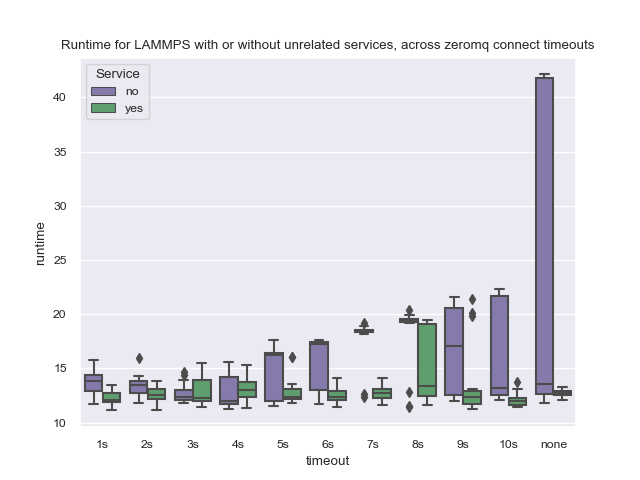

# Service Timing

The Flux Operator started with a design that would use a one-off service container to
generate a certificate. We did this by way of creating the container using the same
base (with Flux) used by the workflow, and running `flux keygen`. After our 
talk at [Kubecon](https://t.co/vjRydPx1rb), we started work on a bunch of new fixes
or features, and one of our goals was to remove this extraneous service pod.
This was made possible by way of [installing bindings for zeromq](https://github.com/flux-framework/flux-operator/pull/152) directly in
the operator. However, this change had unintended conseuquences, some of which we will
discuss here.

## Problems

We identified two problems:

- ZeroMQ had an exponential backoff when no connect timeout was set
- Regardles of the above, having a service pod always acted as a "warmup" to make the runtime faster

We were able to fix the first by adding a variable to define a set backoff (e.g., 5s by default)
to zeromq, and while this greatly improved times (140 seconds down to 28-30 on MiniKube, and 40 down to 12-15 on a production cluster)
it simply should not be the case that an external service influences the network connect timings.

## Testing

Our early testing was reported [in this issue](https://github.com/kubernetes-sigs/jobset/issues/104). Regardless of where
we ran these testing jobs (and indeed there was variance between a production cluster like GKE and MiniKube) we saw that
having another random service somehow served as a warmup for the operator MiniCluster. It was consistently faster,
even across zeromq timeouts (as we showed here) when a service existed, even when the service was entirely unrelated.
While we still need to generate a reproducing case for a Kubernetes team to look at (without the Flux Operator)
the experiment here was important to do in order to test again against a variant of the operator with a fix to
the initial zeromq issue.

### Setup

To run this experiment, I first made the code changes to the operator to allow defining the connect timeout for zeromq.
I then created a production GKE cluster with coredns, and I
I was able to install the operator, and then do this via the Python SDK (script included here as [time-minicluster-lammps.py])(time-minicluster-lammps.py).
Those steps looked like this:

```bash
$ gcloud container clusters create flux-operator --cluster-dns=clouddns --cluster-dns-scope=cluster \
   --region=us-central1-a --project $GOOGLE_PROJECT \
   --machine-type n1-standard-2 --num-nodes=4 --enable-network-policy \
   --tags=flux-cluster --enable-intra-node-visibility
```

To install the operator, this is how I do that for development (from the root of the repository)

```bash
$ make test-deploy
$ kubectl create namespace flux-operator
$ kubectl apply -f examples/dist/flux-operator-dev.yaml
```

And then I ran the experiments! This saved the data files here:

```bash
$ python time-minicluster-lammps.py
```

And generated the plots:

```bash
$ python plot-times.py
```

And this resulted in the plot below:



And of course, don't forget to clean up:

```bash
$ gcloud container clusters delete flux-operator
```

## Results

What we learn from the above is that a zeromq connect timeout between 1s and 5s is best, and likely I'll set it to 5s as 
a reasonable value. We also see that the service is impactful, and ideally this would not happen. I will need to figure
out how to reproduce this outside of the operator and properly report a bug.

What does this mean for the operator, before and after? With the bug, you might see creation times between 40-140 
seconds (40 seconds on a production cluster, 140 on MiniKube) for a single MiniCluster, which is abysmal.
With the fix to zeromq, this goes does to 19-20. With the further addition of adding the warmup service, it goes
down to ~16. With the service plus a better networking setup than kube-dns, it returns to the original 11-12 seconds.