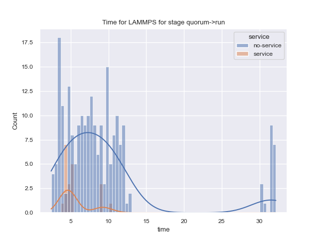
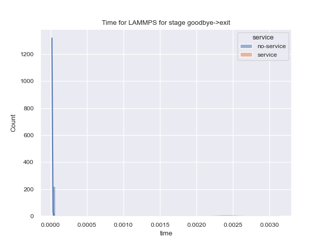
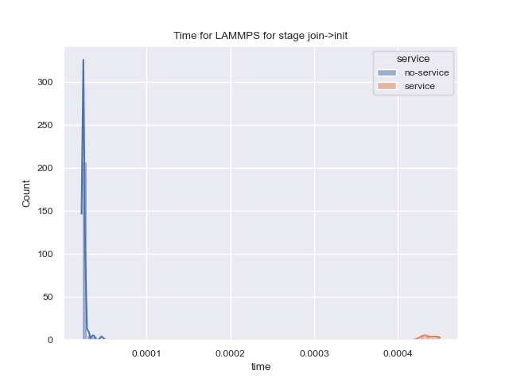

# Google Experiments

These experiments were run by Google across 22 runs. We have data for:

 - [workers.json](leaders.json)
 - [leaders.json](leaders.json)

Since the leaders (rank 0) are most relevant (and reflect the workers hooking up as well)
we can focus on them. It's much less data to process and plot too. I think we are primarily
interested in:

- 'init->quorum': RANK 0: reflects any delay in running rc1
- 'quorum->run': RANK 0: this would be the time it takes to network?
- 'run->cleanup': RANK 0: this would be the runtime of lammps

## Plots

### init->quorum

Reflects delay in running rc1.
This plot is probably not telling us anything interesting.

### quorum->run

Reflects the time it takes to network.
We can clearly see the group that doesn't have a zeromq timeout set. 
Since the network isn't ready on the getgo, the timeout kicks in.
This shouldn't happen I don't think.

### run->cleanup

Reflects the runtime of LAMMPS.
This is enormously concerning for such a small problem size on such a large
cluster! It reflects a huge cost in the networking and no benefit to the run.

### cleanup->shutdown

This plot is probably not telling us anything interesting.

### goodbye->exit

This plot seems to have three different groups - I'd be interested to know if
the zeromq timeout is related to this, but I don't think we collected that.

### join->init

### none->join

This plot is probably not telling us anything interesting.

### shutdown->finalize

This plot is probably not telling us anything interesting.

