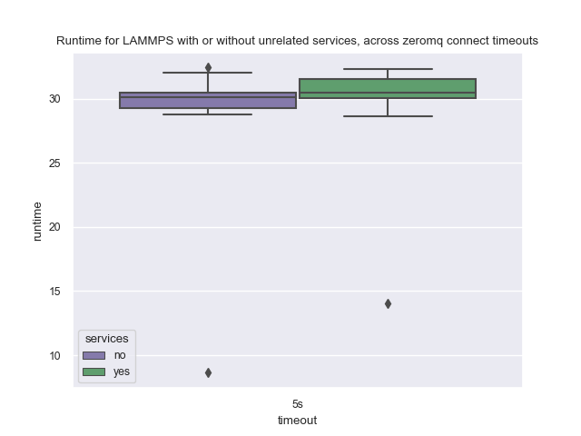
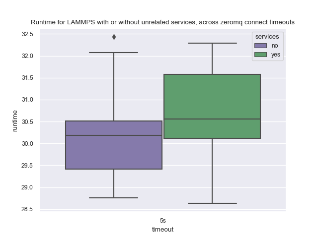

# NodeLocal Cache with C2-Standard-8

My first experiments with NodeLocal used an e2-medium instance, and without compact. 
I'd like to try to improve upon that with a compute optimized image, and use compact mode.
I also forgot to put `--threads-per-core=1`

```bash
GOOGLE_PROJECT=myproject
```
```bash
$ gcloud container clusters create flux-cluster --project $GOOGLE_PROJECT \
    --zone us-central1-a \
    --machine-type c2-standard-8 \
    --addons=NodeLocalDNS \
    --threads-per-core=1 \
    --num-nodes=8 --tags=flux-cluster --enable-intra-node-visibility \
    --placement-type COMPACT
```

If each run is ~10 seconds, 10 runs per timeout, ~10 timeouts, that should be about ~16 minutes.
That seemed to work again to create 8. Then create the namespace and install the operator.

```bash
kubectl create namespace flux-operator
kubectl apply -f ../operator/flux-operator.yaml
kubectl get nodes -o json > nodes.json
```

Manually create the MiniCluster and look at flux-sample-0 logs to ensure all the nodes network.

```bash
kubectl apply -f minicluster.yaml
```

This would also pull the container to the nodes so you don't need to do it later.
This will show when they are all running:

```bash
kubectl get pods -n flux-operator 
```

And in the index-0 pod you should see:

```bash
$ kubectl logs -n flux-operator flux-sample-0-tlxwr 
```
```console
broker.info[0]: online: flux-sample-0 (ranks 0)               # the broker (rank 0) is online
broker.info[0]: online: flux-sample-[0-7] (ranks 0-7)         # the other brokers (ranks 1-7) are online
broker.info[0]: quorum-full: quorum->run 3.13634s             # everyone is online! The quorum is full!
```

That connected! Now let's try some scripted runs.
You'll need the fluxoperator and kubernetes modules installed:

```bash
$ python -m venv env
$ source env/bin/activate
$ pip install kubernetes
$ pip install fluxoperator
$ pip install IPython
```

Delete the current MiniCluster.

```bash
kubectl delete -f minicluster.yaml
```

To run experiments:

 - All have a default 5s zeromq timeout
 - 20 iterations for each
 - with and without services

```bash
$ python time-minicluster-lammps.py lammps
$ python time-minicluster-lammps.py lammps --service
```

If there is any failure an IPython.embed will be run, so you can inspect what happened and 
continue if desired. What I do is delete everything in a different terminal (and ensure all
pods have Terminated AND disappeared) and then I exit from IPython and the next run continues.
When both sets of runs are done, plot times here:

```bash
$ pip install pandas seaborn
$ python ../plot-times.py $(pwd)
```

Here is the plot with outliers (each had one much faster time for the first run):



And without:



Wow - with services is now slower! This is what I'd expect, it's the opposite of
the original pattern and it does make sense that adding another pod to create
for the service should make it slightly slower. Who knows what was happening before
(but I bet you it had to do with DNS lookup).

### Clean Up

When you are done - clean up!

```bash
gcloud container clusters delete flux-cluster
```

## 2. Local Cache + Compact

```bash
$ gcloud container clusters create flux-cluster --project $GOOGLE_PROJECT \
    --location us-central1 --machine-type n1-standard-2 \
    --addons=NodeLocalDNS \
    --placement-type COMPACT \
    --num-nodes=8 --tags=flux-cluster --enable-intra-node-visibility
```

Then I created the namespace and installed the operator.

```bash
kubectl create namespace flux-operator
kubectl apply -f operator/flux-operator.yaml
kubectl get nodes -o json > operator/nodes.json
```

