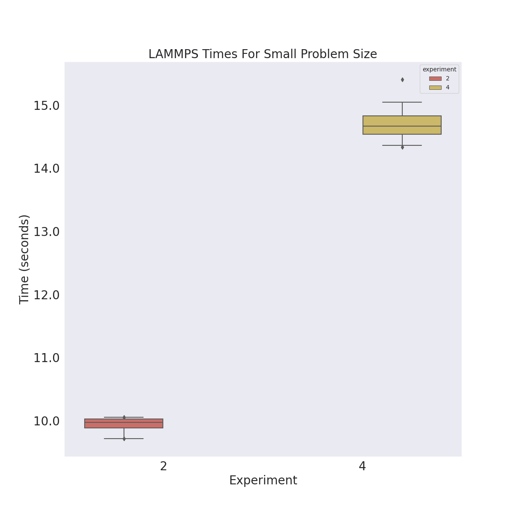

# Flux Framework LAMMPS Cluster Deployment

We are now going to test the same flags, but at scale. The issue we ran into previously
is that the original cluster was not even able to create - the workers never networked.
We had wanted to do a comparison of GKE and Compute Engine months ago but could not.

## 1. Create the Cluster

We are first going to try this on size 64, which didn't work before. We had wanted to do size 128 
for the actual experiments, but since Compute Engine isn't ready, it doesn't make sense to try that yet.

```bash
GOOGLE_PROJECT=myproject
```
```bash
$ time gcloud container clusters create flux-cluster --project $GOOGLE_PROJECT \
    --zone us-central1-a \
    --machine-type c2d-standard-112 \
    --addons=NodeLocalDNS \
    --addons=GcpFilestoreCsiDriver \
    --threads-per-core=1 \
    --num-nodes=64 --tags=flux-cluster --enable-intra-node-visibility \
    --placement-type COMPACT

gcloud container clusters get-credentials flux-operator --zone us-central1-a --project $GOOGLE_PROJECT
kubectl create clusterrolebinding cluster-admin-binding --clusterrole cluster-admin --user $(gcloud config get-value core/account)
```

Before the above only worked for size 8 and smaller clusters. Also note that these instances are $6/hour, so 
I'm aiming to not go over an hour or 2 ($5 * 64) ~ $320/hour plus change!

The c2d-standard-112 instance type has:

 - 112 vCPU which is 56 actual cores
 - 448 GB memory

<details>

<summary>Relevant creation notes</summary>

Note that we've added Filestore. The time for size 64:

```console
Default change: VPC-native is the default mode during cluster creation for versions greater than 1.21.0-gke.1500. To create advanced routes based clusters, please pass the `--no-enable-ip-alias` flag
Default change: During creation of nodepools or autoscaling configuration changes for cluster versions greater than 1.24.1-gke.800 a default location policy is applied. For Spot and PVM it defaults to ANY, and for all other VM kinds a BALANCED policy is used. To change the default values use the `--location-policy` flag.
Note: Your Pod address range (`--cluster-ipv4-cidr`) can accommodate at most 1008 node(s).
Creating cluster flux-cluster in us-central1-a... Cluster is being health-checked (master is healthy)...done.                               
Created [https://container.googleapis.com/v1/projects/llnl-flux/zones/us-central1-a/clusters/flux-cluster].
To inspect the contents of your cluster, go to: https://console.cloud.google.com/kubernetes/workload_/gcloud/us-central1-a/flux-cluster?project=llnl-flux
kubeconfig entry generated for flux-cluster.
NAME          LOCATION       MASTER_VERSION   MASTER_IP      MACHINE_TYPE      NODE_VERSION     NUM_NODES  STATUS
flux-cluster  us-central1-a  1.26.5-gke.1200  34.31.185.163  c2d-standard-112  1.26.5-gke.1200  64         RUNNING

real	4m58.454s
user	0m3.264s
sys	0m0.178s
```

</details>

## 2. Setup the Flux Operator

Then install the operator.

```bash
$ kubectl create namespace flux-operator
$ kubectl apply -f ../operator/flux-operator.yaml
```

Create the persistent volume claim for Filestore:

```bash
$ kubectl apply -f ./pvc.yaml
```

And check on the status:

```bash
$ kubectl get -n flux-operator pvc
NAME   STATUS    VOLUME   CAPACITY   ACCESS MODES   STORAGECLASS   AGE
data   Pending                                      standard-rwx   6s
```

It will be pending under we make a request to use it! Let's do that by creating the MiniCluster:
We are  creating one size 64 cluster, and will create smaller allocations on it. 

```bash
$ kubectl apply -f minicluster.yaml
```

I had to play around with the resource limits (memory and cpu) until it told me scheduling would work.
Likely when we add the NodeLocal daemonset it adds additional usage of our resources.
Wait until you see all the pods running (I started to see them running around 90 seconds), 
and verify that the flux-sample-0-xxx has a full quorum by looking at the log for flux-sample-0-xxxx. 

```bash
$ POD=$(kubectl get pods -n flux-operator -o json | jq -r .items[0].metadata.name)
$ kubectl logs -n flux-operator $POD
```

You absolutely must see:

```console
broker.err[0]: quorum reached
broker.info[0]: quorum-full: quorum->run 1.02575m
```

And this is amazing - this didn't work before without the NodeLocalDNS thing!
You'll then want to copy the experiments file over

```bash
$ kubectl cp ./run-experiments.py flux-operator/${POD}:/home/flux/run-experiments.py
```

...shell in and connect to the broker:

```bash
$ kubectl exec -it -n flux-operator ${POD} -- bash
$ sudo -u flux -E HOME=/home/flux -E PATH=$PATH -E PYTHONPATH=$PYTHONPATH flux proxy local:///run/flux/local bash
```
And since we have flux installed under spack, we need a few special commands.

```bash
. /etc/profile.d/z10_spack_environment.sh 
cd /opt/spack-environment
. /opt/spack-environment/spack/share/spack/setup-env.sh
spack env activate .
cd /opt/lammps/examples/reaxff/HNS
```

Also verify our NFS share is there:

```
$ ls /workflow/
lost+found
```

Note that we are in the experiment running directory. We will next run experiments using allocations.

### Run LAMMPS 

Here are the commands to do for each one - they must be run one at a time.
Go to the experiment directory with our files of interest

```bash
cd /opt/lammps/examples/reaxff/HNS
```

Note that for each of the Python commands below, it will submit jobs that look like:

```bash
flux submit -N ${nodes} -n 448 --output ... --error lmp...
```

Export the output directory:

```
# flux operator
export outdir=/workflow
```

Let's copy the script to the shared space, just for consistency with what I've done before.

```bash
sudo cp /home/flux/run-experiments.py /workflow/run-experiments.py
sudo chown flux /workflow/run-experiments.py
```

#### Size 2 Full

> This was for testing only

Size 2 tasks should be 56 * 2 == 112

```bash
flux alloc -N 2 /bin/bash
nodes=2
sudo mkdir -p ${outdir}/data/size_${nodes}
sudo chown ${USER} ${outdir}/data/size_${nodes}
cd /opt/lammps/examples/reaxff/HNS
python3 /workflow/run-experiments.py --workdir /opt/lammps/examples/reaxff/HNS --tasks 112 --times 20 -N ${nodes} lmp -v x 64 -v y 16 -v z 16 -in in.reaxc.hns -nocite --outdir $outdir/data/size_${nodes} --identifier lammps-${nodes}
exit
```

This problem size had no output (aside from the early log warnings for pmix) so I cut it and downsized to the smaller one.

#### Size 2 Small

> This was for testing only

Size 2 tasks should be 56 * 2 == 112

```bash
flux alloc -N 2 /bin/bash
nodes=2
sudo mkdir -p ${outdir}/data/size_${nodes}_small
sudo chown ${USER} ${outdir}/data/size_${nodes}_small
python3 /workflow/run-experiments.py --workdir /opt/lammps/examples/reaxff/HNS --tasks 112 --times 20 -N ${nodes} lmp -v x 2 -v y 2 -v z 2 -in in.reaxc.hns -nocite --outdir $outdir/data/size_${nodes}_small --identifier lammps-${nodes}
exit
```

That size at least ran. I'm hoping the first didn't run because we didn't have enough juice for the problem size!

#### Size 64 Full

At this point (after exiting the allocation) and went for the full set of nodes. If it's an issue of not enough cpu for the problem size, we would hope this works.

Size 64 tasks should be 56 * 64 == 3584

```bash
flux alloc -N 64 /bin/bash
nodes=64
sudo mkdir -p ${outdir}/data/size_${nodes}
sudo chown ${USER} ${outdir}/data/size_${nodes}
cd /opt/lammps/examples/reaxff/HNS
python /workflow/run-experiments.py --workdir /opt/lammps/examples/reaxff/HNS --tasks 3584 --times 3 -N ${nodes} lmp -v x 64 -v y 16 -v z 16 -in in.reaxc.hns -nocite --outdir $outdir/data/size_${nodes} --identifier lammps-${nodes}
```

Wow - it ran after 4 minutes! This is absolutely terrible, but it's something. I'll go ahead and run this for a few sizes. If we see that it gets faster with fewer nodes,
we know there are still networking issues.

#### Size 64 Small

This is run in the same allocation. I want to test if it takes as long (suggesting it's the networking and not the problem size)

```bash
sudo mkdir -p ${outdir}/data/size_${nodes}_small
sudo chown ${USER} ${outdir}/data/size_${nodes}_small
python /workflow/run-experiments.py --workdir /opt/lammps/examples/reaxff/HNS --tasks 3584 --times 3 -N ${nodes} lmp -v x 2 -v y 2 -v z 2 -in in.reaxc.hns -nocite --outdir $outdir/data/size_${nodes}_small --identifier lammps-${nodes}
exit
```

This is really strange, it took LONGER.

```
flux submit -N 64 -n 3584 --output /workflow/data/size_64_small/lammps-64-0.log --error /workflow/data/size_64_small/lammps-64-0.log -ompi=openmpi@5 -c 1 -o cpu-affinity=per-task --watch -vvv lmp -v x 2 -v y 2 -v z 2 -in in.reaxc.hns -nocite
ƒBkvKLhVH: 0.000s submit
ƒBkvKLhVH: 0.012s validate
ƒBkvKLhVH: 0.023s depend
ƒBkvKLhVH: 0.023s priority
ƒBkvKLhVH: 0.172s alloc
ƒBkvKLhVH: 0.202s start
ƒBkvKLhVH: 0.172s exec.init
ƒBkvKLhVH: 0.173s exec.starting
ƒBkvKLhVH: 0.269s exec.shell.init
ƒBkvKLhVH: 382.990s finish
ƒBkvKLhVH: complete: status=0
ƒBkvKLhVH: 382.992s release
ƒBkvKLhVH: 382.992s free
ƒBkvKLhVH: 382.992s clean
Submit ƒBkvKLhVH: 1 of 3
```
That's 6.3 minutes!


#### Size 32 Full

Note that once you get to 32, you can have these running in two separate allocations at once (to not waste time/resources).
I strangely couldn't get this working when I tried with 16 - it would spit out a PMIX error.

Size 32 tasks should be 56 * 32 == 1792

```bash
flux alloc -N 32 /bin/bash
nodes=32
sudo mkdir -p ${outdir}/data/size_${nodes}
sudo chown ${USER} ${outdir}/data/size_${nodes}
python /workflow/run-experiments.py --workdir /opt/lammps/examples/reaxff/HNS --tasks 1792 --times 3 -N ${nodes} lmp -v x 64 -v y 16 -v z 16 -in in.reaxc.hns -nocite --outdir $outdir/data/size_${nodes} --identifier lammps-${nodes}
exit
```

#### Size 16 Full

Size 16 tasks should be 56 * 16 == 896

```bash
flux alloc -N 16 /bin/bash
nodes=16
sudo mkdir -p ${outdir}/data/size_${nodes}
sudo chown ${USER} ${outdir}/data/size_${nodes}
cd /opt/lammps/examples/reaxff/HNS
python3 /workflow/run-experiments.py --workdir /opt/lammps/examples/reaxff/HNS --tasks 896 --times 3 -N ${nodes} lmp -v x 64 -v y 16 -v z 16 -in in.reaxc.hns -nocite --outdir $outdir/data/size_${nodes} --identifier lammps-${nodes}
exit
```

#### Size 8 Full

Size 8 tasks should be 56 * 8 == 448

```bash
flux alloc -N 8 /bin/bash
nodes=8
sudo mkdir -p ${outdir}/data/size_${nodes}
sudo chown ${USER} ${outdir}/data/size_${nodes}
python3 /workflow/run-experiments.py --workdir /opt/lammps/examples/reaxff/HNS --tasks 448 --times 3 -N ${nodes} lmp -v x 64 -v y 16 -v z 16 -in in.reaxc.hns -nocite --outdir $outdir/data/size_${nodes} --identifier lammps-${nodes}
exit
```

#### Size 4 Full

Size 4 tasks should be 56 * 4 == 224

```bash
flux alloc -N 4 /bin/bash
nodes=4
sudo mkdir -p ${outdir}/data/size_${nodes}
sudo chown ${USER} ${outdir}/data/size_${nodes}
python3 /workflow/run-experiments.py --workdir /opt/lammps/examples/reaxff/HNS --tasks 224 --times 3 -N ${nodes} lmp -v x 64 -v y 16 -v z 16 -in in.reaxc.hns -nocite --outdir $outdir/data/size_${nodes} --identifier lammps-${nodes}
exit
```

This is where the time started to spike up again (about 5.5 minutes) so I decided to do a run with a smaller problem size - maybe we would see an interesting pattern
when now the problem size would be the primary factor of slowness as compared to the networking between 4 nodes.

#### Size 4 Small

Size 2 tasks should be 56 * 2 == 112

```bash
sudo mkdir -p ${outdir}/data/size_${nodes}_small
sudo chown ${USER} ${outdir}/data/size_${nodes}_small
python3 /workflow/run-experiments.py --workdir /opt/lammps/examples/reaxff/HNS --tasks 224 --times 20 -N ${nodes} lmp -v x 2 -v y 2 -v z 2 -in in.reaxc.hns -nocite --outdir $outdir/data/size_${nodes}_small --identifier lammps-${nodes}
exit
```

Wow that was faster! Each took only ~14 seconds (why I could run 20x). 

### Finish Up

Exit from the broker and the node/pod, and then copy the results over with kubectl

```bash
$ mkdir -p ./data/
$ kubectl cp flux-operator/${POD}:/workflow/data ./data/
```

Don't forget to save nodes and pods if you need to debug!

```bash
$ kubectl get pods -o json > ./data/pods.json
$ kubectl get nodes -o json > ./data/nodes.json
```

And when you are sure you have all the data, cleanup the cluster. You need to delete the pvc
explicitly, either here or in the console (it doesn't just cleanup with the cluster)!

```bash
$ kubectl delete -f pvc.yaml
$ gcloud container clusters delete --zone us-central1-a flux-cluster
```

## Results

Plot results:

```
python plot-results.py 
```

The first plot I made was hard to read because of the scale (we are looking at disorganized times across two problem sizes, large, and small, so I decided to split them.


### Large Problem Size

These results are interesting because they somewhat show the tradeoff between problem size and the cost of networking. At the low size, although we know the networking is much better (there are fewer nodes that need to connect) because the problem size is large, it takes ~340 seconds (only 3 runs) which is about 5.6 minutes. But then when we double the number of nodes, the cost of networking isn't so great compared to the problem size so we see big improvement in the runtime. The same problem size with more cpu cores takes ~230 seconds (~3.8 minutes) and this pattern continues down to size 32, where we see the best times of ~200 seconds (3.3 minutes). Then we start to see the cost of networking kick in - 64 nodes shoots back up to ~250. Likely you would get the same time for approximately 6 nodes.


### Small Problem Size

I only ran these for sizes where it seemed to be taking way too much time, which were size 2 (if size 4 above for the large problem size was almost 6 minutes, I'm sure this exponentially shoots up.
and then 4 nodes (only to compare with the large problem size). For 2 nodes, the networking cost must be really low, and the run only takes about 10 seconds! For 4 nodes, each takes about 15 seconds, which is still much faster than the larger problem size. This makes total sense, because of the large problem size.



My conclusions right now are that we are seeing the switch between connecting cost and node size. So I think we can conclude with the current GCP networking, if one wants to run experiments, it's better to use a few number of really large nodes to avoid this networking cost.
