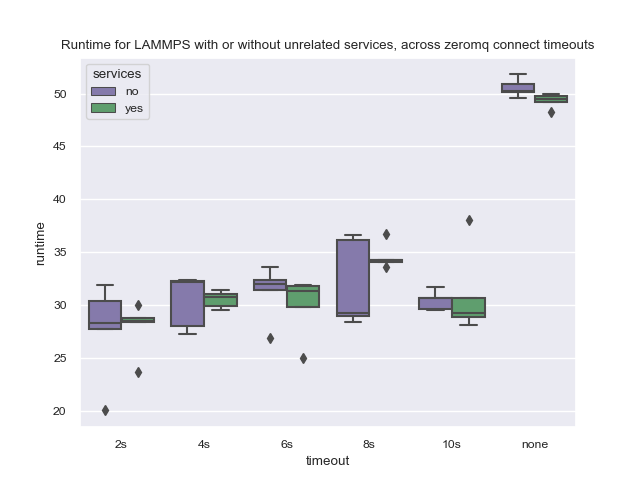

# NodeLocal Cache

The [NodeLocal](https://cloud.google.com/kubernetes-engine/docs/how-to/nodelocal-dns-cache) DNS Cache says that
it can improve DNS lookup latency by using a local cache. If it's the case that we are bottlenecked by
this lookup, this might help. See the [benefits mentioned here](https://cloud.google.com/kubernetes-engine/docs/how-to/nodelocal-dns-cache#benefits_of).

```bash
GOOGLE_PROJECT=myproject
```
```bash
$ gcloud container clusters create flux-cluster --project $GOOGLE_PROJECT \
    --location us-central1 --machine-type n1-standard-2 \
    --addons=NodeLocalDNS \
    --num-nodes=8 --tags=flux-cluster --enable-intra-node-visibility
```

**IMPORTANT** this created 24 nodes! I have no idea why but I immediately deleted the cluster.
That was not a suprise I was ready for! I wondered if my machine type was not correct,
so I tried removing that flag to use the default, and restoring the original zone:

```bash
$ gcloud container clusters create flux-cluster --project $GOOGLE_PROJECT \
    --zone us-central1-a \
    --addons=NodeLocalDNS \
    --num-nodes=8 --tags=flux-cluster --enable-intra-node-visibility
```

That seemed to work again to create 8. Then create the namespace and install the operator.

```bash
kubectl create namespace flux-operator
kubectl apply -f ../operator/flux-operator.yaml
kubectl get nodes -o json > nodes.json
```

Then I manually created the MiniCluster. If this never networks, then we can't run any experiments.

```bash
kubectl apply -f minicluster.yaml
```

This would also pull the container to the nodes so you don't need to do it later.
It networked! This is great!

```bash
kubectl get pods -n flux-operator 
```

That connected! Now let's try some scripted runs.
You'll need the fluxoperator and kubernetes modules installed:

```bash
$ python -m venv env
$ source env/bin/activate
$ pip install kubernetes
$ pip install fluxoperator
$ pip install IPython
```

Delete the current MiniCluster.
To run experiments, with and without services:

```bash
$ python time-minicluster-lammps.py lammps
$ python time-minicluster-lammps.py lammps --service
```

We are still testing zeromq timeouts here, mostly to see any patterns with
and without services. After this run I'm hoping to remove that outer loop
so I don't need to consider it. And then plot times here:

```bash
$ pip install pandas seaborn
$ python ../plot-times.py $(pwd)
```

Here is the plot!



From this I concluded the zeromq timeout isn't super important anymore - we see the expected
change in time depending on it, but we would be better off just letting it be the default 5s.
For next experiments I am going to tweak the cluster a bit and do this same set of runs with
and without services, but not across zeromq timeouts.

### Clean Up

When you are done - clean up!

```bash
gcloud container clusters delete flux-cluster
```
