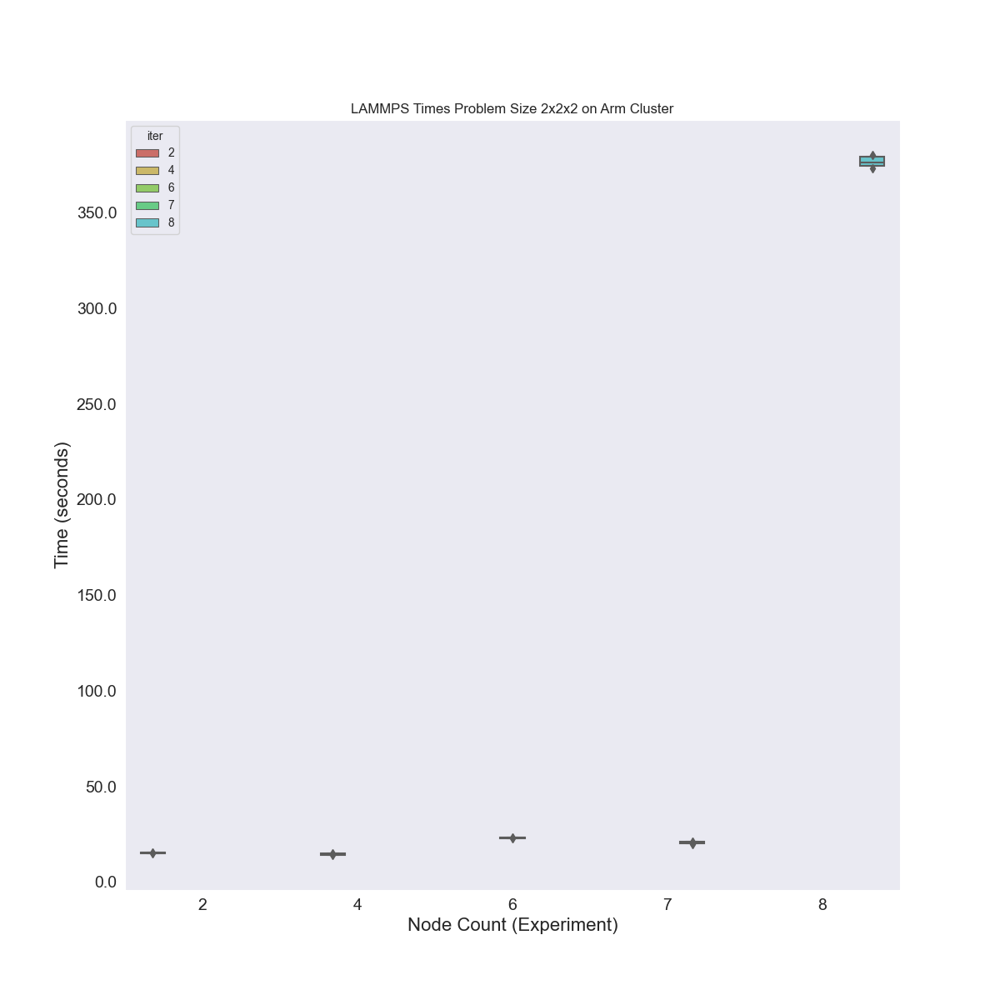

# LAMMPS Cluster Deployment

Let's test a tiny cluster on ARM. I am reading the `t2a-standard-8` has 8 vCPU (4 cpu)
and 64GB, and is about ~0.30 / hour so this would be a good contender. Note
we are doing this size because we have a 96 vCPU quota limit for this instance type.

## 1. Create the Cluster

We are first going to try this on a small size 8. We won't run full experiments here -
just a small set and sanity check the cluster creation. This instance should by default have
one thread per core, if I read that correctly. Note that this instance type doesn't have support
for COMPACT.

```bash
GOOGLE_PROJECT=myproject
```
```bash
$ gcloud container clusters create flux-cluster --project $GOOGLE_PROJECT \
    --zone us-central1-a \
    --machine-type t2a-standard-8 \
    --addons=NodeLocalDNS \
    --addons=GcpFilestoreCsiDriver \
    --threads-per-core=1 \
    --num-nodes=8 --tags=flux-cluster --enable-intra-node-visibility
```

Let's save before and after removing the taint.

```bash
$ kubectl get nodes -o json > nodes-tainted.json
```

Remove the node taint - I couldn't get it working with it.

```bash
for n in $( kubectl get nodes | tail -n +2 | cut -d' ' -f1 ); do
    kubectl taint nodes $n kubernetes.io/arch=arm64:NoSchedule-
done 
```

This seems wrong, but after I did it the operator pod started so...

```bash
$ kubectl get nodes -o json > nodes.json
```

## 2. Setup Filestore

Create the persistent volume claim for Filestore:


```bash
$ kubectl creater namespace flux-operator
$ kubectl apply -f ./pvc.yaml
```

And check on the status:

```bash
$ kubectl get -n flux-operator pvc
NAME   STATUS    VOLUME   CAPACITY   ACCESS MODES   STORAGECLASS   AGE
data   Pending                                      standard-rwx   6s
```

It will be pending under we make a request to use it! 

## 3. Setup the Flux Operator

Then install the operator.

```bash
$ kubectl apply -f ../operator/flux-operator-arm.yaml
```

Let's do that by creating the MiniCluster:
We are creating one size 8 cluster, and will create smaller allocations on it. 

```bash
$ kubectl apply -f minicluster.yaml
```

I had to play around with the resource limits (memory and cpu) until it told me scheduling would work.
I had trouble getting this originally up, but finally did.

```bash
$ POD=$(kubectl get pods -n flux-operator -o json | jq -r .items[0].metadata.name)
$ kubectl logs -n flux-operator $POD
```

You absolutely must see:

```console
broker.err[0]: quorum reached
broker.info[0]: quorum-full: quorum->run 1.02575m
```

And this is amazing - this didn't work before without the NodeLocalDNS thing!
You'll then want to copy the experiments file over

```bash
$ kubectl cp ./run-experiments.py flux-operator/${POD}:/home/flux/run-experiments.py
```

...shell in and connect to the broker:

```bash
$ kubectl exec -it -n flux-operator ${POD} -- bash
```
And since we have flux installed under spack, we need a few special commands.

```bash
. /etc/profile.d/z10_spack_environment.sh 
cd /opt/spack-environment
. /opt/spack-environment/spack/share/spack/setup-env.sh
spack env activate .
cd /home/flux/examples/reaxff/HNS
```

Connect to the broker:
```bash
$ sudo -u flux -E HOME=/home/flux -E PATH=$PATH -E PYTHONPATH=$PYTHONPATH flux proxy local:///run/flux/local bash
```
Also verify our NFS share is there:

```
$ ls /workflow/
lost+found
```

Note that we are in the experiment running directory. We will next run experiments using allocations.

### Run LAMMPS 

Here are the commands to do for each one - they must be run one at a time.
Go to the experiment directory with our files of interest

```bash
cd /home/flux/examples/reaxff/HNS
```

Note that for each of the Python commands below, it will submit jobs that look like:

```bash
flux submit -N ${nodes} -n 448 --output ... --error lmp...
```

Export the output directory:

```
# flux operator
export outdir=/workflow
```

Let's copy the script to the shared space, just for consistency with what I've done before.

```bash
sudo cp /home/flux/run-experiments.py /workflow/run-experiments.py
sudo chown flux /workflow/run-experiments.py
```

Resources we have:

```
$ flux resource list
     STATE NNODES   NCORES    NGPUS NODELIST
      free      8       64        0 flux-sample-[0-7]
 allocated      0        0        0 
      down      0        0        0
```

The result of lscpu seems to indicate 8 cores / node?

```
flux@flux-sample-0:~/examples/reaxff/HNS$ lscpu
Architecture:                    aarch64
CPU op-mode(s):                  64-bit
Byte Order:                      Little Endian
CPU(s):                          8
On-line CPU(s) list:             0-7
Thread(s) per core:              1
Core(s) per socket:              8
Socket(s):                       1
NUMA node(s):                    1
Vendor ID:                       ARM
Model:                           1
Model name:                      Neoverse-N1
Stepping:                        r3p1
BogoMIPS:                        50.00
NUMA node0 CPU(s):               0-7
Vulnerability Itlb multihit:     Not affected
Vulnerability L1tf:              Not affected
Vulnerability Mds:               Not affected
Vulnerability Meltdown:          Not affected
Vulnerability Mmio stale data:   Not affected
Vulnerability Retbleed:          Not affected
Vulnerability Spec store bypass: Mitigation; Speculative Store Bypass disabled via prctl
Vulnerability Spectre v1:        Mitigation; __user pointer sanitization
Vulnerability Spectre v2:        Mitigation; CSV2, BHB
Vulnerability Srbds:             Not affected
Vulnerability Tsx async abort:   Not affected
Flags:                           fp asimd evtstrm aes pmull sha1 sha2 crc32 atomics fphp asimdhp cpuid asimdrdm lrcpc dcpop asimddp ssbs
```

#### Size 2

> This was for testing only

Size 2 tasks should be 4 cores * 2 == 8
Flux seems to see 8/node, so I tried asking for that... 8 * 2 = 16
But LAMMPS actually FROZE and didn't produce any output for the third run, so I'm going to cut back
to 4. There is something going on I don't understand here.

```bash
flux mini alloc -N 2 /bin/bash
nodes=2
sudo mkdir -p ${outdir}/data/size_${nodes}
sudo chown ${USER} ${outdir}/data/size_${nodes}
cd /home/flux/examples/reaxff/HNS
python3 /workflow/run-experiments.py --workdir /home/flux/examples/reaxff/HNS --tasks 8 --times 20 -N ${nodes} lmp -v x 2 -v y 2 -v z 2 -in in.reaxc.hns -nocite --outdir $outdir/data/size_${nodes} --identifier lammps-${nodes}
exit
```

#### Size 4

Size 2 tasks should be 4 * 4 == 16

```bash
flux mini alloc -N 4 /bin/bash
nodes=4
sudo mkdir -p ${outdir}/data/size_${nodes}
sudo chown ${USER} ${outdir}/data/size_${nodes}
python3 /workflow/run-experiments.py --workdir /home/flux/examples/reaxff/HNS --tasks 16 --times 20 -N ${nodes} lmp -v x 2 -v y 2 -v z 2 -in in.reaxc.hns -nocite --outdir $outdir/data/size_${nodes} --identifier lammps-${nodes}
exit
```

#### Size 6

Size 6 tasks should be 4 * 6 == 24

```bash
flux mini alloc -N 6 /bin/bash
nodes=6
sudo mkdir -p ${outdir}/data/size_${nodes}
sudo chown ${USER} ${outdir}/data/size_${nodes}
python3 /workflow/run-experiments.py --workdir /home/flux/examples/reaxff/HNS --tasks 24 --times 20 -N ${nodes} lmp -v x 2 -v y 2 -v z 2 -in in.reaxc.hns -nocite --outdir $outdir/data/size_${nodes} --identifier lammps-${nodes}
exit
```

#### Size 8

Size 7 tasks should be 4 * 7 == 28

```bash
flux mini alloc -N 7 /bin/bash
nodes=7
sudo mkdir -p ${outdir}/data/size_${nodes}
sudo chown ${USER} ${outdir}/data/size_${nodes}
python3 /workflow/run-experiments.py --workdir /home/flux/examples/reaxff/HNS --tasks 28 --times 10 -N ${nodes} lmp -v x 2 -v y 2 -v z 2 -in in.reaxc.hns -nocite --outdir $outdir/data/size_${nodes} --identifier lammps-${nodes}
exit
```

#### Size 8

Size 8 tasks should be 4 * 8 == 32

```bash
flux mini alloc -N 8 /bin/bash
nodes=8
sudo mkdir -p ${outdir}/data/size_${nodes}
sudo chown ${USER} ${outdir}/data/size_${nodes}
python3 /workflow/run-experiments.py --workdir /home/flux/examples/reaxff/HNS --tasks 32 --times 5 -N ${nodes} lmp -v x 2 -v y 2 -v z 2 -in in.reaxc.hns -nocite --outdir $outdir/data/size_${nodes} --identifier lammps-${nodes}
exit
```

### Finish Up

Exit from the broker and the node/pod, and then copy the results over with kubectl

```bash
$ mkdir -p ./data/flux-operator
$ kubectl cp flux-operator/${POD}:/workflow/data ./data/flux-operator
```

Let's delete the flux operator and MiniCluster to prepare running Hyperqueue

```bash
$ kubectl delete -f minicluster.yaml
$ kubectl delete -f ../operator/flux-operator-arm.yaml
```

And when you are sure you have all the data, cleanup the cluster. You need to delete the pvc
explicitly, either here or in the console (it doesn't just cleanup with the cluster)!

```bash
$ kubectl delete -f pvc.yaml
$ gcloud container clusters delete --zone us-central1-a flux-cluster
```

## Results

Plot results:

```
python plot-results.py 
```

This does not look good.


