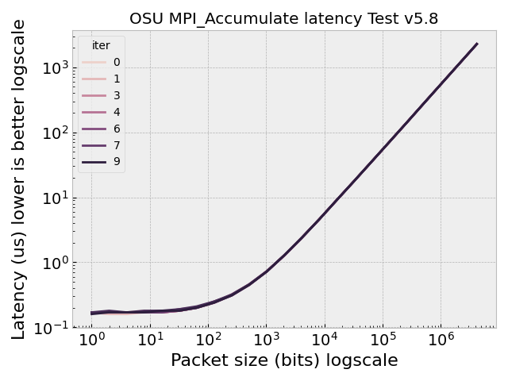
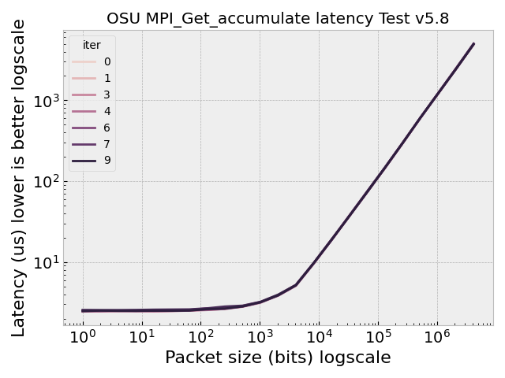
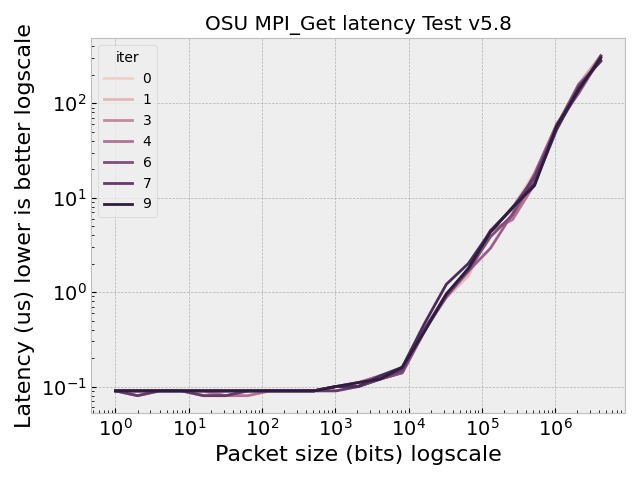
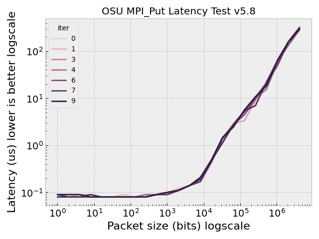

# Flux Framework OSU Benchmarks with/without TIER-1

Let's run the OSU benchmarks on [sole tenancy nodes](https://cloud.google.com/kubernetes-engine/docs/how-to/sole-tenancy).
This should only require two nodes. This will be the first time we try doing this,
so right now we are only trying to figure out how to create the node group and attach it to the cluster!
Questions for Google collaborators:

 - How do we create the cluster with just the sole tenancy nodes without needing to create a 1 node cluster beforehand?

## 0. Create the template

```bash
# For the c2 instance type
gcloud compute sole-tenancy node-templates create sole-tenant-c2-node-60-240 \
    --node-type=c2-node-60-240 \
    --region=us-central1
```

## 1. Create node group from our template

```bash
gcloud compute sole-tenancy node-groups create osu-benchmark-test-2-node-c2-node-60-240 \
    --zone us-central1-a \
    --node-template sole-tenant-c2-node-60-240 \
    --target-size 2
```

Make sure to [choose a zone](https://cloud.google.com/compute/docs/regions-zones#available) with the instance type we want.

## 2. Create the GKE cluster with zero nodes

And then create our GKE cluster (with the correct instance type and size)

```bash
gcloud container clusters create osu-benchmarks \
    --region us-central1 \
    --node-locations us-central1-a \
    --num-nodes=1 \
    --machine-type=c2-standard-60
```

Note that I did this first with 2 nodes, and my final cluster had 4, which I didn't want.
It didn't allow me to create one with 0 nodes, so I had to choose 1. Seems like it's not exactly what I'd want.

## 3. Create the node pool for the cluster

I then created the node pool and targeted the cluster (I don't know if this is the right order
there isn't a good instruction anywhere). 

```bash
gcloud container node-pools create osu-benchmark-test-2-node-c2-node-60-240 \
  --cluster osu-benchmarks \
  --zone us-central1 \
  --num-nodes=2 \
  --machine-type=c2-standard-60 \
  --scopes=storage-full,cloud-platform
```

## 4. Upgrade the cluster to use it

Then we need to upgrade it and ask to use our node pool (I didn't see another way to do this,
e.g., it would be easier to create and ask for the original node pool!)

```bash
gcloud container clusters upgrade osu-benchmarks \
  --region us-central1 \
  --node-pool=osu-benchmark-test-2-node-c2-node-60-240
```

I think (at least) that gives me the node pool I want running in my GKE cluster?
This isn't really ideal, I don't want to have to use taints / etc. to control
scheduling. I just want the 2 nodes that are sole tenancy and I don't care about the third.

```bash
kubectl get nodes
```
```console
$ kubectl get nodes
NAME                                                  STATUS   ROLES    AGE     VERSION
gke-osu-benchmarks-default-pool-0b11dfc7-fpdn         Ready    <none>   8m30s   v1.27.2-gke.1200
gke-osu-benchmarks-osu-benchmark-test-2f81d5a4-vn5d   Ready    <none>   56s     v1.27.2-gke.1200
gke-osu-benchmarks-osu-benchmark-test-2f81d5a4-wnk9   Ready    <none>   35s     v1.27.2-gke.1200
```

The prices are [high](https://cloud.google.com/compute/sole-tenant-pricing#sole-tenant_node_billing) so I'm
nervous to run this for an actual experiment. Note that we didn't add any special flags to our cluster for TIER-R or compact, e.g.,
here was the original command.

```bash
GOOGLE_PROJECT=myproject
```
```bash
$ time gcloud container clusters create flux-cluster --project $GOOGLE_PROJECT \
    --zone us-central1-a \
    --machine-type c2d-standard-112 \
    --addons=NodeLocalDNS \
    --network-performance-configs=total-egress-bandwidth-tier=TIER_1 \
    --addons=GcpFilestoreCsiDriver \
    --threads-per-core=1 \
    --num-nodes=64 --tags=flux-cluster --enable-intra-node-visibility \
    --placement-type COMPACT
```

## Run OSU Benchmarks

We are going to use the [Metrics Operator] to deploy the benchmarks. First install JobSet:

```bash
VERSION=v0.2.0
kubectl apply --server-side -f https://github.com/kubernetes-sigs/jobset/releases/download/$VERSION/manifests.yaml
```

Install the operator:

```bash
$ kubectl apply -f https://raw.githubusercontent.com/converged-computing/metrics-operator/main/examples/dist/metrics-operator.yaml
```

How to see metrics operator logs:

```bash
$ kubectl logs -n metrics-system metrics-controller-manager-859c66464c-7rpbw
```

Then create the metrics set. This is going to run a simple sysstat tool to collect metrics
as lammps runs.

```bash
kubectl apply -f metrics.yaml
```

Get the pods and wait until they are running. There is a launcher (l) and worker (w):

```
$ kubectl get pods
NAME                           READY   STATUS              RESTARTS   AGE
metricset-sample-l-0-0-c9mbq   0/1     ContainerCreating   0          11s
metricset-sample-w-0-0-g5ch4   0/1     ContainerCreating   0          11s
```

When the jobs are done, save the data to a file. We can do this 10 times.

```bash
mkdir -p ./logs
for i in 1 2 3 4 5 6 7 8 9; do
   echo "Running iteration $i"
   kubectl apply -f metrics.yaml
   sleep 60
   POD=$(kubectl get pods -o json | jq -r .items[0].metadata.name)
   kubectl logs ${POD} > ./logs/log-$i.txt
   kubectl delete -f metrics.yaml
   sleep 10
done
```

After that, there should be logs in [logs](logs).
That should be enough for an early test -note that we need to do this ensuring we get the
pods scheduled on the two nodes.

## Cleanup

When you are done, cleanup:

```bash
gcloud container clusters delete osu-benchmarks --region us-central1
```

And delete the node group:

```bash
gcloud compute sole-tenancy node-groups delete osu-benchmark-test-2-node-c2-node-60-240
```

And delete the template:

```bash
gcloud compute sole-tenancy node-templates delete sole-tenant-c2-node-60-240 
```

This is just being careful to ensure we aren't being charged for anything.
I think (hope) that's all I need to do.

## Analyze

We have simple scripts to generate data and plot latency:

```bash
pip install seaborn metricsoperator pandas
python analyze-logs.py
```






## References

- [sole tenancy nodes (GKE)](https://cloud.google.com/kubernetes-engine/docs/how-to/sole-tenancy)
- [sole tenancy nodes (CE)](https://cloud.google.com/compute/docs/nodes/sole-tenant-nodes#node_types)
- [pricing](https://cloud.google.com/compute/sole-tenant-pricing#sole-tenant_node_billing)
