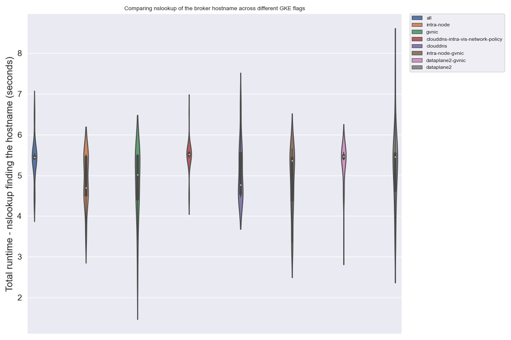

# Service Timing

See [notes in run1](../run1) for full background. This experiment will aim to run nslookup
for just the broker pod across different combinations of flags.

### Setup

I started varying the names of the GKE clusters so I could bring one up 
while another was coming down (but still not run experiments at the same
time because I didn't want to risk kubectl hitting the wrong one!)

#### 1. Dependencies

You'll need the Python bindings and a virtual environment. We just are using Python to programatically submit (and time) the jobs.

```bash
$ python -m venv env
$ source env/bin/activate
$ pip install fluxoperator # this should be 0.0.24
$ pip install kubernetes   # I was using 26.1.0
```

#### 2. Create Cluster

We will create each of the clusters below. The set of commands creates the cluster,
and then installs the operator, runs experiments under a namespace, and cleans up.

##### clouddns + intra-node-visibility + enable-network-policy

```bash
$ gcloud container clusters create flux-operator --cluster-dns=clouddns --cluster-dns-scope=cluster \
   --region=us-central1-a --project $GOOGLE_PROJECT \
   --machine-type n1-standard-2 --num-nodes=4 --enable-network-policy \
   --tags=flux-cluster --enable-intra-node-visibility

$ kubectl create namespace flux-operator
$ kubectl apply -f operator/flux-operator.yaml

$ python nslookup-minicluster.py clouddns-intra-vis-network-policy
$ gcloud container clusters delete flux-operator
```

##### clouddns

```bash
$ gcloud container clusters create flux-operator --cluster-dns=clouddns --cluster-dns-scope=cluster \
   --region=us-central1-a --project $GOOGLE_PROJECT \
   --machine-type n1-standard-2 --num-nodes=4 \
   --tags=flux-cluster

$ kubectl create namespace flux-operator
$ kubectl apply -f operator/flux-operator.yaml

$ python nslookup-minicluster.py clouddns
$ gcloud container clusters delete flux-operator
```

##### intra-node-visibility

```bash
$ gcloud container clusters create flux-operator \
   --region=us-central1-a --project $GOOGLE_PROJECT \
   --machine-type n1-standard-2 --num-nodes=4 \
   --tags=flux-cluster --enable-intra-node-visibility

$ kubectl create namespace flux-operator
$ kubectl apply -f operator/flux-operator.yaml

$ python nslookup-minicluster.py intra-node
$ gcloud container clusters delete flux-operator
```

##### gvnic

```bash
$ gcloud container clusters create flux-cluster \
   --region=us-central1-a --project $GOOGLE_PROJECT \
   --machine-type n1-standard-2 --num-nodes=4 \
   --tags=flux-cluster --enable-gvnic 

$ kubectl create namespace flux-operator
$ kubectl apply -f operator/flux-operator.yaml

$ python nslookup-minicluster.py gvnic
$ gcloud container clusters delete flux-cluster
```

##### dataplane 2

```bash
$ gcloud container clusters create flux-operator \
   --region=us-central1-a --project $GOOGLE_PROJECT \
   --machine-type n1-standard-2 --num-nodes=4 \
   --tags=flux-cluster  --enable-dataplane-v2

$ kubectl create namespace flux-operator
$ kubectl apply -f operator/flux-operator.yaml

$ python nslookup-minicluster.py dataplane2
$ gcloud container clusters delete flux-operator
```


##### dataplane 2 + gvnic

```bash
$ gcloud container clusters create flux-cluster \
   --region=us-central1-a --project $GOOGLE_PROJECT \
   --machine-type n1-standard-2 --num-nodes=4 \
   --tags=flux-cluster --enable-dataplane-v2 \
   --enable-gvnic 

$ kubectl create namespace flux-operator
$ kubectl apply -f operator/flux-operator.yaml

$ python nslookup-minicluster.py dataplane2-gvnic
$ gcloud container clusters delete flux-cluster
```

##### all

```bash
$ gcloud container clusters create flux-operator --cluster-dns=clouddns --cluster-dns-scope=cluster \
   --region=us-central1-a --project $GOOGLE_PROJECT \
   --machine-type n1-standard-2 --num-nodes=4 \
   --tags=flux-cluster --enable-intra-node-visibility \
   --enable-dataplane-v2 \
   --enable-gvnic 

$ kubectl create namespace flux-operator
$ kubectl apply -f operator/flux-operator.yaml

$ python nslookup-minicluster.py all
$ gcloud container clusters delete flux-operator
```

##### gvnic + clouddns

Wow - this didn't work at all! I even tried it twice. It looped forever trying to find the name,
but nslookup always failed (after minutes).

```bash
$ gcloud container clusters create flux-cluster --cluster-dns=clouddns --cluster-dns-scope=cluster \
   --region=us-central1-a --project $GOOGLE_PROJECT \
   --machine-type n1-standard-2 --num-nodes=4 \
   --tags=flux-cluster --enable-gvnic 

$ kubectl create namespace flux-operator
$ kubectl apply -f operator/flux-operator.yaml

$ python nslookup-minicluster.py clouddns-gvnic
$ gcloud container clusters delete flux-cluster
```

Just for debugging, here is the /etc/hosts inside the pod:

```
# cat /etc/hosts
# Kubernetes-managed hosts file.
127.0.0.1	localhost
::1	localhost ip6-localhost ip6-loopback
fe00::0	ip6-localnet
fe00::0	ip6-mcastprefix
fe00::1	ip6-allnodes
fe00::2	ip6-allrouters
10.116.2.5	lammps-0.flux-service.flux-operator.svc.cluster.local	lammps-0
```

```bash
# hostname
lammps-0
```

```
# cat /etc/resolv.conf 
search flux-operator.svc.cluster.local svc.cluster.local cluster.local us-central1-a.c.llnl-flux.internal c.llnl-flux.internal google.internal
nameserver 169.254.169.254
options ndots:5
```

So probably those two shouldn't be used together!

##### gvnic + intra-node-visibility

```bash
$ gcloud container clusters create flux-operator \
   --region=us-central1-a --project $GOOGLE_PROJECT \
   --machine-type n1-standard-2 --num-nodes=4 \
   --tags=flux-cluster --enable-gvnic \
   --enable-intra-node-visibility  

$ kubectl create namespace flux-operator
$ kubectl apply -f operator/flux-operator.yaml

$ python nslookup-minicluster.py intra-node-gvnic
$ gcloud container clusters delete flux-operator
```


#### 3. Results

The above runs will save times that we can then plot:

```bash
$ python ./plot-times.py
```
```console
Found result for all
Found result for intra-node
Found result for gvnic
Found result for clouddns-intra-vis-network-policy
Found result for clouddns
Found result for intra-node-gvnic
Found result for dataplane2-gvnic
Found result for dataplane2
Mean runtime across runs: 5.117637199163437
Means for flag groups: flags
gvnic                                4.764706
intra-node-gvnic                     4.838995
intra-node                           4.863540
clouddns                             5.122298
dataplane2                           5.228835
dataplane2-gvnic                     5.243888
all                                  5.409076
clouddns-intra-vis-network-policy    5.469760
Name: runtime, dtype: float64
```

And this resulted in the plot below:



## Results

```
gvnic                                4.764706
intra-node-gvnic                     4.838995
intra-node                           4.863540
clouddns                             5.122298
dataplane2                           5.228835
dataplane2-gvnic                     5.243888
all                                  5.409076
clouddns-intra-vis-network-policy    5.469760
```

We learned:

 - gvnic absolutely does not work with clouddns!
 - clouddns generally slows things down
 - gvnic on its own seems the "best" (fastest)
 - for all, the variability isn't great - I chose violin plot to show that (the boxplot would vary in how it showed outliers)

It looks like there are [different things we might be able to try](https://cloud.google.com/kubernetes-engine/docs/best-practices/networking)?
