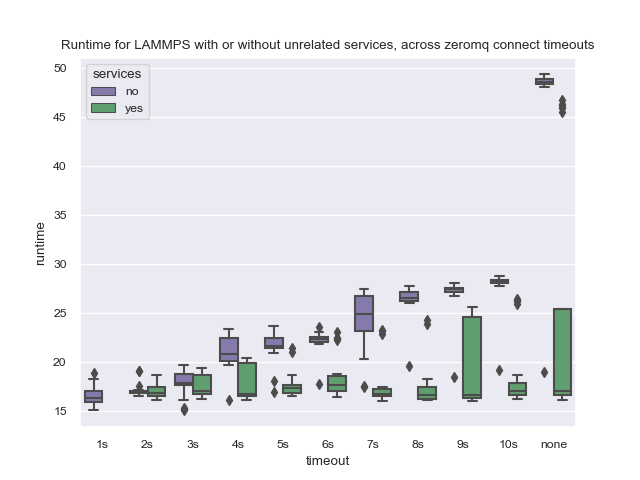

# Service Timing

This will be a reproduction of [run7](../run7) - one more for good measure!
I want to be extra sure this reproduces.

### Setup

```console
gcloud container clusters create flux-operator \
   --region=us-central1-a --project $GOOGLE_PROJECT \
   --cluster-dns=clouddns --cluster-dns-scope=cluster \
   --machine-type n1-standard-2 --num-nodes=4 \
   --tags=flux-cluster  --enable-dataplane-v2

$ kubectl create namespace flux-operator
```

Then apply the current design (with wrap added) so we can save pods (and see hostnames)

```bash
$ kubectl apply -f operator/flux-operator.yaml
```

Save the nodes:

```bash
$ kubectl get nodes -o json > operator/nodes.json
```

Then run the experiments!

```bash
$ python time-minicluster-lammps.py lammps
```

These experiments will:

 - run a lammps job across 4 pods
 - save output with strace logging (wrap) for networking
 - save timings of running lammps
 - run across different zeromq timeouts
 - with and without a service
 
And there is a try / accept around the delicate bits in case there is an error
with the Python communication. If so, you should be able to see where you are
in the loop and pick up. While it's running, if you wish, you can save a set of 
nodes for later inspection:

```bash
$ kubectl get pods -n flux-operator -o json > operator/pods.json
```

### Results

And generated the plots:

```bash
$ python plot-times.py
```

And this resulted in the plot below:



And of course, don't forget to clean up:

```bash
$ gcloud container clusters delete flux-operator
```

