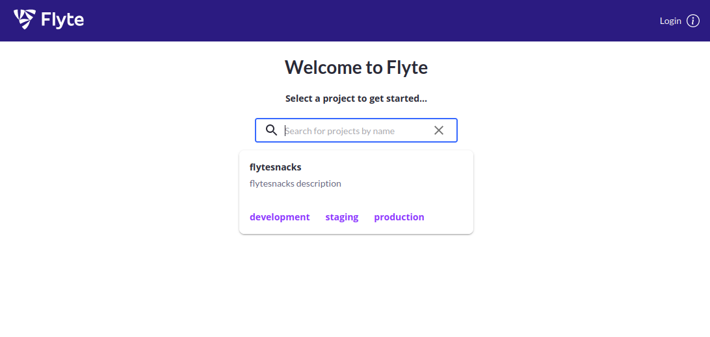
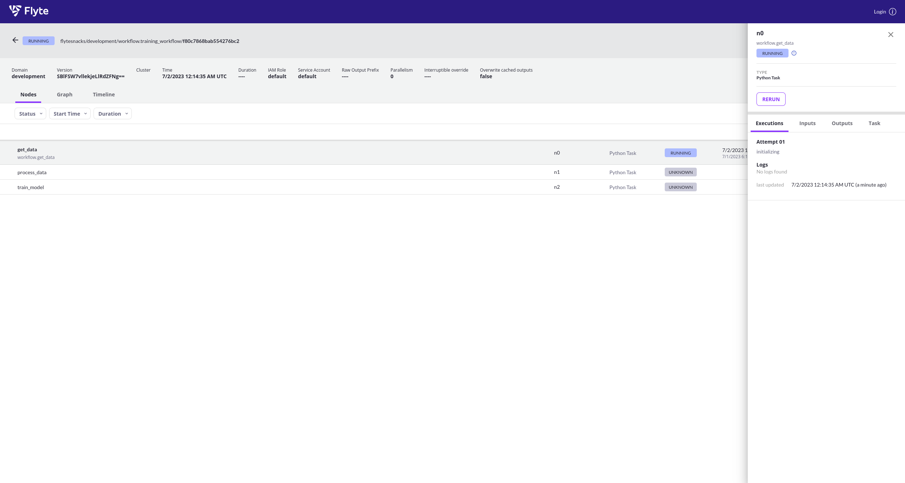
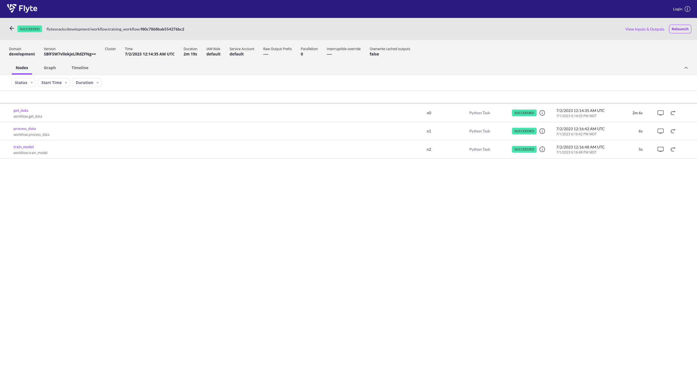

# Testing Flyte

This is going to evaluate [Flyte](https://github.com/flyteorg/flyte) in the context of running the Flux Operator
(and then possibly integrating other KubeFlow pipelines, Kubernetes objects, and components that we like).

## Usage

We will start at the [getting started](https://docs.flyte.org/projects/cookbook/en/latest/index.html) guide.
Note for poking around the [repository](https://github.com/flyteorg/flyte#quick-start) references a sandbox.

### Setup

Create a virtual environment and install dependencies

```bash
python -m venv env
source env/bin/activate
pip install flytekit scikit-learn
```

And install `flytectl`

```bash
mkdir -p ./bin
curl -sL https://ctl.flyte.org/install | bash -s -- -b ./bin
export PATH=$PWD/bin:$PATH
```

And then [following the instructions](https://docs.flyte.org/projects/cookbook/en/latest/index.html#creating-a-workflow)
we will write a basic workflow to perform a series of tasks, this is [workflow.py](workflow.py).

You should have `pyflyte` on your path!

```bash
which pyflyte
```
And then run the workflow like this:

```bash
pyflyte run workflow.py training_workflow --hyperparameters '{"C": 0.1}'
```
```console
LogisticRegression(C=0.1, max_iter=3000)
```

That must have been pure Python based, because I don't have access to / am not running
a Kubernetes cluster!


### Create Cluster

Now let's do the same, but try to create what Flyte is calling a cluster. I won't know
what this is until I try it.

```bash
# This creates a local demo Kubernetes cluster
$ flytectl demo start
```

My first concern is that there [might be a bug](https://github.com/flyteorg/flyte/issues/3821) with the UI output - it seems kind of messy.
And then seeing the sizes, I wonder what it's deploying?

```console
/665.9MB","id":"16ba2cacbb9e"}
{"status":"Downloading","progressDetail":{"current":599596887,"total":665896049},"progress":"[=============================================\u003e     ]  599.6MB/665.9MB","id":"16ba2cacbb9e"}
{"status":"Downloading","progressDetail":{"current":600137559,"total":665896049},"progress":"[=============================================\u003e     ]  600.1MB/665.9MB","id":"16ba2cacbb9e"}
{"status":"Downloading","progressDetail":{"current":600678231,"total":665896049},"progress":"[=============================================\u003e     ]  600.7MB/665.9MB","id":"16ba2cacbb9e"}
{"status":"Downloading","progressDetail":{"current":601218903,"total":665896049},"progress":"[=============================================\u003e     ]  601.2MB/665.9MB","id":"16ba2cacbb9e"}
```

I think it's just pulling and extracting container layers?
Oh wow, it's legit bootstrapping Kubernetes! Lol I don't know if this is a good idea,
but I'm too excited to stop it now!

```console
{"status":"Status: Downloaded newer image for cr.flyte.org/flyteorg/flyte-sandbox-bundled:sha-1ae254f8683699b68ecddc89d775fc5d39cc3d84"}
🧑‍🏭 booting Flyte-sandbox container
Waiting for cluster to come up...
Waiting for cluster to come up...
Waiting for cluster to come up...
Waiting for cluster to come up...
Waiting for cluster to come up...
Waiting for cluster to come up...
context modified for "flyte-sandbox" and switched over to it.

+-----------------------------------+---------------+-----------+
|              SERVICE              |    STATUS     | NAMESPACE |
+-----------------------------------+---------------+-----------+
| k8s: This might take a little bit | Bootstrapping |           |
+-----------------------------------+---------------+-----------+
```

A little bit later... Flyte seems to be deploying it's own set of containers.

```console
+-----------------------------------------------------+---------------+-----------+
|                       SERVICE                       |    STATUS     | NAMESPACE |
+-----------------------------------------------------+---------------+-----------+
| flyte-sandbox-minio-645c8ddf7c-6g85c                | Pending       | flyte     |
+-----------------------------------------------------+---------------+-----------+
| flyte-sandbox-postgresql-0                          | Pending       | flyte     |
+-----------------------------------------------------+---------------+-----------+
| flyte-sandbox-kubernetes-dashboard-6757db879c-v6b56 | Pending       | flyte     |
+-----------------------------------------------------+---------------+-----------+
| flyte-sandbox-76d484c4b9-schcp                      | Pending       | flyte     |
+-----------------------------------------------------+---------------+-----------+
| flyte-sandbox-docker-registry-78fb6fd969-67spt      | Pending       | flyte     |
+-----------------------------------------------------+---------------+-----------+
| flyte-sandbox-proxy-d95874857-q6bfs                 | Pending       | flyte     |
+-----------------------------------------------------+---------------+-----------+
```

I suspect this is what they are running for their sandbox! In another terminal
I was able to confirm that we are running a local Kubernetes:

```bash
$ kubectl get pods --all-namespaces
NAMESPACE     NAME                                                  READY   STATUS      RESTARTS        AGE
flyte         flyte-sandbox-docker-registry-78fb6fd969-67spt        1/1     Running     0               4m16s
kube-system   local-path-provisioner-7b7dc8d6f5-mq4k9               1/1     Running     0               4m17s
kube-system   coredns-b96499967-tdb9k                               1/1     Running     0               4m17s
flyte         flyte-sandbox-kubernetes-dashboard-6757db879c-v6b56   1/1     Running     0               4m17s
flyte         flyte-sandbox-proxy-d95874857-q6bfs                   1/1     Running     0               4m17s
flyte         flyte-sandbox-minio-645c8ddf7c-6g85c                  1/1     Running     0               4m17s
flyte         flyte-sandbox-postgresql-0                            1/1     Running     0               4m17s
kube-system   metrics-server-668d979685-b5qx2                       1/1     Running     0               4m17s
flyte         flyte-sandbox-76d484c4b9-schcp                        2/2     Running     1 (3m25s ago)   4m17s
default       py39-cacher                                           0/1     Completed   0               3m11s
```

Nice!

```console
+-----------------------------------------------------+---------------+-----------+
|                       SERVICE                       |    STATUS     | NAMESPACE |
+-----------------------------------------------------+---------------+-----------+
| flyte-sandbox-docker-registry-78fb6fd969-67spt      | Running       | flyte     |
+-----------------------------------------------------+---------------+-----------+
| flyte-sandbox-kubernetes-dashboard-6757db879c-v6b56 | Running       | flyte     |
+-----------------------------------------------------+---------------+-----------+
| flyte-sandbox-proxy-d95874857-q6bfs                 | Running       | flyte     |
+-----------------------------------------------------+---------------+-----------+
| flyte-sandbox-minio-645c8ddf7c-6g85c                | Running       | flyte     |
+-----------------------------------------------------+---------------+-----------+
| flyte-sandbox-postgresql-0                          | Running       | flyte     |
+-----------------------------------------------------+---------------+-----------+
| flyte-sandbox-76d484c4b9-schcp                      | Running       | flyte     |
+-----------------------------------------------------+---------------+-----------+
👨‍💻 Flyte is ready! Flyte UI is available at http://localhost:30080/console 🚀 🚀 🎉 
❇️ Run the following command to export demo environment variables for accessing flytectl
	export FLYTECTL_CONFIG=/home/vanessa/.flyte/config-sandbox.yaml 
🐋 Flyte sandbox ships with a Docker registry. Tag and push custom workflow images to localhost:30000
📂 The Minio API is hosted on localhost:30002. Use http://localhost:30080/minio/login for Minio console
```

My computer didn't crash, so that's great! And in the UI... there are snacks!



Wow so to point out a few things:

- we have a full web interface
- we also have a full docker registry
- AND minio storage?


Now let's ensure we tell our commands about it:

```bash
export FLYTECTL_CONFIG=~/.flyte/config-sandbox.yaml
```

And now let's submit our job again:

```bash
$ pyflyte run --remote workflow.py training_workflow --hyperparameters '{"C": 0.1}'
```
```console
Go to http://localhost:30080/console/projects/flytesnacks/domains/development/executions/f80c7868bab554276bc2 to see execution in the console.
```

The difference now is that we are creating a pod to run the steps of the job. E.g.,

```diff
$ kubectl get pods --all-namespaces
NAMESPACE                 NAME                                                  READY   STATUS              RESTARTS      AGE
flyte                     flyte-sandbox-docker-registry-78fb6fd969-67spt        1/1     Running             0             11m
kube-system               local-path-provisioner-7b7dc8d6f5-mq4k9               1/1     Running             0             11m
kube-system               coredns-b96499967-tdb9k                               1/1     Running             0             11m
flyte                     flyte-sandbox-kubernetes-dashboard-6757db879c-v6b56   1/1     Running             0             11m
flyte                     flyte-sandbox-proxy-d95874857-q6bfs                   1/1     Running             0             11m
flyte                     flyte-sandbox-minio-645c8ddf7c-6g85c                  1/1     Running             0             11m
flyte                     flyte-sandbox-postgresql-0                            1/1     Running             0             11m
kube-system               metrics-server-668d979685-b5qx2                       1/1     Running             0             11m
flyte                     flyte-sandbox-76d484c4b9-schcp                        2/2     Running             1 (10m ago)   11m
default                   py39-cacher                                           0/1     Completed           0             10m
+ flytesnacks-development   f80c7868bab554276bc2-n0-0                             0/1     ContainerCreating   0             62s
```

In the web interface:



And actually, one is created per step:

```diff
$ kubectl get pods --all-namespaces
NAMESPACE                 NAME                                                  READY   STATUS      RESTARTS      AGE
flyte                     flyte-sandbox-docker-registry-78fb6fd969-67spt        1/1     Running     0             12m
kube-system               local-path-provisioner-7b7dc8d6f5-mq4k9               1/1     Running     0             12m
kube-system               coredns-b96499967-tdb9k                               1/1     Running     0             12m
flyte                     flyte-sandbox-kubernetes-dashboard-6757db879c-v6b56   1/1     Running     0             12m
flyte                     flyte-sandbox-proxy-d95874857-q6bfs                   1/1     Running     0             12m
flyte                     flyte-sandbox-minio-645c8ddf7c-6g85c                  1/1     Running     0             12m
flyte                     flyte-sandbox-postgresql-0                            1/1     Running     0             12m
kube-system               metrics-server-668d979685-b5qx2                       1/1     Running     0             12m
flyte                     flyte-sandbox-76d484c4b9-schcp                        2/2     Running     1 (11m ago)   12m
default                   py39-cacher                                           0/1     Completed   0             11m
+ flytesnacks-development   f80c7868bab554276bc2-n0-0                             0/1     Completed   0             2m18s
+ flytesnacks-development   f80c7868bab554276bc2-n2-0                             1/1     Running     0             5s
+ flytesnacks-development   f80c7868bab554276bc2-n1-0                             0/1     Completed   0             11s
```

And then when it's done:



The UI is pretty cool, but I wonder if it's really adding anything for me. I suspect someone
not comfortable with the command line would benefit, but it still seems like it's hard to find outputs
(e.g., it's referencing some fake s3 address for me and i'm not sure where that actually is).

I'm trying to figure out if Flyte is just limited to it's own [CRD](https://docs.flyte.org/en/latest/concepts/component_architecture/flytepropeller_architecture.html#flyteworkflow-crd-k8s-integration) and then launching
tasks, or if it could control another CRD too. Ah, this [native backend plugins](https://docs.flyte.org/projects/cookbook/en/latest/integrations.html#native-backend-plugins) section might be useful. It looks like:

 - Other workflow tools (e.g., [Airflow](https://docs.flyte.org/projects/cookbook/en/latest/auto_examples/airflow_plugin/index.html) can deploy Flyte). That's probably not what we want. 
 - [External service plugins](https://docs.flyte.org/projects/cookbook/en/latest/integrations.html#external-service-backend-plugins) might be useful, although we are still interested in a use case with CRD.
 - We can use a [Kubeflow Pytorch Operator](https://docs.flyte.org/projects/cookbook/en/latest/auto_examples/kfpytorch_plugin/index.html) so I think that answers my question - we could also have a Flux Operator plugin.
 
Ah [here are the plugins](https://github.com/flyteorg/flytekit/tree/master/plugins)! ⭐️

So I think this will be my next step - to try making one for the Flux Operator.

### Clean Up

```bash
flytectl demo teardown
```

Wow, that tears down really quickly!
