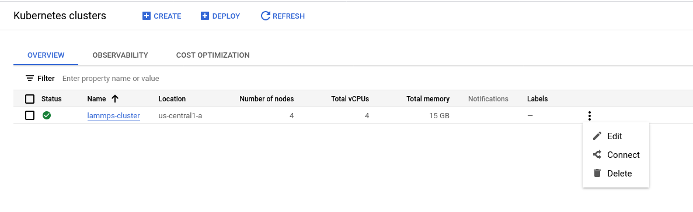

# Lammps on Google Kubernetes Engine

In this short experiment we will run the Flux Operator on Google Cloud, at first
at a very small size intended for development. 

## Install

You should first [install gcloud](https://cloud.google.com/sdk/docs/quickstarts) 
and ensure you are logged in and have kubectl installed:

```bash
$ gcloud auth login
```

Depending on your install, you can either install with gcloud:

```bash
$ gcloud components install kubectl
```
or just [on your own](https://kubernetes.io/docs/tasks/tools/).


## Create Cluster

Now let's use gcloud to create a cluster, and we are purposefully going to choose
a very small node type to test. Note that I choose us-central1-a because it tends
to be cheaper (and closer to me).

```bash
$ gcloud container clusters create lammps-cluster --project <project name> --zone us-central1-a --cluster-version 1.23 --machine-type n1-standard-1 --num-nodes=4
```

In your Google cloud interface, you should be able to see the cluster! Note
this might take a few minutes.



I also chose a tiny one anticipating having it up longer to figure things out.

## Get Credentials

Next we need to ensure that we can issue commands to our cluster with kubectl.
To get credentials, in the view shown above, select the cluster and click "connect."
Doing so will show you the correct statement to run to configure command-line access,
which probably looks something like this:

```bash
$ gcloud container clusters get-credentials lammps-cluster --zone us-central1-a --project <project name>
```
```console
Fetching cluster endpoint and auth data.
kubeconfig entry generated for lammps-cluster.
```

Finally, use [cloud IAM](https://cloud.google.com/iam) to ensure you can create roles, etc.

```bash
$ kubectl create clusterrolebinding cluster-admin-binding --clusterrole cluster-admin --user $(gcloud config get-value core/account)
```
```console
clusterrolebinding.rbac.authorization.k8s.io/cluster-admin-binding created
```

At this point you should be able to get your nodes:

```bash
$ kubectl get nodes
```
```console
NAME                                            STATUS   ROLES    AGE     VERSION
gke-lammps-cluster-default-pool-f103d9d8-379m   Ready    <none>   3m41s   v1.23.14-gke.1800
gke-lammps-cluster-default-pool-f103d9d8-3wf9   Ready    <none>   3m42s   v1.23.14-gke.1800
gke-lammps-cluster-default-pool-f103d9d8-c174   Ready    <none>   3m42s   v1.23.14-gke.1800
gke-lammps-cluster-default-pool-f103d9d8-zz1q   Ready    <none>   3m42s   v1.23.14-gke.1800
```

## Deploy Operator 

To deploy the Flux Operator, here is how to do it directly from the codebase.
Note that this is how I develop / test (with a development branch checked out!)

```bash
$ git clone https://github.com/flux-framework/flux-operator
$ cd flux-operator
```

A deploy will use the latest docker image [from the repository](https://github.com/orgs/flux-framework/packages?repo_name=flux-operator).

```
$ make deploy
```
```console
...
clusterrole.rbac.authorization.k8s.io/operator-manager-role created
clusterrole.rbac.authorization.k8s.io/operator-metrics-reader created
clusterrole.rbac.authorization.k8s.io/operator-proxy-role created
rolebinding.rbac.authorization.k8s.io/operator-leader-election-rolebinding created
clusterrolebinding.rbac.authorization.k8s.io/operator-manager-rolebinding created
clusterrolebinding.rbac.authorization.k8s.io/operator-proxy-rolebinding created
configmap/operator-manager-config created
service/operator-controller-manager-metrics-service created
deployment.apps/operator-controller-manager created
```

Ensure the `operator-system` namespace was created:

```bash
$ kubectl get namespace
NAME              STATUS   AGE
default           Active   6m39s
kube-node-lease   Active   6m42s
kube-public       Active   6m42s
kube-system       Active   6m42s
operator-system   Active   39s
```
```bash
$ kubectl describe namespace operator-system
Name:         operator-system
Labels:       control-plane=controller-manager
              kubernetes.io/metadata.name=operator-system
Annotations:  <none>
Status:       Active

Resource Quotas
  Name:                              gke-resource-quotas
  Resource                           Used  Hard
  --------                           ---   ---
  count/ingresses.extensions         0     100
  count/ingresses.networking.k8s.io  0     100
  count/jobs.batch                   0     5k
  pods                               1     1500
  services                           1     500

No LimitRange resource.
```

And you can find the name of the operator pod as follows:

```bash
$ kubectl get pod --all-namespaces
```
```console
      <none>
operator-system   operator-controller-manager-56b5bcf9fd-m8wg4               2/2     Running   0          73s
```

## Create Flux Operator namespace

Make your namespace for the flux-operator custom resource definition (CRD):

```bash
$ kubectl create namespace flux-operator
```

## Create the Lammps Job

Now let's apply the custom resource definition to create the lammps mini cluster!
Here we are back in the repository with this README.md (and not in the root of the
Flux Operator). Importantly, we have set `localDeploy` to false because we need to create volume
claims and not local host mounts for shared resources.

```bash
$ kubectl apply -f minicluster-lammps.yaml 
```

There are different ways to see logs for pods. First, see pods running and state.
You probably want to wait until the state changes from `ContainersCreating` to `Running`
because this is where we are pulling the chonker containers.

```bash
$ kubectl get -n flux-operator pods
```

If you need to debug (or see general output for a pod about creation) you can do:

```bash
$ kubectl -n flux-operator describe pods flux-sample-0-742bm
```

And finally, the most meaty piece of metadata is the log for the pod,
where the Flux Operator will be setting things up and starting flux.

```
# Add the -f to keep it hanging
$ kubectl -n flux-operator logs flux-sample-0-742bm -f
```

To shell into a pod to look around (noting where important flux stuff is)

```bash
$ kubectl exec --stdin --tty -n flux-operator flux-sample-0-742bm -- /bin/bash
```
```console
ls /mnt/curve
ls /etc/flux
ls /etc/flux/config
```

To get logs for the operator itself:

```bash
$ kubectl logs -n operator-system operator-controller-manager-56b5bcf9fd-j2g75
```

If you need to run in verbose (non-test) mode, set test to false in the [minicluster-lammps.yaml](minicluster-lammps.yaml).
And make sure to clean up first:

```bash
$ kubectl delete -f minicluster-lammps.yaml
```

and wait until the pods are gone:

```bash
$ kubectl get -n flux-operator pods
No resources found in flux-operator namespace.
```

Observations about comparing this to MiniKube (local):

 - The containers that are large actually pull
 - The startup times of the different pods vary quite a bit.
 - A few config maps aren't found or timed out mount for up to 3-4 minutes, then it ran!

**TODO**: We stopped at the point where the flux worker nodes seem to be starting happily
without connecting to the parent, which isn't what we want:

```bash
🌀sudo -u flux -E flux start -o --config /etc/flux/config -Scron.directory=/etc/flux/system/cron.d   -Stbon.fanout=256   -Srundir=/run/flux   -Sstatedir=/var/lib/flux   -Slocal-uri=local:///run/flux/local   -Slog-stderr-level=6    -Slog-stderr-mode=local
broker.info[2]: start: none->join 8.29657ms
```

We have a "while True" loop there, but we do need this command to fail (and then capture the error and try again).
I think when that works this might actually work in full!

## Clean up

Make sure you clean everything up! You can delete the lammps deploy first:

```bash
$ kubectl delete -f minicluster-lammps.yaml
```

And then undeploy the operator (this is again at the root of the operator repository clone)

```bash
$ make undeploy
```

And then to delete the cluster with gcloud:

```bash
$ gcloud container clusters delete --zone us-central1-a lammps-cluster
```

I like to check in the cloud console to ensure that it was actually deleted.

## Customization

### Use a Different Flux Operator Container

If you own the operator, you can build and push first to develop:

```bash
$ make docker-build
$ make docker-push
```

Otherwise you'll need to set the IMG variable to your own container (that you've built and pushed). E.g, in the Makefile:

```bash
# Image URL to use all building/pushing image targets
IMG ?= ghcr.io/flux-framework/flux-operator
```
and your command:

```bash
make IMG=mycontainer/flux-operator
```

TODO current error, can't cross namespaces:


```
1.6721159253643591e+09	INFO	minicluster-reconciler	Config Generator Pod	{"Name": "flux-sample-cert-generator"}
1.672115925364839e+09	INFO	minicluster-reconciler	Config Generator Pod	{"Container": "flux-sample-cert-generator"}
1.6721159253666878e+09	ERROR	Reconciler error	{"controller": "minicluster", "controllerGroup": "flux-framework.org", "controllerKind": "MiniCluster", "miniCluster": {"name":"flux-sample","namespace":"flux-operator"}, "namespace": "flux-operator", "name": "flux-sample", "reconcileID": "8051719c-e9ff-4259-9873-f6f97e48a6d4", "error": "pods \"flux-sample-cert-generator\" is forbidden: User \"system:serviceaccount:operator-system:operator-controller-manager\" cannot get resource \"pods/log\" in API group \"\" in the namespace \"flux-operator\""}
sigs.k8s.io/controller-runtime/pkg/internal/controller.(*Controller).processNextWorkItem
	/go/pkg/mod/sigs.k8s.io/controller-runtime@v0.12.1/pkg/internal/controller/controller.go:273
sigs.k8s.io/controller-runtime/pkg/internal/controller.(*Controller).Start.func2.2
	/go/pkg/mod/sigs.k8s.io/controller-runtime@v0.12.1/pkg/internal/controller/controller.go:234
```
